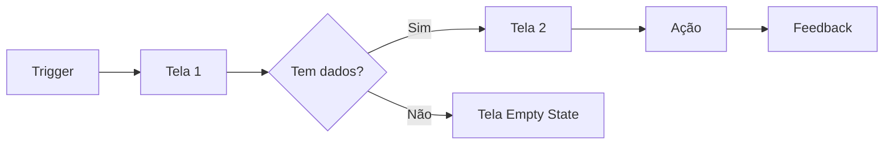

# Prompt: Criar User Flow

Crie o fluxo de usuário para a funcionalidade abaixo.

## Funcionalidade

- **Nome:** [nome]
- **Ator:** [tipo de usuário]
- **Objetivo:** [o que o usuário quer fazer]
- **Trigger:** [o que inicia o fluxo]

## Formato esperado

## Cenários a cobrir

1. **Happy path** — tudo ocorre como esperado
2. **Empty state** — não há dados
3. **Error state** — algo deu errado
4. **Edge case** — comportamento inesperado do usuário

Para cada cenário, descreva:
- Tela atual
- Ação do usuário
- Resposta do sistema
- Próxima tela
