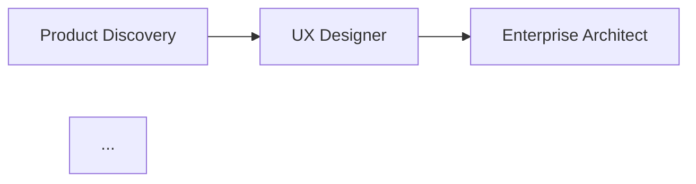

# Exercícios — Módulo 18

## Exercício 1: Anatomia de um agente

**Objetivo:** Completar a ficha técnica de um agente.

Para cada agente abaixo, complete: Domínio, Conhecimento Base (3 itens), Responsabilidades (3 itens), Limites (2 itens).

| Agente | Domínio | Conhecimento | Responsabilidades | Limites |
|--------|---------|--------------|-------------------|---------|
| Database Architect | | | | |
| Performance Expert | | | | |
| Documentation Agent | | | | |

---

## Exercício 2: Criando um agente do zero

**Objetivo:** Criar a estrutura completa de um novo agente.

Crie o agente **Mobile Expert Agent** especializado em React Native / Expo para desenvolvimento mobile.

Estrutura esperada:

```markdown
# Mobile Expert Agent

## Domínio
...

## Conhecimento Base
- ...
- ...
- ...

## Responsabilidades
- ...
- ...
- ...

## Limites
- ...
- ...

## Checklist
- [ ] ...
- [ ] ...
- [ ] ...

## Prompt template: Criar Tela
...
```

---

## Exercício 3: Pipeline de agentes

**Objetivo:** Projetar um pipeline de agentes para um cenário real.

Cenário: "Uma startup precisa criar um **marketplace de serviços** onde:
- Profissionais se cadastram com portfólio
- Clientes buscam e contratam serviços
- Pagamentos são processados na plataforma
- Há avaliação pós-serviço"

Desenhe o pipeline de agentes necessário para construir esse sistema, identificando:

1. Quais agentes são necessários
2. A ordem do pipeline
3. O que cada agente produz
4. Como a qualidade é verificada em cada etapa

Use o formato:



---

## Exercício 4: Prompt engineering

**Objetivo:** Praticar a escrita de prompts eficazes.

Reescreva os prompts ruins abaixo em prompts eficazes seguindo o padrão do módulo.

**Prompt ruim 1:**
"Faz um formulário de cadastro aí."

**Prompt ruim 2:**
"Preciso de uma API de produtos."

**Prompt ruim 3:**
"Faz o banco de dados do sistema."

---

## Exercício 5: Meta-Agent

**Objetivo:** Projetar um Meta-Agent.

Descreva como seria um Meta-Agent que, dado o problema abaixo, cria agentes especializados sob demanda:

> "Sistema de telemedicina com agendamento de consultas, prontuário eletrônico, integração com planos de saúde, chat em tempo real e prescrição digital."

Para cada agente que o Meta-Agent criaria, especifique:
1. Nome do agente
2. Domínio
3. Conhecimento base
4. Responsabilidades
5. Como ele se integra no pipeline
