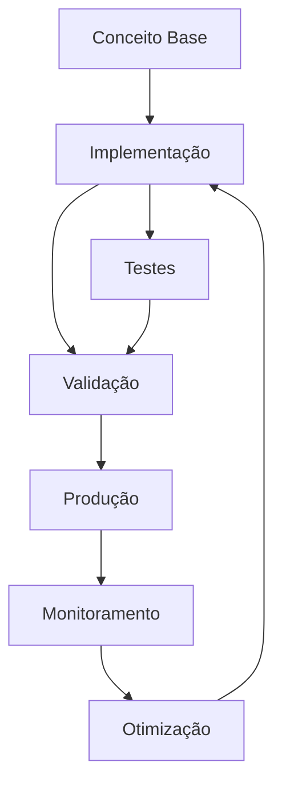

# Módulo 03 — Design Thinking: Inovação Centrada no Usuário

**Uma abordagem human-centered para resolver problemas complexos.**

---


## Objetivos de Aprendizagem

Ao final deste modulo, voce sera capaz de:

- **Definir** os conceitos fundamentais de Module 03 Design Thinking
- **Explicar** as estrategias e padroes envolvidos
- **Aplicar** as tecnicas em cenarios reais de desenvolvimento
- **Analisar** as compensacoes (trade-offs) entre diferentes abordagens
- **Implementar** solucoes seguindo as melhores praticas do mercado


## 1. O que é Design Thinking


> **Nota:** Este conceito é fundamental para o entendimento dos tópicos seguintes. Certifique-se de compreendê-lo antes de prosseguir.

> **Dica:** Ao implementar em projetos reais, comece com uma versão simplificada e iterativamente adicione complexidade.


Design Thinking é uma abordagem **centrada no ser humano** para solução de problemas que combina empatia, criatividade e racionalidade. Diferente de métodos tradicionais que partem de uma solução técnica, o Design Thinking começa com o **usuário** e suas necessidades reais.

### Origem

| Ano | Marco |
|-----|-------|
| 1969 | Herbert Simon publica "The Sciences of the Artificial" — primeiras bases |
| 1987 | Peter Rowe usa o termo "Design Thinking" em livro de arquitetura |
| 1991 | David Kelley funda a IDEO, que populariza o método |
| 2005 | D.School de Stanford sistematiza o processo em 5 fases |
| 2010+ | Adoção em larga escala por empresas como Apple, Google, IBM |


### Mindset do Design Thinking

```text
┌─────────────────────────────────────────────────┐
│                MINDSET DT                        │
│                                                   │
│  • Centrado no ser humano                         │
│  • Colaborativo e multidisciplinar                │
│  • Orientado à ação (aprender fazendo)            │
│  • Tolerante ao erro (falhe rápido, aprenda logo) │
│  • Otimista (toda solução é possível)             │
│  • Iterativo (nunca está pronto)                  │
└─────────────────────────────────────────────────┘
```markdown



> **Diagrama 1:** Visão geral do fluxo de trabalho abordado neste módulo. O ciclo contínuo de implementação → validação → produção → monitoramento → otimização garante entregas de qualidade.


### Abordagem tradicional vs Design Thinking

```text
TRADICIONAL:                                   DESIGN THINKING:
Problema → Análise → Solução → Entrega        Problema → Empatia → Definir → Ideias → Protótipo → Teste
                                                                                            ↻
```markdown

Enquanto a abordagem tradicional busca a **solução certa** de primeira, o Design Thinking busca **entender o problema certo** antes de solucionar, iterando quantas vezes for necessário.

---

## 2. As 5 Fases do Design Thinking

O processo é dividido em 5 fases **não-lineares** — você pode (e deve) voltar a fases anteriores conforme aprende.

```text
                        ┌─────────────┐
                        │   EMPATIZAR  │
                        └──────┬──────┘
                               ↓
                        ┌─────────────┐
                        │   DEFINIR   │
                        └──────┬──────┘
                               ↓
                        ┌─────────────┐
                        │   IDEIAR    │
                        └──────┬──────┘
                               ↓
                   ┌─────────────────────┐
                   │     PROTOTIPAR      │
                   └──────────┬──────────┘
                              ↓
                   ┌─────────────────────┐
                   │       TESTAR        │←──── Iteração
                   └─────────────────────┘
```text

Cada fase responde a uma pergunta central:

| Fase | Pergunta |
|------|----------|
| Empatizar | **O quê** o usuário sente, pensa e precisa? |
| Definir | **Qual** é o problema real? |
| Ideiar | **Quantas** soluções podemos gerar? |
| Prototipar | **Como** tornar a solução tangível? |
| Testar | **Funciona** na prática com o usuário? |

---

## 3. Fase 1: Empatizar

### Por que empatizar?

Sem empatia, você constrói soluções baseadas em **suposições**. Com empatia, você constrói baseado em **fatos** sobre o que o usuário realmente vive.

### Técnicas de empatia

#### 3.1 Entrevistas com usuários

```markdown
# Roteiro de entrevista — Exemplo

## Abertura (5 min)
- "Conte um pouco sobre seu trabalho/dia a dia"
- "Como você lida com [tópico] atualmente?"

## Exploração (15 min)
- "Me conte a última vez que você precisei fazer [ação]"
- "O que foi mais frustrante nesse processo?"
- "O que você fez para contornar?"

## Aprofundamento (10 min)
- "Por que isso é importante para você?"
- "O que aconteceria se você não conseguisse fazer isso?"
- "Como você descreveria a solução ideal?"

## Fechamento (5 min)
- "Mais alguma coisa que gostaria de compartilhar?"
- "Posso voltar a falar com você se surgir mais dúvidas?"
```text

**Regras de ouro para entrevistas:**

```text
✅ Faça:
  • Perguntas abertas ("Me conte sobre...")
  • Escute mais do que fala (proporção 80/20)
  • Pergunte "por quê?" repetidamente (técnica dos 5 porquês)
  • Observe linguagem corporal e tom de voz
  • Registre com autorização (áudio/anotações)

❌ Não faça:
  • Perguntas direcionadas ("Você não acha que...")
  • Perguntas fechadas ("Você usa X? Sim ou não?")
  • Interromper o usuário
  • Defender ideias ou justificar o sistema atual
  • Buscar validação para sua solução
```markdown

#### 3.2 Observação contextual

A observação revela o que as pessoas **realmente fazem** (vs. o que dizem fazer).

```typescript
// Framing da observação
interface Observacao {
  usuario: string;
  contexto: string;
  tarefa: string;
  acoes: Array<{
    timestamp: string;
    acao: string;
    tempo: number;      // segundos
    frustracao: 1 | 2 | 3 | 4 | 5;
    observacao: string;
  }>;
  workarounds: string[];
  insights: string[];
}
```text

**Exemplo de observação:**

```text
Usuário: Maria (Analista de BI)
Tarefa: Gerar relatório mensal de vendas

09:01 → Abre sistema, digita login — 12s
09:02 → Navega por 4 telas até encontrar "Relatórios" — 45s
09:03 → Seleciona filtros (mês, região, produto) — 30s
09:05 → Sistema trava ao carregar 3 meses de dados — frustração: 4/5
09:07 → Chama o suporte, enquanto isso abre Excel e começa a fazer manual
```markdown

**Insight:** A usuária prefere fazer manual no Excel (30 min) do que esperar o sistema travar repetidamente.

#### 3.3 Imersão

A imersão coloca o time **na pele do usuário**. Você experimenta o problema em primeira pessoa.

- **Imersão direta:** Use o sistema como se fosse o usuário
- **Imersão indireta:** Acompanhe o usuário por um dia (shadowing)
- **Auto-imersão:** Passe um dia sem a solução atual e documente as dificuldades

### Mapa de Empatia

```text
┌─────────────────────────────────────────────────────────────────┐
│                    MAPA DE EMPATIA                              │
├─────────────────────────────────────────────────────────────────┤
│                                                                  │
│  O QUE ELE              O QUE ELE                               │
│  FALA?                  FAZ?                                     │
│  "Isso é muito            • Abre Excel direto                    │
│   complicado"             • Pede ajuda no WhatsApp              │
│  "Perco muito             • Tenta 3x antes de desistir          │
│   tempo nisso"                                                     │
├──────────────────────┬──────────────────────────────────────────┤
│                                                                  │
│  O QUE ELE           │   O QUE ELE                               │
│  OUVE?               │   PENSA E SENTE?                          │
│  Gerente: "Preciso   │   "Deve ter um jeito mais fácil"         │
│    do relatório"     │   "Sou burro por não conseguir?"         │
│  Colega: "Sistema    │   "Isso me estressa"                     │
│    é horrível"       │   "Se eu aprender Python resolvo"        │
├──────────────────────┴──────────────────────────────────────────┤
│                                                                  │
│  DORES (Frustrações)            GANHOS (Desejos)                │
│  • Sistema lento                • Relatório em 1 clique         │
│  • Curva de aprendizado alta     • Automação de tarefas         │
│  • Falta de suporte humano      • Interface intuitiva           │
│  • Retrabalho constante         • Reconhecimento do chefe       │
└─────────────────────────────────────────────────────────────────┘
```markdown

---

## 4. Fase 2: Definir

### Do problema amplo ao ponto de vista

Na fase de Definir, você sintetiza tudo que aprendeu na empatia para criar um **ponto de vista** (POV) claro.

### Problem Statement

Uma boa declaração de problema segue esta estrutura:

```text
[USUÁRIO] precisa de [NECESSIDADE] porque [INSIGHT]
```text

**Exemplos:**

```text
❌ Ruim: "O sistema de relatórios é lento"
    (focado na solução, não no usuário)

✅ Bom: "Maria, analista de BI, precisa gerar relatórios
    semanais sem depender do time de TI porque cada
    solicitação leva em média 3 dias para ser atendida"
    (focado no usuário, necessidade e motivo real)

✅ Enterprise: "João, gerente de operações, precisa
    consolidar dados de 5 fontes diferentes em tempo
    real porque as decisões baseadas em dados de
    ontem já não são competitivas"
```markdown

### How Might We (HMW)

As perguntas **How Might We** transformam o problem statement em oportunidades de solução.

```text
HMW = How Might We (Como Poderíamos)

How  → Assume que é possível (mente aberta)
Might → Permite tentativa e erro (não precisa acertar)
We   → É colaborativo (não é individual)
```text

**Técnica:** Para cada problem statement, gere 5-10 HMWs em diferentes direções:

```markdown
Problem Statement: Maria precisa gerar relatórios sem o time de TI

HMWs:
1. HMW tornar a criação de relatórios tão fácil quanto escrever um email?
2. HMW permitir que Maria combine dados sem saber SQL?
3. HMW reduzir o tempo de relatório de 3 dias para 5 minutos?
4. HMW usar IA para sugerir relatórios que Maria nem sabia que precisava?
5. HMW fazer o time de TI responder em minutos em vez de dias?
6. HMW eliminar a necessidade de relatórios manuais completamente?
7. HMW transformar Maria em power-user que ajuda outros colegas?
8. HMW integrar as 5 fontes em um único dashboard em tempo real?
```text

### Matriz de Priorização

```text
                    ALTO IMPACTO
                        │
    ┌───────────────────┼───────────────────┐
    │                   │                   │
    │   FAÇA PRIMEIRO   │   FAÇA DEPOIS     │
    │   (Quick Wins)    │   (Big Bets)      │
    │                   │                   │
    │   HMW #3          │   HMW #4          │
    │   HMW #5          │   HMW #8          │
    │                   │                   │
    ├───────────────────┼───────────────────┤
    │                   │                   │
    │   FAÇA SE SOBRAR  │   EVITE           │
    │   (Fill-ins)      │   (Money Pits)    │
    │                   │                   │
    │   HMW #1          │   HMW #6          │
    │   HMW #7          │                   │
    │                   │                   │
    └───────────────────┼───────────────────┘
                        │
                    BAIXO IMPACTO
   BAIXO ESFORÇO ─────────────────── ALTO ESFORÇO
```markdown

---

## 5. Fase 3: Ideiar

### Princípios do brainstorming

```text
REGRAS DO BRAINSTORMING:
1. ⭐ Quantidade gera qualidade — quanto mais ideias, melhor
2. 🚫 Não critique — julgamento só depois
3. 🚀 Construa sobre ideias alheias ("Sim, e...")
4. 🌊 Busque ideias selvagens — as mais loucas viram as melhores
5. 🎯 Seja visual — desenhe, rabisque, use post-its
6. ⏱ Tempo curto — 15-30 minutos no máximo
7. 🗂 Um tópico por vez
```markdown

### Crazy 8

Crazy 8 é uma técnica de **divergência rápida**: cada pessoa dobra uma folha A4 em 8 partes e tem 8 minutos para preencher **8 ideias diferentes** (1 minuto por ideia).

```text
┌──────────┬──────────┬──────────┬──────────┐
│ Ideia 1  │ Ideia 2  │ Ideia 3  │ Ideia 4  │
│          │          │          │          │
│ (esboço) │ (esboço) │ (esboço) │ (esboço) │
├──────────┼──────────┼──────────┼──────────┤
│ Ideia 5  │ Ideia 6  │ Ideia 7  │ Ideia 8  │
│          │          │          │          │
│ (esboço) │ (esboço) │ (esboço) │ (esboço) │
└──────────┴──────────┴──────────┴──────────┘
```markdown

**Por que funciona:** A pressão do tempo impede o perfeccionismo e força o cérebro a criar conexões inesperadas.

### Matriz Impacto x Esforço

Após o brainstorming, organize as ideias para priorizar:

| Esforço ↓ / Impacto → | **Baixo Impacto** | **Alto Impacto** |
|------------------------|-------------------|------------------|
| **Baixo Esforço** | Quick Wins menores | **Implemente agora** |
| **Alto Esforço** | Evite | Big Bets (planeje) |

```markdown
Exemplo de priorização para um sistema de onboarding:

| Ideia                                   | Impacto | Esforço | Prioridade |
|-----------------------------------------|---------|---------|------------|
| Tutorial interativo na primeira tela    | Alto    | Baixo   | 1º         |
| Integração com LinkedIn para preencher  | Baixo   | Alto    | 4º         |
| Chat ao vivo com suporte                | Alto    | Alto    | 2º (Big Bet) |
| Remover campos obrigatórios desnecessários | Alto | Baixo   | 1º         |
| Gamificação com badges                  | Baixo   | Médio   | 3º         |
```markdown

### Outras técnicas de ideação

| Técnica | Como funciona | Quando usar |
|---------|--------------|-------------|
| Brainwriting | Cada pessoa escreve ideias em silêncio, depois passa para o próximo | Grupos grandes ou times tímidos |
| SCAMPER | Substitute, Combine, Adapt, Modify, Put to another use, Eliminate, Reverse | Melhorar solução existente |
| Analogias | "Como a Netflix resolveria isso?" | Buscar perspectivas diferentes |
| Storyboarding | Desenhar cenas do usuário usando a solução | Validar fluxo de uso |

---

## 6. Fase 4: Prototipar

### Por que prototipar?

> "Um protótipo vale mais que mil reuniões."

Prototipar transforma ideias abstratas em algo **tangível** que pode ser testado, discutido e melhorado.

### Níveis de fidelidade

```text
BAIXA FIDELIDADE                        ALTA FIDELIDADE
├─────────────────────────────────────────────────────┤
  Papel → Wireframe → Mockup → Protótipo clicável → MVP
```markdown

#### Protótipos de baixa fidelidade

Feitos com papel, post-its, ou ferramentas simples. **Rápidos e descartáveis.**

```markdown
Vantagens:
• Leva minutos para criar
• Qualquer um pode fazer
• Ninguém se apega (fácil de descartar)
• Foco no conceito, não na estética
• Baixíssimo custo

Materiais: Papel, caneta, post-it, tesoura, celular para filmar
```text

#### Protótipos de média fidelidade (Wireframes)

```typescript
interface WireframeElement {
  tipo: 'header' | 'footer' | 'card' | 'form' | 'button' | 'modal';
  posicao: { x: number; y: number; w: number; h: number };
  conteudo: string;
  estado?: 'normal' | 'hover' | 'error' | 'loading' | 'empty' | 'success';
}
```yaml

Ferramentas: Figma, Balsamiq, Whimsical, Miro.

#### Protótipos de alta fidelidade

Interativos, simulam a experiência real. Podem ser confundidos com o produto final.

```markdown
Ferramentas:
• Figma (com prototipagem interativa)
• Axure RP
• Framer
• ProtoPie
• Código real (HTML/CSS/React)

Use quando:
• Precisa testar interações complexas
• Stakeholders precisam visualizar o produto final
• Vai apresentar para clientes
```text

### Exemplo: Protótipo de baixa fidelidade para app mobile

```text
┌──────────────────────┐
│ 📱 09:41          ≡ │  ← Header com hora e menu
├──────────────────────┤
│                      │
│  Buscar produtos...  │  ← Campo de busca
│                      │
│  ┌────────────────┐  │
│  │ 🏆 Promoções   │  │  ← Card de categoria
│  │ do dia         │  │
│  └────────────────┘  │
│                      │
│  ┌────┬────┬────┬──┐ │
│  │ 📦 │ 👟 │ 💻 │ 📚│ │  ← Grid de categorias
│  │Livs│Calç│Elet│Liv│ │
│  └────┴────┴────┴──┘ │
│                      │
│  Produtos em alta     │
│  ┌────┬────┬────┬──┐ │
│  │ P1  │ P2  │ P3  │ │  ← Lista horizontal
│  └────┴────┴────┴──┘ │
│                      │
├──────────────────────┤
│ 🏠  🔍  🛒  👤     │  ← Navigation bar
└──────────────────────┘
```markdown

### Dicas para prototipar

```text
✅ FAÇA:
  • Prototipe apenas o essencial para testar a hipótese
  • Use papel primeiro (5 min vs 5h no Figma)
  • Dê nomes às telas (facilita discussão)
  • Mostre estados: loading, empty, error, success
  • Teste com usuários reais o mais cedo possível

❌ NÃO FAÇA:
  • Prototipar o sistema inteiro de uma vez
  • Gastar horas em detalhes visuais antes de validar
  • Apresentar protótipo como "quase pronto"
  • Pular etapas (papel → direto para código)
```markdown

---

## 7. Fase 5: Testar

### O ciclo de teste

```text
┌─────────────────────────────────────────────────────────┐
│                                                          │
│   PROTÓTIPO → TESTAR → APRENDER → ITERAR → PROTÓTIPO    │
│                                                          │
│                    (e recomeça)                           │
└─────────────────────────────────────────────────────────┘
```markdown

### Tipos de teste

| Tipo | O que testa | Participantes | Formato |
|------|-------------|---------------|---------|
| Teste de usabilidade | Navegação, compreensão | 5 usuários | Presencial/remoto |
| Teste A/B | Qual versão performa melhor | Centenas/milhares | Online |
| Teste de conceito | A ideia faz sentido? | 10-20 pessoas | Entrevista |
| Teste de wizard of Oz | Backend simulado por humano | 3-5 usuários | Controlado |
| Teste de protótipo | Fluxo e interações | 5 usuários | Moderado |

### Conduzindo um teste de usabilidade

```markdown
## Setup

1. Defina as tarefas que o usuário deve executar
2. Prepare o protótipo (papel, figma, código)
3. Configure gravação (tela + áudio + câmera)
4. Prepare o roteiro de moderação

## Roteiro (20-30 min)

1. Aquecimento (3 min):
   - "Conte um pouco sobre você"
   - "O que você entende que esse sistema faz?"

2. Tarefas (15 min):
   - "Você quer comprar um presente para sua mãe. Como faria?"
   - "Você percebeu que o endereço está errado. Como corrige?"
   - "Quanto custou seu último pedido?"

3. Exploração livre (5 min):
   - "Navegue à vontade e me diga o que está pensando"

4. Fechamento (5 min):
   - "O que mais gostou? O que menos gostou?"
   - "Se pudesse mudar uma coisa, o que seria?"

## O que observar

✓ O usuário conseguiu completar a tarefa?
✓ Quanto tempo levou?
✓ Onde ele hesitou?
✓ Onde ele errou?
✓ O que ele verbalizou? (pensar em voz alta)
✓ Expressões faciais e linguagem corporal

## Erro comum: explicar o protótipo

❌ Moderador: "Aqui você clica nesse botão e abre um modal..."
✅ Moderador: "O que você faria agora?"
```markdown

### Feedback Loop

```text
COLETA                  SÍNTESE                  AÇÃO
─────────────────────────────────────────────────────────
Gravações              Agrupar padrões          Definir o que
Anotações              Priorizar problemas      mudar no protótipo
Métricas (tempo,       Identificar              Iterar e testar
taxa de sucesso)       insights                 novamente
```text

Documente os achados com:

```markdown
## Relatório de teste — Sprint 3

| # | Problema | Gravidade | Frequência | Solução proposta |
|---|----------|-----------|------------|------------------|
| 1 | Usuário não encontra o botão "Finalizar" | Alta | 4/5 | Mover para o topo da página |
| 2 | Confunde "Salvar" com "Enviar" | Média | 3/5 | Renomear botões |
| 3 | Campos de data aceitam formato errado | Baixa | 5/5 | Adicionar máscara e validação |
```text

---

## 8. Design Thinking + Ágil

### Integração com Scrum e Kanban

Design Thinking e Métodos Ágeis são **complementares**, não concorrentes.

```text
DESIGN THINKING                         SCRUM
───────────────────────────            ───────────────────────────
Emponder (descobrir)       ───────→    Sprint 0 / Discovery Sprint
Definir (problema)         ───────→    Product Backlog (PBI bem definidos)
Ideiar (soluções)          ───────→    Sprint Planning (discutir abordagens)
Prototipar (testar)        ───────→    Sprint (desenvolvimento)
Testar (validar)           ───────→    Sprint Review (feedback do usuário)
                         ↻
```markdown

#### Discovery Sprints

Antes de começar a codificar, dedique 1-2 semanas para as fases de Empatizar + Definir + Ideiar.

```markdown
Sprint 0 / Discovery Sprint (2 semanas):

Semana 1 — Empatizar + Definir
  Seg: Planejamento da pesquisa, recrutamento de usuários
  Ter-Qua: Entrevistas com 5-8 usuários
  Qui: Sessão de síntese, mapas de empatia
  Sex: Definição do problem statement e HMWs

Semana 2 — Ideiar + Prototipar
  Seg: Sessão de brainstorming + Crazy 8
  Ter: Priorização (matriz impacto x esforço)
  Qua: Prototipação de baixa fidelidade
  Qui: Teste do protótipo com 3-5 usuários
  Sex: Iteração + apresentação para stakeholders
```markdown

#### Kanban com Design Thinking

Adicione colunas de Discovery no Kanban:

```text
┌──────────┬──────────┬──────────┬──────────┬──────────┬──────────┐
│  BACKLOG │ DISCOVERY│  IDEATION│  PROTOT. │   DEV    │   DONE   │
│  (Ideias)│ (Empatia)│ (Definir)│ (Testar) │ (Sprint) │          │
├──────────┼──────────┼──────────┼──────────┼──────────┼──────────┤
│          │          │          │          │          │          │
│  Item A  │  Item B  │  Item C  │  Item D  │  Item E  │  Item F  │
│  Item G  │  HMW #2  │  HMW #1  │  Wirefr. │  Dev #3  │  Valid.  │
│          │          │          │          │          │          │
└──────────┴──────────┴──────────┴──────────┴──────────┴──────────┘
```markdown

### Ritmo: Discovery + Delivery

Empresas maduras separam em dois tracks paralelos:

```text
TRACK 1 — DISCOVERY (Design Thinking)
├── Pesquisa com usuários
├── Prototipação e testes
└── Validação de hipóteses
         │
         ▼ (hipóteses validadas viram PBIs)
         │
TRACK 2 — DELIVERY (Ágil)
├── Sprint Planning
├── Desenvolvimento
└── Sprint Review
```markdown

---

## 9. Design Thinking em Enterprise

### Desafios de escala

Em empresas de grande porte, Design Thinking enfrenta desafios específicos:

| Desafio | Impacto | Como mitigar |
|---------|---------|--------------|
| **Stakeholders demais** | Decisões lentas, conflitos de interesse | Mapear influenciadores, sessões de alinhamento |
| **Processos engessados** | Dificuldade de iterar rápido | Criar espaços protegidos (innovation lab) |
| **Usuários internos complexos** | Múltiplos perfis com necessidades conflitantes | Segmentar personas, design por jornada |
| **Regulamentação** | Restrições legais para testes | Envolver compliance desde o início |
| **Escala global** | Diferenças culturais | Pesquisas localizadas, design inclusivo |
| **ROI difícil de medir** | Dificuldade de justificar investimento | Métricas de aprendizado vs. entrega |

### Escalando a abordagem

#### 1. DesignOps

Assim como DevOps escala engenharia, **DesignOps** escala design:

```markdown
DesignOps — O que faz:
• Cria processos padronizados de pesquisa
• Mantém repositório de insights e personas
• Define métricas de sucesso de design
• Treina times em Design Thinking
• Gerencia ferramentas e assets compartilhados
• Facilita comunicação entre design e negócio
```text

#### 2. Workshops de Design Thinking

Workshops são a principal ferramenta de adoção em Enterprise.

**Kit do workshop facilitador:**

```markdown
📋 Checklist para facilitar workshops:

ANTES (1-2 semanas):
  [ ] Definir objetivo e outcomes esperados
  [ ] Recrutar participantes diversos (devs, PO, UX, negócios)
  [ ] Preparar materiais: post-its, canetas, flipchart, timer
  [ ] Preparar templates (mapa de empatia, matriz, HMW)
  [ ] Reservar sala com paredes livres e projetor
  [ ] Enviar briefing prévio para participantes

DURANTE:
  [ ] Check-in inicial (5 min)
  [ ] Contexto e objetivo (10 min)
  [ ] Atividade 1: Empatizar (30 min)
  [ ] Atividade 2: Definir + HMW (30 min)
  [ ] Pausa (10 min)
  [ ] Atividade 3: Crazy 8 (15 min)
  [ ] Atividade 4: Priorização (20 min)
  [ ] Atividade 5: Prototipação em papel (30 min)
  [ ] Apresentação e feedback (20 min)
  [ ] Próximos passos e check-out (10 min)

DEPOIS:
  [ ] Digitalizar e documentar resultados
  [ ] Compartilhar com stakeholders ausentes
  [ ] Agendar follow-up para validação
  [ ] Medir impacto (o que mudou depois do workshop?)
```markdown

#### 3. Enterprise Design Thinking (IBM)

A IBM criou uma adaptação própria chamada **Enterprise Design Thinking**, que adiciona:

```text
Princípios IBM:
1. Foco no resultado do usuário (não nas funcionalidades)
2. Times multidisciplinares (não silos)
3. Iteração contínua (não entregas gigantes)

Hills (Metas):
  → Diferente de épicos/user stories, Hills descrevem uma
     mudança de comportamento do usuário em linguagem humana

  Exemplo:
    "Um gerente de operações consegue identificar gargalos
     logísticos em tempo real e tomar ações corretivas
     antes que impactem o cliente final"
```markdown

---

## 10. Anti-padrões em Design Thinking

```text
❌ Pular a fase de empatia
   "Já conhecemos nossos usuários" — Não, você não conhece.
   Consequência: Solução para o problema errado.

❌ Brainstorming sem regras
   Sem moderação, líderes dominam e ideias tímidas morrem.
   Consequência: Mesmas soluções de sempre.

❌ Protótipo fotorrealista antes da hora
   Gastar dias no Figma antes de validar a ideia com papel.
   Consequência: Apego à solução, resistência a mudanças.

❌ Testar com amigos e familiares
   Eles querem te agradar, não vão criticar.
   Consequência: Feedback enviesado, falsa validação.

❌ Design Thinking como caixa preta
   "Vamos fazer um workshop de DT e sai uma solução mágica"
   Consequência: Falta de engajamento, resultados superficiais.

❌ Tratar DT como processo linear
   "Já testamos, passamos para a próxima fase"
   Consequência: Perde-se o principal benefício: a iteração.
```markdown

---

## Resumo

1. **Design Thinking** é uma abordagem human-centered para resolver problemas complexos
2. **5 fases não-lineares:** Empatizar → Definir → Ideiar → Prototipar → Testar
3. **Empatia** é a base — entrevistas, observação e imersão revelam necessidades reais
4. **Definir** sintetiza aprendizados em problem statement e perguntas HMW
5. **Ideiar** prioriza quantidade com brainstorming, Crazy 8 e matriz impacto x esforço
6. **Prototipar** vai do papel ao código, do rápido ao refinado
7. **Testar** valida com usuários reais e alimenta o ciclo de iteração
8. **Design Thinking + Ágil** funciona com Discovery Sprints e Kanban com discovery track
9. **Em Enterprise**, DesignOps e workshops estruturados escalam a prática
10. **Anti-padrões** incluem pular empatia, prototipar cedo demais e testar com amigos

## Exercícios: Prática

### Nível 1 — Fácil

1. Implemente uma versão simplificada do conceito abordado neste módulo.
   **Objetivo:** Fixar os fundamentos através de um exemplo prático guiado.

### Nível 2 — Intermediário

2. Estenda a implementação anterior adicionando tratamento de erros e validações.
   **Objetivo:** Aplicar boas práticas em um contexto mais realista.

### Nível 3 — Difícil

3. Projete e implemente uma solução completa integrando múltiplos conceitos do módulo.
   **Objetivo:** Demonstrar domínio dos tópicos em um cenário complexo.

**Gabarito:** As soluções dos exercícios estão disponíveis no diretório `exercicios/gabarito.md`.
**Critérios de correção:** Clareza da solução, uso correto dos padrões, tratamento de edge cases e qualidade do código.

## Quiz de Verificação

Responda as perguntas abaixo para verificar seu entendimento:

1. Qual a principal vantagem da abordagem apresentada?
   a) Simplicidade de implementação
   b) Escalabilidade horizontal
   c) Baixo custo operacional
   d) Todas as anteriores

2. Em qual cenário a estratégia discutida é mais recomendada?
   a) Aplicações monolíticas
   b) Sistemas distribuídos
   c) Aplicações desktop
   d) Scripts simples

3. Qual prática NÃO é recomendada ao implementar esta solução?
   a) Usar transações para garantir consistência
   b) Ignorar tratamento de erros
   c) Implementar logging adequado
   d) Testar em ambiente isolado

> **Respostas:** Consulte o arquivo `quiz/quiz.md` para conferir as respostas comentadas.

## Referências

- Documentação oficial das tecnologias abordadas
- Artigos e publicações referenciados ao longo do módulo
- Código-fonte dos exemplos disponível no repositório do curso
