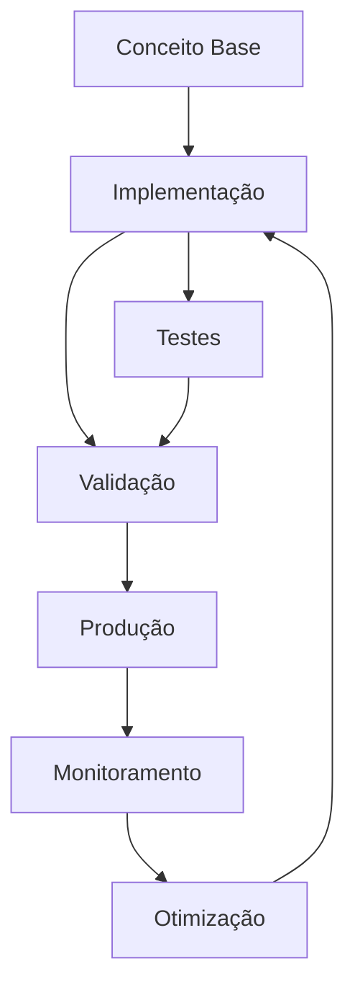

# Modelagem de Sistemas

# Módulo 09 — Modelagem de Dados: Prisma e PostgreSQL

**A base de todo sistema Enterprise.**

---


## Objetivos de Aprendizagem

Ao final deste modulo, voce sera capaz de:

- **Definir** os conceitos fundamentais de Module 09 Modelagem
- **Explicar** as estrategias e padroes envolvidos
- **Aplicar** as tecnicas em cenarios reais de desenvolvimento
- **Analisar** as compensacoes (trade-offs) entre diferentes abordagens
- **Implementar** solucoes seguindo as melhores praticas do mercado


## 1. Por que modelagem importa


> **Nota:** Este conceito é fundamental para o entendimento dos tópicos seguintes. Certifique-se de compreendê-lo antes de prosseguir.

> **Dica:** Ao implementar em projetos reais, comece com uma versão simplificada e iterativamente adicione complexidade.


Modelagem de dados é a **fundação** do sistema. Erros aqui são os mais caros de corrigir.

### O custo de uma modelagem ruim

```text
Modelagem ruim:
  ┌──────────────────────────────────────────┐
  │  Tabela sem índices → query lenta        │
  │  Relação errada → dados inconsistentes   │
  │  Falta de soft delete → perda de dados   │
  │  Sem audit trail → impossível auditar    │
  │  Migração corretiva → horas de trabalho  │
  └──────────────────────────────────────────┘

Modelagem boa:
  ┌──────────────────────────────────────────┐
  │  Índices certos → queries rápidas        │
  │  Relações corretas → dados íntegros      │
  │  Constraints → validade dos dados        │
  │  Migrações testadas → sem surpresas      │
  └──────────────────────────────────────────┘
```markdown



> **Diagrama 1:** Visão geral do fluxo de trabalho abordado neste módulo. O ciclo contínuo de implementação → validação → produção → monitoramento → otimização garante entregas de qualidade.


---

## 2. Entidades e Relacionamentos

### Tipos de Relacionamento

```text
1:1  — Um usuário tem um perfil
1:N  — Um usuário tem muitos pedidos
N:M  — Um produto está em muitas categorias
```markdown

### Exemplo no Prisma

```prisma
// 1:1
model User {
  id      String  @id @default(cuid())
  email   String  @unique
  profile Profile?
}

model Profile {
  id        String @id @default(cuid())
  fullName  String
  avatarUrl String?
  userId    String @unique
  user      User   @relation(fields: [userId], references: [id])
}

// 1:N
model Order {
  id       String    @id @default(cuid())
  total    Decimal
  userId   String
  user     User      @relation(fields: [userId], references: [id])
  items    OrderItem[]
  createdAt DateTime @default(now())
}

model OrderItem {
  id        String  @id @default(cuid())
  orderId   String
  order     Order   @relation(fields: [orderId], references: [id])
  productId String
  product   Product @relation(fields: [productId], references: [id])
  quantity  Int
  price     Decimal
}

// N:M
model Product {
  id           String          @id @default(cuid())
  name         String
  categories   ProductCategory[]
}

model Category {
  id       String          @id @default(cuid())
  name     String
  products ProductCategory[]
}

model ProductCategory {
  productId  String
  categoryId String
  product    Product  @relation(fields: [productId], references: [id])
  category   Category @relation(fields: [categoryId], references: [id])

  @@id([productId, categoryId])
}
```text

---

## 3. Soft Delete e Audit Trail

### Soft Delete

Nunca delete dados definitivamente em sistemas Enterprise.

```prisma
model User {
  id        String    @id @default(cuid())
  email     String    @unique
  name      String
  createdAt DateTime  @default(now())
  updatedAt DateTime  @updatedAt
  deletedAt DateTime?  // Soft delete

  // Filtro global no Prisma
  @@where("@deletedAt is null")
}
```text

```typescript
// Service
class UserService {
  async softDelete(id: string): Promise<void> {
    await this.prisma.user.update({
      where: { id },
      data: { deletedAt: new Date() },
    });
  }

  async findAll(): Promise<User[]> {
    // O @@where garante que deleted não aparece
    return this.prisma.user.findMany();
  }
}
```text

### Audit Trail

```prisma
model AuditLog {
  id         String   @id @default(cuid())
  entity     String   // "User", "Order", "Product"
  entityId   String   // ID do registro
  action     String   // "CREATE", "UPDATE", "DELETE"
  changes    Json?    // { "before": {...}, "after": {...} }
  userId     String?
  ip         String?
  userAgent  String?
  createdAt  DateTime @default(now())

  @@index([entity, entityId])
  @@index([userId])
  @@index([createdAt])
}
```text

```typescript
// AuditService
class AuditService {
  async log(input: AuditInput): Promise<void> {
    await this.prisma.auditLog.create({
      data: {
        entity: input.entity,
        entityId: input.entityId,
        action: input.action,
        changes: JSON.parse(JSON.stringify(input.changes)),
        userId: input.userId,
        ip: input.ip,
        userAgent: input.userAgent,
      },
    });
  }
}

// Uso com hook do Prisma
prisma.$use(async (params, next) => {
  const result = await next(params);

  if (['create', 'update', 'delete'].includes(params.action)) {
    await auditService.log({
      entity: params.model,
      entityId: result?.id,
      action: params.action.toUpperCase(),
      changes: params.args.data,
    });
  }

  return result;
});
```text

---

## 4. Índices e Performance

### Quando criar índices

```prisma
model Order {
  id         String   @id @default(cuid())
  userId     String
  status     OrderStatus
  total      Decimal
  createdAt  DateTime @default(now())

  // Índice para busca por usuário (foreign key)
  @@index([userId])

  // Índice composto para filtro comum
  @@index([userId, status])

  // Índice para ordenação por data
  @@index([createdAt])

  // Índice parcial para pedidos ativos
  @@index([status, createdAt])
}
```markdown

### Regras de índices

```text
Crie índices para:
  - Foreign keys (toda FK deve ter índice)
  - Campos usados em WHERE
  - Campos usados em ORDER BY
  - Campos usados em JOIN

Evite:
  - Índices em colunas de baixa cardinalidade (boolean)
  - Muitos índices em tabelas pequenas (< 1000 registros)
  - Índices que nunca são usados
```markdown

### Query Performance

```typescript
// ❌ N+1 — busca em loop
const orders = await prisma.order.findMany();
for (const order of orders) {
  const items = await prisma.orderItem.findMany({
    where: { orderId: order.id },
  });
}

// ✅ Eager loading — busca tudo de uma vez
const orders = await prisma.order.findMany({
  include: {
    items: true,
    user: true,
  },
});
```text

---

## 5. Migrações Seguras

### Criando migrações

```bash
# Criar migration baseada no schema
npx prisma migrate dev --name create-user-table

# Aplicar em produção
npx prisma migrate deploy

# Resetar banco (dev)
npx prisma migrate reset
```markdown

### Migrações sem downtime

```prisma
// ❌ Ruim: renomear coluna diretamente (quebra queries em execução)
model User {
  fullname String  // Antigo
  name     String  // Novo — erro se ambas existirem
}

// ✅ Bom: expand-migrate-contract
// Passo 1: Adicionar nova coluna (sem remover antiga)
model User {
  fullname String?  // Nullable agora
  name     String?
}

// Passo 2: Preencher dados (script separado)
await prisma.user.updateMany({
  where: { name: null },
  data: { name: prisma.user.fullname }, // valor do campo antigo
});

// Passo 3: Remover coluna antiga (próxima release)
model User {
  name String  // Único campo
}
```text

---

## 6. Estratégias de Backup

### Tipos de backup

```text
Full:     Cópia completa do banco
  Quando: Diário
  Tempo:  Lento, ocupa espaço
  Restore: Completo, mais simples

Incremental: Apenas mudanças desde o último backup
  Quando: Horário
  Tempo:  Rápido, ocupa pouco espaço
  Restore: Precisa do full + todos incrementais

WAL (Write-Ahead Log): Log de transações
  Quando: Contínuo
  Uso:    Point-in-time recovery
```markdown

### Script de backup

```bash
#!/bin/bash
# backup.sh — backup PostgreSQL com compressão

DB_NAME="app"
DB_USER="admin"
BACKUP_DIR="/backups"
DATE=$(date +%Y%m%d_%H%M%S)

pg_dump -U $DB_USER -d $DB_NAME \
  --format=custom \
  --compress=9 \
  --file="$BACKUP_DIR/$DB_NAME-$DATE.dump"

# Manter apenas últimos 7 dias
find $BACKUP_DIR -name "*.dump" -mtime +7 -delete

echo "Backup concluído: $DB_NAME-$DATE.dump"
```markdown

### Restore

```bash
# Restore completo
pg_restore -U $DB_USER -d $DB_NAME \
  --clean \
  --if-exists \
  "$BACKUP_DIR/app-20260601_000000.dump"
```text

---

## 7. Schema completo de exemplo

O diagrama abaixo resume as entidades, atributos e cardinalidades do schema:


```prisma
generator client {
  provider = "prisma-client-js"
}

datasource db {
  provider = "postgresql"
  url      = env("DATABASE_URL")
}

enum UserRole {
  ADMIN
  MANAGER
  USER
}

enum OrderStatus {
  PENDING
  CONFIRMED
  SHIPPED
  DELIVERED
  CANCELLED
}

model Tenant {
  id        String   @id @default(cuid())
  slug      String   @unique
  name      String
  users     User[]
  createdAt DateTime @default(now())

  @@map("tenants")
}

model User {
  id        String    @id @default(cuid())
  email     String    @unique
  name      String
  password  String
  role      UserRole  @default(USER)
  tenantId  String
  tenant    Tenant    @relation(fields: [tenantId], references: [id])
  orders    Order[]
  createdAt DateTime  @default(now())
  updatedAt DateTime  @updatedAt
  deletedAt DateTime?

  @@index([tenantId])
  @@index([email])
  @@index([tenantId, role])
  @@map("users")
}

model Product {
  id          String   @id @default(cuid())
  sku         String   @unique
  name        String
  description String?
  price       Decimal  @db.Decimal(10, 2)
  stock       Int      @default(0)
  active      Boolean  @default(true)
  tenantId    String
  orderItems  OrderItem[]
  createdAt   DateTime @default(now())
  updatedAt   DateTime @updatedAt
  deletedAt   DateTime?

  @@index([tenantId])
  @@index([sku])
  @@index([active])
  @@map("products")
}

model Order {
  id         String      @id @default(cuid())
  total      Decimal     @db.Decimal(10, 2)
  status     OrderStatus @default(PENDING)
  userId     String
  user       User        @relation(fields: [userId], references: [id])
  items      OrderItem[]
  createdAt  DateTime    @default(now())
  updatedAt  DateTime    @updatedAt

  @@index([userId])
  @@index([status])
  @@index([createdAt])
  @@map("orders")
}

model OrderItem {
  id        String  @id @default(cuid())
  orderId   String
  order     Order   @relation(fields: [orderId], references: [id])
  productId String
  product   Product @relation(fields: [productId], references: [id])
  quantity  Int
  price     Decimal @db.Decimal(10, 2)

  @@index([orderId])
  @@index([productId])
  @@map("order_items")
}

model AuditLog {
  id        String   @id @default(cuid())
  entity    String
  entityId  String
  action    String
  changes   Json?
  userId    String?
  ip        String?
  createdAt DateTime @default(now())

  @@index([entity, entityId])
  @@index([userId])
  @@index([createdAt])
  @@map("audit_logs")
}
```markdown

---

## Resumo

1. **Modelagem é a fundação** — erros aqui são os mais caros
2. **1:1, 1:N, N:M** — conheça os 3 tipos de relacionamento
3. **Soft Delete** — nunca delete dados (deletedAt)
4. **Audit Trail** — toda ação importante deve ser registrada
5. **Índices** — toda FK precisa de índice; índices compostos para filtros comuns
6. **Eager Loading** — previne N+1
7. **Migrações seguras** — expand-migrate-contract para mudanças sem downtime
8. **Backup** — full + incremental + WAL; testar restore periodicamente

| Conceito | Descrição | Aplicação |
|----------|-----------|-----------|
| Abordagem Principal | Estratégia central discutida no módulo | Implementação direta |
| Padrão Relacionado | Padrão complementar | Casos de uso específicos |
| Boa Prática | Recomendação de mercado | Cenários de produção |
| Anti-padrão | Prática a ser evitada | Consequências negativas |

## Exercícios: Prática

### Nível 1 — Fácil

1. Implemente uma versão simplificada do conceito abordado neste módulo.
   **Objetivo:** Fixar os fundamentos através de um exemplo prático guiado.

### Nível 2 — Intermediário

2. Estenda a implementação anterior adicionando tratamento de erros e validações.
   **Objetivo:** Aplicar boas práticas em um contexto mais realista.

### Nível 3 — Difícil

3. Projete e implemente uma solução completa integrando múltiplos conceitos do módulo.
   **Objetivo:** Demonstrar domínio dos tópicos em um cenário complexo.

**Gabarito:** As soluções dos exercícios estão disponíveis no diretório `exercicios/gabarito.md`.
**Critérios de correção:** Clareza da solução, uso correto dos padrões, tratamento de edge cases e qualidade do código.

## Quiz de Verificação

Responda as perguntas abaixo para verificar seu entendimento:

1. Qual a principal vantagem da abordagem apresentada?
   a) Simplicidade de implementação
   b) Escalabilidade horizontal
   c) Baixo custo operacional
   d) Todas as anteriores

2. Em qual cenário a estratégia discutida é mais recomendada?
   a) Aplicações monolíticas
   b) Sistemas distribuídos
   c) Aplicações desktop
   d) Scripts simples

3. Qual prática NÃO é recomendada ao implementar esta solução?
   a) Usar transações para garantir consistência
   b) Ignorar tratamento de erros
   c) Implementar logging adequado
   d) Testar em ambiente isolado

> **Respostas:** Consulte o arquivo `quiz/quiz.md` para conferir as respostas comentadas.

## Referências

- Documentação oficial das tecnologias abordadas
- Artigos e publicações referenciados ao longo do módulo
- Código-fonte dos exemplos disponível no repositório do curso

