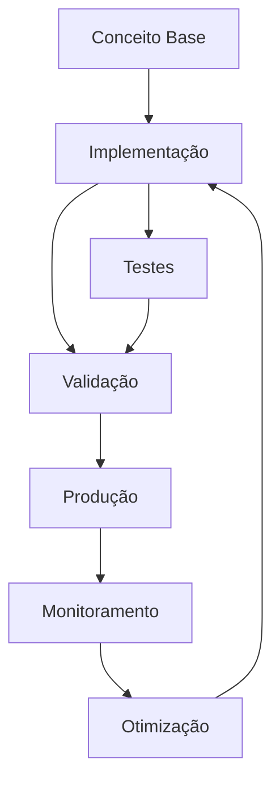

# Multi-Tenant: Migrations, Dados e Seed

# Módulo 13c — Multi-Tenant: Migrations, Dados e Seed

**Migrations multi-tenant, estratégias de dados compartilhados vs isolados e seed automático por tenant.**


## Objetivos de Aprendizagem

Ao final deste modulo, voce sera capaz de:

- **Definir** os conceitos fundamentais de Module 13C Multi Tenant Dados
- **Explicar** as estrategias e padroes envolvidos
- **Aplicar** as tecnicas em cenarios reais de desenvolvimento
- **Analisar** as compensacoes (trade-offs) entre diferentes abordagens
- **Implementar** solucoes seguindo as melhores praticas do mercado


## 1. Migrations Multi-Tenant


> **Nota:** Este conceito é fundamental para o entendimento dos tópicos seguintes. Certifique-se de compreendê-lo antes de prosseguir.

> **Dica:** Ao implementar em projetos reais, comece com uma versão simplificada e iterativamente adicione complexidade.


### 1.1 Database per Tenant

```typescript
// migrate-all-tenants.ts
import { Pool } from 'pg';
import { readMigrationFiles } from './migration-runner';

async function migrateAllTenants(): Promise<void> {
  const tenants = [
    { id: 'acme', dbUrl: 'postgresql://.../acme' },
    { id: 'zeta', dbUrl: 'postgresql://.../zeta' },
    { id: 'omega', dbUrl: 'postgresql://.../omega' },
  ];

  const migrations = await readMigrationFiles();

  for (const tenant of tenants) {
    console.log(`[${tenant.id}] Iniciando migrations...`);
    const pool = new Pool({ connectionString: tenant.dbUrl });

    try {
      for (const migration of migrations) {
        await pool.query('BEGIN');
        try {
          await pool.query(migration.sql);
          await pool.query(
            `INSERT INTO _migrations (name, applied_at) VALUES ($1, NOW())`,
            [migration.name]
          );
          await pool.query('COMMIT');
          console.log(`[${tenant.id}] ✅ ${migration.name}`);
        } catch (err) {
          await pool.query('ROLLBACK');
          console.error(`[${tenant.id}] ❌ ${migration.name}:`, err);
          throw err; // abortar todos? ou continuar?
        }
      }
    } finally {
      await pool.end();
    }
  }
}
```text



> **Diagrama 1:** Visão geral do fluxo de trabalho abordado neste módulo. O ciclo contínuo de implementação → validação → produção → monitoramento → otimização garante entregas de qualidade.


### 1.2 Schema per Tenant

```typescript
// schema-migration-runner.ts
const pool = new Pool({ connectionString: process.env.DATABASE_URL });

const MIGRATIONS = [
  {
    name: '001_create_users',
    sql: `
      CREATE TABLE IF NOT EXISTS __SCHEMA__.users (
        id UUID PRIMARY KEY DEFAULT gen_random_uuid(),
        name TEXT NOT NULL,
        email TEXT NOT NULL,
        role TEXT NOT NULL DEFAULT 'member',
        created_at TIMESTAMPTZ DEFAULT NOW()
      );
    `,
  },
  {
    name: '002_add_phone',
    sql: `
      ALTER TABLE __SCHEMA__.users
      ADD COLUMN IF NOT EXISTS phone TEXT;
    `,
  },
  {
    name: '003_create_projects',
    sql: `
      CREATE TABLE IF NOT EXISTS __SCHEMA__.projects (
        id UUID PRIMARY KEY DEFAULT gen_random_uuid(),
        name TEXT NOT NULL,
        description TEXT,
        created_at TIMESTAMPTZ DEFAULT NOW()
      );
    `,
  },
];

async function migrateSchema(schema: string): Promise<void> {
  const client = await pool.connect();

  try {
    // Criar schema se não existe
    await client.query(`CREATE SCHEMA IF NOT EXISTS "${schema}"`);

    // Criar tabela de controle de migrations no schema
    await client.query(`
      CREATE TABLE IF NOT EXISTS "${schema}"._migrations (
        name TEXT PRIMARY KEY,
        applied_at TIMESTAMPTZ DEFAULT NOW()
      )
    `);

    for (const migration of MIGRATIONS) {
      // Verificar se já foi aplicada
      const exists = await client.query(
        `SELECT 1 FROM "${schema}"._migrations WHERE name = $1`,
        [migration.name]
      );

      if (exists.rows.length > 0) continue;

      // Aplicar migration
      const sql = migration.sql.replace(/__SCHEMA__/g, `"${schema}"`);
      await client.query('BEGIN');
      try {
        await client.query(sql);
        await client.query(
          `INSERT INTO "${schema}"._migrations (name) VALUES ($1)`,
          [migration.name]
        );
        await client.query('COMMIT');
        console.log(`[${schema}] ✅ ${migration.name}`);
      } catch (err) {
        await client.query('ROLLBACK');
        throw err;
      }
    }
  } finally {
    client.release();
  }
}

async function migrateAllSchemas(): Promise<void> {
  const tenants = await pool.query('SELECT slug FROM tenants WHERE active = true');
  for (const tenant of tenants.rows) {
    await migrateSchema(`tenant_${tenant.slug}`);
  }
}
```markdown

### 1.3 Estratégias de Rollback

```typescript
// migrate-with-transaction.ts
async function migrateTenantWithTransaction(
  tenantId: string,
  migrationSql: string
): Promise<void> {
  const schema = `tenant_${tenantId}`;
  const client = await pool.connect();

  try {
    await client.query('BEGIN');

    // Isolar a transação no schema do tenant
    await client.query(`SET search_path TO "${schema}"`);

    await client.query(migrationSql);
    await client.query(`INSERT INTO _migrations (name) VALUES ($1)`, [
      '004_add_status',
    ]);

    await client.query('COMMIT');
    console.log(`[${tenantId}] Migration aplicada com sucesso`);
  } catch (error) {
    await client.query('ROLLBACK');
    console.error(`[${tenantId}] Migration falhou, rollback executado`);
    throw error;
  } finally {
    client.release();
  }
}
```text

### 1.4 Shared Database

```typescript
// shared-migration.ts
// Migrations tradicionais — funcionam como app single-tenant

async function migrateShared(): Promise<void> {
  const client = await pool.connect();
  try {
    await client.query('BEGIN');

    // Adicionar coluna tenant_id se não existe
    await client.query(`
      ALTER TABLE users
      ADD COLUMN IF NOT EXISTS tenant_id TEXT NOT NULL DEFAULT 'default'
    `);

    // Índices compostos para performance
    await client.query(`
      CREATE INDEX IF NOT EXISTS idx_users_tenant_email
      ON users (tenant_id, email)
    `);

    await client.query(`
      CREATE INDEX IF NOT EXISTS idx_orders_tenant_created
      ON orders (tenant_id, created_at DESC)
    `);

    await client.query('COMMIT');
  } catch (error) {
    await client.query('ROLLBACK');
    throw error;
  } finally {
    client.release();
  }
}
```markdown

---

## 2. Dados Compartilhados vs Por Tenant

### 2.1 Tabelas Globais (Compartilhadas)

Dados que **não pertencem a nenhum tenant específico** e são comuns a todos:

```typescript
// Globais — uma única instância para o sistema todo
interface Plan {
  id: string;
  name: string;              // "Free", "Pro", "Enterprise"
  maxUsers: number;
  maxStorage: number;        // MB
  monthlyPrice: number;
  features: string[];        // ["api_access", "custom_domain", "advanced_reports"]
}

interface FeatureFlag {
  id: string;
  key: string;               // "audit_log"
  description: string;
  enabledByDefault: boolean;
}

interface SystemConfig {
  key: string;               // "max_upload_size_mb"
  value: string;
  description: string;
}

interface AuditLog {
  id: string;
  tenantId: string;
  action: string;
  userId: string;
  metadata: JSON;
  createdAt: Date;
}
```text

### 2.2 Tabelas Por Tenant (Isoladas)

Dados que **pertencem a um tenant específico** e devem ser isolados:

```typescript
// Isoladas por tenant
interface User {
  id: string;
  tenantId: string;          // FK implícita para o tenant
  name: string;
  email: string;
  role: 'admin' | 'member' | 'viewer';
  createdAt: Date;
}

interface Project {
  id: string;
  tenantId: string;
  name: string;
  description?: string;
  status: 'active' | 'archived';
  createdAt: Date;
}

interface Task {
  id: string;
  tenantId: string;
  projectId: string;
  title: string;
  assigneeId?: string;
  status: 'todo' | 'doing' | 'done';
  createdAt: Date;
}

interface Invoice {
  id: string;
  tenantId: string;
  number: string;
  amount: number;
  status: 'pending' | 'paid' | 'cancelled';
  dueDate: Date;
}
```markdown

### 2.3 Regra Prática

```text
┌─────────────────────────────────────────────────────┐
│              DADOS GLOBAIS (shared)                  │
│                                                      │
│  • Planos e preços          • Feature flags          │
│  • Configurações do sistema  • Templates              │
│  • Catálogo de integrações   • Regiões/Países        │
│  • Auditoria centralizada    • Webhooks system        │
├─────────────────────────────────────────────────────┤
│              DADOS POR TENANT (isolados)             │
│                                                      │
│  • Usuários e permissões     • Projetos e tarefas    │
│  • Faturas e pagamentos      • Produtos e catálogo   │
│  • Configurações do tenant   • Logs de atividade     │
│  • Arquivos e uploads        • Relatórios gerados    │
└─────────────────────────────────────────────────────┘
```markdown

### 2.4 Implementação em Schema per Tenant

```sql
-- Schema global (público)
CREATE SCHEMA IF NOT EXISTS public;

CREATE TABLE public.plans (
  id UUID PRIMARY KEY DEFAULT gen_random_uuid(),
  name TEXT NOT NULL,
  max_users INT NOT NULL,
  monthly_price NUMERIC(10,2) NOT NULL,
  features JSONB NOT NULL DEFAULT '[]'
);

CREATE TABLE public.tenants (
  id UUID PRIMARY KEY DEFAULT gen_random_uuid(),
  slug TEXT UNIQUE NOT NULL,
  name TEXT NOT NULL,
  plan_id UUID REFERENCES public.plans(id),
  active BOOLEAN DEFAULT true,
  created_at TIMESTAMPTZ DEFAULT NOW()
);

-- Schema do tenant
CREATE SCHEMA IF NOT EXISTS tenant_acme;

CREATE TABLE tenant_acme.users (
  id UUID PRIMARY KEY DEFAULT gen_random_uuid(),
  tenant_id UUID REFERENCES public.tenants(id),
  name TEXT NOT NULL,
  email TEXT NOT NULL,
  role TEXT NOT NULL DEFAULT 'member',
  created_at TIMESTAMPTZ DEFAULT NOW()
);

-- Query que cruza dado global com dado do tenant
SELECT u.name, p.name as plan_name
FROM tenant_acme.users u
JOIN public.tenants t ON t.id = u.tenant_id
JOIN public.plans p ON p.id = t.plan_id
WHERE u.email = 'joao@acme.com';
```text

---

## 3. Seed por Tenant

### 3.1 Seed Automático ao Criar Tenant

```typescript
// tenant-seed.ts
async function seedNewTenant(tenantSlug: string, plan: string): Promise<void> {
  const schema = `tenant_${tenantSlug}`;
  const client = await pool.connect();

  try {
    await client.query(`CREATE SCHEMA IF NOT EXISTS "${schema}"`);

    // 1. Migrations básicas
    await client.query(`
      CREATE TABLE IF NOT EXISTS "${schema}".users (
        id UUID PRIMARY KEY DEFAULT gen_random_uuid(),
        name TEXT NOT NULL,
        email TEXT NOT NULL,
        role TEXT NOT NULL DEFAULT 'member',
        created_at TIMESTAMPTZ DEFAULT NOW()
      )
    `);

    await client.query(`
      CREATE TABLE IF NOT EXISTS "${schema}".projects (
        id UUID PRIMARY KEY DEFAULT gen_random_uuid(),
        name TEXT NOT NULL,
        description TEXT,
        status TEXT DEFAULT 'active',
        created_at TIMESTAMPTZ DEFAULT NOW()
      )
    `);

    await client.query(`
      CREATE TABLE IF NOT EXISTS "${schema}".settings (
        key TEXT PRIMARY KEY,
        value TEXT NOT NULL
      )
    `);

    // 2. Seed data padrão
    await client.query(`
      INSERT INTO "${schema}".users (name, email, role)
      VALUES ('Admin', 'admin@${tenantSlug}.com', 'admin')
    `);

    await client.query(`
      INSERT INTO "${schema}".settings (key, value) VALUES
        ('locale', 'pt-BR'),
        ('timezone', 'America/Sao_Paulo'),
        ('notification_email', 'true'),
        ('max_upload_size_mb', '10'),
        ('default_language', 'pt')
    `);

    // 3. Dados condicionais por plano
    if (plan === 'enterprise') {
      await client.query(`
        INSERT INTO "${schema}".settings (key, value) VALUES
          ('custom_domain', ''),
          ('sso_enabled', 'true'),
          ('audit_log_retention_days', '365')
      `);
    }

    console.log(`[${tenantSlug}] Seed concluído`);
  } catch (error) {
    console.error(`[${tenantSlug}] Seed falhou:`, error);
    throw error;
  } finally {
    client.release();
  }
}

// Hook na criação do tenant
async function createTenant(data: { slug: string; name: string; plan: string }) {
  const result = await pool.query(
    `INSERT INTO tenants (slug, name, plan_id)
     VALUES ($1, $2, (SELECT id FROM plans WHERE name = $3))
     RETURNING *`,
    [data.slug, data.name, data.plan]
  );

  const tenant = result.rows[0];
  await seedNewTenant(tenant.slug, data.plan);

  return tenant;
}
```markdown

### 3.2 Comandos CLI (NestJS Command)

```typescript
// tenant.command.ts
import { Command, CommandRunner } from 'nest-commander';
import { TenantService } from './tenant.service';

@Command({ name: 'tenant:create', description: 'Cria novo tenant com seed' })
export class TenantCommand extends CommandRunner {
  constructor(private tenantService: TenantService) {
    super();
  }

  async run(inputs: string[]): Promise<void> {
    const [slug, name, plan = 'free'] = inputs;

    if (!slug || !name) {
      console.error('Uso: tenant:create <slug> <name> [plan]');
      process.exit(1);
    }

    console.log(`Criando tenant: ${slug} (${name}) - Plano: ${plan}`);
    const tenant = await this.tenantService.createTenant({ slug, name, plan });
    console.log(`✅ Tenant ${tenant.slug} criado com sucesso!`);
  }
}
```text

### 3.3 Idempotência

```typescript
// Seeds devem ser idempotentes (podem rodar múltiplas vezes)
async function seedSettingsIfNotExists(schema: string): Promise<void> {
  const defaultSettings = [
    { key: 'locale', value: 'pt-BR' },
    { key: 'timezone', value: 'America/Sao_Paulo' },
    { key: 'notification_email', value: 'true' },
  ];

  for (const setting of defaultSettings) {
    await pool.query(`
      INSERT INTO "${schema}".settings (key, value)
      VALUES ($1, $2)
      ON CONFLICT (key) DO NOTHING
    `, [setting.key, setting.value]);
  }
}
```text

---

| Conceito | Descrição | Aplicação |
|----------|-----------|-----------|
| Abordagem Principal | Estratégia central discutida no módulo | Implementação direta |
| Padrão Relacionado | Padrão complementar | Casos de uso específicos |
| Boa Prática | Recomendação de mercado | Cenários de produção |
| Anti-padrão | Prática a ser evitada | Consequências negativas |

## Exercícios: Prática

### Nível 1 — Fácil

1. Implemente uma versão simplificada do conceito abordado neste módulo.
   **Objetivo:** Fixar os fundamentos através de um exemplo prático guiado.

### Nível 2 — Intermediário

2. Estenda a implementação anterior adicionando tratamento de erros e validações.
   **Objetivo:** Aplicar boas práticas em um contexto mais realista.

### Nível 3 — Difícil

3. Projete e implemente uma solução completa integrando múltiplos conceitos do módulo.
   **Objetivo:** Demonstrar domínio dos tópicos em um cenário complexo.

**Gabarito:** As soluções dos exercícios estão disponíveis no diretório `exercicios/gabarito.md`.
**Critérios de correção:** Clareza da solução, uso correto dos padrões, tratamento de edge cases e qualidade do código.

## Quiz de Verificação

Responda as perguntas abaixo para verificar seu entendimento:

1. Qual a principal vantagem da abordagem apresentada?
   a) Simplicidade de implementação
   b) Escalabilidade horizontal
   c) Baixo custo operacional
   d) Todas as anteriores

2. Em qual cenário a estratégia discutida é mais recomendada?
   a) Aplicações monolíticas
   b) Sistemas distribuídos
   c) Aplicações desktop
   d) Scripts simples

3. Qual prática NÃO é recomendada ao implementar esta solução?
   a) Usar transações para garantir consistência
   b) Ignorar tratamento de erros
   c) Implementar logging adequado
   d) Testar em ambiente isolado

> **Respostas:** Consulte o arquivo `quiz/quiz.md` para conferir as respostas comentadas.

## Conclusão

Neste módulo, exploramos os conceitos e práticas fundamentais abordados. A aplicação correta desses princípios permite construir sistemas mais robustos, escaláveis e maintainíveis. Por exemplo, as estratégias discutidas podem ser aplicadas diretamente em projetos reais. Portanto, recomendamos revisar os exercícios propostos e aplicar o conhecimento adquirido em cenários práticos.

### Principais aprendizados

- Compreensão dos conceitos centrais e sua aplicação prática
- Capacidade de tomar decisões informadas sobre trade-offs
- Domínio das técnicas de implementação apresentadas
- Base sólida para avançar para tópicos mais complexos

## Referências

- Documentação oficial das tecnologias abordadas
- Artigos e publicações referenciados ao longo do módulo
- Código-fonte dos exemplos disponível no repositório do curso

