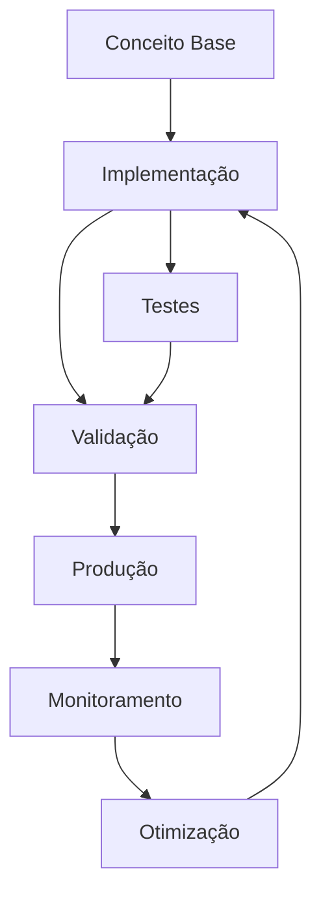

# Bônus — O Erro de 90% ao Usar IA para Programar

# O erro que 90% das pessoas cometem usando IA para programar

**Nível:** Conceitos / Engenharia
**Tempo estimado:** 20 minutos
**Público-alvo:** Desenvolvedores iniciantes e intermediários que utilizam assistentes de IA no dia a dia

---

## Pré-requisitos

- Experiência básica com programação em qualquer linguagem
- Familiaridade com uso de assistentes de IA (GitHub Copilot, Claude Code, ChatGPT, etc.)
- Noções fundamentais de Git e versionamento

## Objetivos de aprendizagem

Ao final desta aula, o aluno será capaz de:

1. **Identificar** os 5 erros mais comuns ao usar IA para programar
2. **Diferenciar** uso produtivo de uso prejudicial de assistentes de IA
3. **Aplicar** técnicas de prompt estruturado para obter respostas precisas
4. **Estabelecer** um fluxo de validação e revisão para código gerado por IA
5. **Configurar** arquivos de instrução do projeto (AGENTS.md / CLAUDE.md) para melhorar a consistência do agente

## Competências desenvolvidas

**Hard skills:**
- Prompt engineering aplicado à programação
- Code review de código gerado por IA
- Configuração de assistentes de IA no projeto
- Automação de testes como ferramenta de verificação

**Soft skills:**
- Pensamento crítico e validação de fontes
- Comunicação clara e estruturada
- Responsabilidade profissional sobre o código produzido
- Iteração e refinamento contínuo

---

## 1. Introdução: por que 90% cometem esse erro


> **Nota:** Este conceito é fundamental para o entendimento dos tópicos seguintes. Certifique-se de compreendê-lo antes de prosseguir.

> **Dica:** Ao implementar em projetos reais, comece com uma versão simplificada e iterativamente adicione complexidade.


Era uma terça-feira comum. O desenvolvedor precisava de uma função simples para validar emails. Pediu ao ChatGPT, copiou o código, fez deploy. Na sexta, o banco de dados estava cheio de registros com emails como "usuario@". Aquela função — que parecia perfeita — só verificava se existia um "@" na string.

A IA acertou a sintaxe. Errou a lógica. O desenvolvedor não revisou. Produção quebrou.

Esse cenário se repete milhares de vezes todos os dias. Assistentes de IA geram código em segundos — mas essa velocidade tem um custo oculto. Pesquisas da indústria revelam um padrão preocupante:

| Dado | Fonte |
|------|-------|
| **63%** dos desenvolvedores encontraram erros inesperados ao usar IA | Stack Overflow Survey |
| **68%** têm dificuldade em integrar IA efetivamente nos workflows | Stack Overflow Survey |
| Sem regras configuradas, código gerado por IA tem **~40% de erro** | Claude Code Pro Pack |
| Com 12 regras, o erro cai para **~3%** — melhoria de **~13,3x** | Claude Code Pro Pack Research (DEV.to) |

O problema não é a IA. O problema é **como usamos a IA**. A maioria dos desenvolvedores repete os mesmos 5 erros — e 90% sequer percebe que os está cometendo.

> [!NOTE]
> Esta aula compila fontes oficiais (GitHub, Anthropic, OpenCode), pesquisa acadêmica (arXiv 2512.05239) e benchmarks da indústria para mapear os erros e, mais importante, mostrar como corrigi-los.

**Pare e pense:** quantas vezes você copiou código de IA sem ler cada linha? Se a resposta for "algumas vezes", esta aula é para você.

---

## 2. Erro 1: Confiar cegamente na saída da IA

### Definição

Aceitar o código gerado pela IA como correto sem qualquer questionamento, validação ou revisão.

### Por que acontece

A IA gera respostas com **alta fluência e aparência de confiança**. O código parece correto, compila e muitas vezes até passa em testes simples — mas pode conter bugs sutis de lógica, segurança ou performance.

> "A IA erra com confiança, não com hesitação." — TechTudo

O problema é psicológico: nosso cérebro associa fluência a competência. Quando a IA escreve um parágrafo ou função que "soa bem", relaxamos a guarda. Só que a IA não sabe o que está fazendo — ela está apenas completando padrões estatísticos.

O survey arXiv 2512.05239 classifica os bugs encontrados em código gerado por IA em quatro categorias:

| Tipo de Bug | O que significa | Exemplo |
|-------------|-----------------|---------|
| **Lógica** | Código sintaticamente correto, mas semanticamente errado | Valida email só com `includes('@')` |
| **Segurança** | Vulnerabilidades introduzidas | SQL injection, senha em MD5 |
| **Performance** | Código ineficiente | Loop aninhado desnecessário, N+1 queries |
| **Compatibilidade** | Dependências incorretas ou desatualizadas | Import de biblioteca que não existe mais |

### Consequência

Bugs em produção, vulnerabilidades de segurança e dívida técnica acumulada. Como alerta a documentação oficial do GitHub Copilot:

> "Remember that you are in charge, and Copilot is a powerful tool at your service."

Traduzindo: o responsável é você. A ferramenta é só a ferramenta.

### Exemplo concreto

```javascript
// 🚫 Código gerado por IA — parece certo, mas está errado
function calculateDiscount(price, coupon) {
  if (coupon === 'SAVE10') {
    return price * 0.9;
  }
  return price; // ❌ Esqueceu de validar se price é número
}

calculateDiscount('cem reais', 'SAVE10'); // NaN em produção
```text



> **Diagrama 1:** Visão geral do fluxo de trabalho abordado neste módulo. O ciclo contínuo de implementação → validação → produção → monitoramento → otimização garante entregas de qualidade.


### Como corrigir

Passo a passo para todo código gerado por IA:

1. **Leia cada linha antes de implementar** — se não entendeu, não use
2. **Teste com casos extremos** — string vazia, null, negativo, tipos inesperados
3. **Valide dependências sugeridas** — a IA pode inventar bibliotecas que não existem
4. **Use type checking** (TypeScript, mypy, etc.) para pegar erros de tipo

> [!TIP]
> Trate a saída da IA como um **rascunho inicial**, não como produto acabado. A diferença entre um profissional e um amador é que o profissional verifica antes de entregar.

---

## 3. Erro 2: Prompts vagos sem contexto

### Definição

Fazer pedidos genéricos e esperar respostas precisas e úteis.

### Por que acontece

A IA opera com base em probabilidades: quanto menos contexto, mais genérica a resposta. É como perguntar "Me recomenda um filme?" para um amigo — você vai receber uma lista genérica. Agora pergunte "Me recomenda um filme de suspense coreano com menos de 2 horas" — a resposta muda completamente.

O mesmo vale para código.

> "Pedido fraco, resposta fraca em escala industrial." — TechTudo

### Consequência

Respostas genéricas que não resolvem o problema real. O desenvolvedor perde tempo iterando sobre sugestões irrelevantes, se frustra com a ferramenta e culpa a IA — quando o problema era o prompt.

### Exemplo concreto

<table>
<tr>
<td width="50%">

**Prompt vago** ❌

"Melhore esse código"

*A IA não sabe:*
- Qual linguagem?
- Qual critério de "melhor"?
- Performance? Legibilidade? Segurança?
- Qual o contexto do projeto?

</td>
<td width="50%">

**Prompt estruturado** ✅

"Refatore a função `handleSubmit` no arquivo `src/forms.ts` para usar `async/await` com `try-catch`, mantendo o mesmo comportamento e seguindo o padrão de error handling do resto do projeto."

*A IA sabe:*
- Arquivo e função exatos
- O que fazer (refatorar)
- Como fazer (async/await + try-catch)
- Restrições (manter comportamento, seguir padrão existente)

</td>
</tr>
</table>

### Como corrigir

Estruture todo prompt com três elementos:

| Elemento | Pergunta guia | Exemplo |
|----------|---------------|---------|
| **Contexto** | Qual é o cenário? | "No arquivo `login.ts`, função `authenticateUser`..." |
| **Intenção** | O que você quer alcançar? | "...precisa validar token JWT antes de consultar o banco" |
| **Formato esperado** | Como deve ser a resposta? | "...retorne `Result<T, E>`, sem `throw`, com testes em Vitest" |

> [!TIP]
> Antes de escrever um prompt, pergunte-se: "Se eu desse esta instrução para um colega desenvolvedor, ele saberia exatamente o que fazer?" Se a resposta for não, adicione mais contexto.

---

## 4. Erro 3: Pular code review e testes

### Definição

Ignorar as etapas de revisão de código e testes automatizados para código gerado por IA, tratando-o como isento de erros.

### Por que acontece

A velocidade da IA cria a ilusão de que o código já passou por um "controle de qualidade implícito". O desenvolvedor assume que, se a IA gerou, está correto.

> "Se você copia e cola sem ler, o erro deixa de ser da ferramenta. Passa a ser seu." — TechTudo

Essa falsa sensação de segurança é traiçoeira. O código gerado por IA **não foi revisado por ninguém**. Ele é o equivalente a um primeiro rascunho escrito por alguém que nunca usou seu sistema.

A documentação do Claude Code é categórica:

> "Give Claude a check it can run: tests, a build, a screenshot to compare. It's the difference between a session you watch and one you walk away from."

Sem uma verificação executável, "parece pronto" é o único sinal disponível. Você se torna o loop de verificação — cada erro espera **você** perceber.

### Consequência

Dívida técnica acumulada, bugs não detectados, vulnerabilidades de segurança e código de difícil manutenção. O commit vai para o repositório com **seu nome** — a IA não assume responsabilidade.

### Como corrigir

1. **Code review obrigatório** — revise código gerado por IA como revisaria de um colega. Pergunte: "Eu aceitaria isso num PR?"
2. **Testes automatizados como verificação** — antes de aceitar o código, peça para a IA gerar os testes também
3. **CI pipeline** — todo código, inclusive o gerado por IA, deve passar pelos mesmos checks automatizados

> [!WARNING]
> Pular code review em código gerado por IA não economiza tempo — ele **terceiriza o risco** para você. O bug vai aparecer, a pergunta vai ser "quem autorizou isso?", e a resposta será seu nome no commit.

---

## 5. Erro 4: Ignorar configuração do projeto (AGENTS.md / CLAUDE.md)

### Definição

Não configurar arquivos de instrução persistente para os agentes de IA, deixando-os operar sem contexto do projeto.

### Por que acontece

Arquivos como `AGENTS.md` (OpenCode) e `CLAUDE.md` (Claude Code) funcionam como a memória de longo prazo do agente. Eles contêm regras, padrões e convenções do projeto.

Sem eles, a IA opera com conhecimento genérico. Ela não sabe se o projeto usa React 18 ou Vue 3. Não sabe se prefere `const` ou `function`. Não sabe se os testes são com Vitest ou Jest. **Ela chuta.**

> "5 minutos de configuração economizam horas de retrabalho." — OpenCode Community

### Consequência

Comportamento inconsistente do agente — o código gerado muda de estilo a cada interação, ignora padrões do projeto e força retrabalho manual.

Os números são contundentes:

| Configuração | Taxa de erro | Melhoria |
|-------------|:------------:|:--------:|
| Sem regras | ~40% | — |
| Com 4 regras básicas | ~11% | ~3,6x |
| Com 12 regras (pro pack) | ~3% | ~13,3x |

Fonte: Claude Code Pro Pack Research (DEV.to)

### Como corrigir

Crie um arquivo de instrução na raiz do projeto. A estrutura mínima inclui:

**Exemplo de `AGENTS.md` para um projeto front-end:**

```markdown
# Agente: Front-end

## Stack
React 18 + TypeScript + Tailwind CSS

## Regras
- Use arrow functions para componentes
- Prefira `const` sobre `let`
- Testes com Vitest, não Jest
- Erros devem usar `Result<T, E>` (never throw)
- Nomes de arquivo em kebab-case
- Componentes em `src/components/`, páginas em `src/pages/`
```text

> [!TIP]
> Invista 5 minutos agora para criar o `AGENTS.md`. É o investimento com maior retorno por minuto no uso de IA para programar. A cada novo projeto, comece por ele.

**Pare e pense:** seu projeto atual tem um arquivo de instruções para a IA? Se não, esse é o erro número 1 que você está cometendo sem perceber.

---

## 6. Erro 5: Tratar IA como resposta final

### Definição

Usar a primeira resposta da IA como solução definitiva, sem refinamento ou iteração.

### Por que acontece

A IA entrega respostas completas e aparentemente prontas. O desenvolvedor assume que a primeira tentativa é a melhor e encerra o ciclo ali. É o mesmo impulso de mandar um email sem reler — a gratificação imediata de "pronto" supera a disciplina de refinar.

> "A primeira resposta raramente é a melhor. Ela é o ponto de partida, não o produto final." — TechTudo

### Consequência

Resultados superficiais. O código funciona no caminho feliz, mas quebra nos casos extremos. O desenvolvedor perde a oportunidade de refinar, corrigir e adaptar a solução ao contexto real. Pior: nunca sabe o que perdeu.

### Exemplo concreto

Comparação entre primeira resposta vs. versão refinada de um prompt de validação de email:

```javascript
// 🚫 Primeira resposta (rascunho)
function validateEmail(email) {
  return email.includes('@');
  // ❌ Aceita "@", "a@", "a@b"
}

// ✅ Versão refinada com feedback
function validateEmail(email) {
  const emailRegex = /^[^\s@]+@[^\s@]+\.[^\s@]+$/;
  return emailRegex.test(email);
  // ✅ Rejeita "@", "a@", "a@b", aceita "user@domain.com"
}
```text

### Como corrigir

Trate IA como **processo iterativo**, não como resposta final:

1. **Obtenha uma primeira versão** — o rascunho inicial
2. **Revise e identifique pontos de melhoria** — o que está faltando?
3. **Refine com feedback direcionado** — seja específico sobre o que mudar
4. **Repita até atender aos critérios de qualidade** — quando passar nos testes e na revisão

> [!TIP]
> Em vez de reescrever o prompt do zero, **itere através de feedback**. Diga à IA especificamente o que ajustar: "Mude a nomenclatura para camelCase", "Extraia essa lógica para um hook separado" ou "Adicione tratamento para o caso de lista vazia."

A pesquisa SFEIR Institute confirma: desenvolvedores que iteram com feedback estruturado reduzem em **~35% as iterações necessárias** em comparação com quem reescreve prompts do zero.

---

## 7. Conclusão: como usar IA corretamente

Usar IA para programar não é sobre aceitar código — é sobre **colaboração inteligente**. A IA é uma ferramenta poderosa, mas sem direção, validação e contexto, ela produz resultados medíocres.

### Os 5 mandamentos do uso correto de IA

| # | Mandamento | Por quê |
|---|------------|---------|
| 1 | **Valide** toda saída da IA | IA erra com confiança, não com hesitação |
| 2 | **Estruture** prompts com contexto | Pedido fraco → resposta fraca |
| 3 | **Revise e teste** como qualquer código | Seu nome está no commit |
| 4 | **Configure** o projeto para a IA | 5 minutos economizam horas |
| 5 | **Itere**, não aceite a primeira resposta | Refinamento separa o mediano do excelente |

> [!NOTE]
> Desenvolvedores que aplicam essas práticas reduzem em **~35% as iterações necessárias** (SFEIR Institute) e produzem código com **~97% de acerto** (Claude Code Pro Pack).

### Diagrama conceitual: Fluxo ideal de uso de IA

```text
[Prompt Estruturado] → [IA gera rascunho] → [Code Review] → [Testes] → [Refinamento] → [Commit]
        ↑                                                                                |
        └────────────────────── Iteração (feedback) ────────────────────────────────────┘
```markdown

### Analogia principal

Usar IA para programar é como ter um **estagiário brilhante, mas inexperiente**. Ele trabalha rápido, escreve bem, mas precisa de supervisão, contexto e revisão constantes. Confiar cegamente nele é negligência; ignorá-lo é desperdício. O profissional sábio sabe exatamente quando delegar, quando revisar e como orientar.

---

## Recursos didáticos sugeridos

**Exemplo prático para sala de aula:**

```javascript
// Prompt vago: "Valide esse email"
function validateEmail(email) {
  return email.includes('@'); // ❌ Superficial, não valida domínio nem formato
}

// Prompt estruturado: "Valide email com regex básica de formato, retorne booleano"
function validateEmail(email) {
  const emailRegex = /^[^\s@]+@[^\s@]+\.[^\s@]+$/;
  return emailRegex.test(email); // ✅ Validação mais robusta
}
```text

**Sugestão de diagrama:** Mapa mental dos 5 erros com causas e correções lado a lado, em formato de tabela visual.

**Mini-exercício mental para reflexão:** Pense no último código que você copiou de uma IA. Você revisou linha por linha? Escreveu testes? Se respondeu "não" para qualquer pergunta, identifique qual dos 5 erros você cometeu.

---

## Exercício prático

**Título:** Diagnosticando um prompt ruim

**Duração:** 5 minutos

**Instruções:**

1. Leia o prompt abaixo:
   > "Faz aí uma função de login pra mim"

2. Liste **3 problemas** com este prompt (erro 2 — prompt vago)

3. Reescreva o prompt seguindo a estrutura **Contexto + Intenção + Formato Esperado**

4. Se possível, execute o prompt reescrito em um assistente de IA e compare a qualidade da resposta

**Critérios de sucesso:**
- Identificou a falta de: linguagem/framework, definição de sucesso, tratamento de erros
- Novo prompt inclui pelo menos: stack tecnológica, regras de negócio, formato da resposta esperada

**Gabarito (problemas identificados):**
| Problema | Explicação |
|----------|------------|
| Falta linguagem/framework | "Faz aí" não diz se é Node, Python, PHP, etc. |
| Falta definição de sucesso | O que é "login"? JWT? Sessão? OAuth? |
| Falta tratamento de erros | E se o usuário não existe? Senha errada? Taxa de limite? |

**Prompt reescrito (exemplo):**

> "Crie uma função de login em Node.js com Express. O usuário envia email e senha no corpo da requisição. Valide o email com regex, compare a senha com bcrypt, e retorne um token JWT com expiração de 24h. Se o email não existir ou a senha estiver errada, retorne 401 com mensagem clara. Use `async/await` com `try-catch`."

---

## Desafio final

**Título:** Auditoria de código gerado por IA

**Duração:** 10 minutos

**Cenário:** Você recebeu um Pull Request com código 100% gerado por IA. O desenvolvedor apenas copiou e colou sem revisar.

**Tarefa:** Analise o trecho abaixo, identifique **todos os erros** e proponha correções:

```python
import os
import hashlib

def hash_password(password):
    # Gerar hash simples
    return hashlib.md5(password.encode()).hexdigest()

def save_user(username, password):
    hashed = hash_password(password)
    query = f"INSERT INTO users (username, password) VALUES ('{username}', '{hashed}')"
    os.system(f"mysql -e \"{query}\"")
```sql

**O que procurar:**
- **Erro 1:** confiar cegamente — código tem vulnerabilidades graves
- **Erro 3:** pular code review — falta de testes e validação
- **Erro 5:** tratar como resposta final — código inseguro em produção

**Resposta esperada:**

| Erro identificado | Por que é grave | Correção |
|-------------------|-----------------|----------|
| MD5 para senhas | MD5 é instantaneamente quebrável com ataques de dicionário | Use `bcrypt` ou `argon2` |
| SQL injection | String formatada diretamente permite injeção de comandos SQL | Use prepared statements / ORM |
| `os.system` | Expõe o shell a comandos maliciosos; desnecessário | Use biblioteca MySQL com parâmetros (`mysql-connector-python`) |
| Falta validação de entrada | `username` pode conter caracteres maliciosos | Valide e sanitize entradas |

**Código corrigido (exemplo):**

```python
import os
import bcrypt
import mysql.connector

def hash_password(password):
    return bcrypt.hashpw(password.encode(), bcrypt.gensalt())

def save_user(username, password):
    if not username or not password:
        raise ValueError("Campos obrigatórios")
    
    hashed = hash_password(password)
    conn = mysql.connector.connect(
        host=os.getenv("DB_HOST", "localhost"),
        user=os.getenv("DB_USER", "app"),
        password=os.getenv("DB_PASSWORD"),
        database=os.getenv("DB_NAME", "appdb")
    )
    cursor = conn.cursor()
    cursor.execute(
        "INSERT INTO users (username, password) VALUES (%s, %s)",
        (username, hashed)
    )
    conn.commit()
    cursor.close()
    conn.close()
```markdown

---

## Leituras complementares

- GitHub Copilot Best Practices — https://docs.github.com/en/copilot/get-started/best-practices
- Claude Code Best Practices — https://code.claude.com/docs/en/best-practices
- OpenCode Official Docs — https://opencode.ai/
- "A Survey of Bugs in AI-Generated Code" (arXiv 2512.05239) — https://arxiv.org/abs/2512.05239
- 5 erros ao usar IA que sabotam suas respostas (TechTudo) — https://www.techtudo.com.br/listas/2026/04/5-erros-ao-usar-ia-que-sabotam-suas-respostas-e-como-evita-los-edsoftwares.ghtml
- CLAUDE.md Rules: How to Cut AI Coding Mistakes from ~40% to ~3% (DEV.to) — https://dev.to/rams901/claudemd-rules-how-to-cut-ai-coding-mistakes-from-40-to-3-in-2026-2j7o
- 10 Most Common Mistakes Using AI Coding Tools (Ryz Labs) — https://www.ryzlabs.com/

## Quiz de Verificação

Responda as perguntas abaixo para verificar seu entendimento:

1. Qual a principal vantagem da abordagem apresentada?
   a) Simplicidade de implementação
   b) Escalabilidade horizontal
   c) Baixo custo operacional
   d) Todas as anteriores

2. Em qual cenário a estratégia discutida é mais recomendada?
   a) Aplicações monolíticas
   b) Sistemas distribuídos
   c) Aplicações desktop
   d) Scripts simples

3. Qual prática NÃO é recomendada ao implementar esta solução?
   a) Usar transações para garantir consistência
   b) Ignorar tratamento de erros
   c) Implementar logging adequado
   d) Testar em ambiente isolado

> **Respostas:** Consulte o arquivo `quiz/quiz.md` para conferir as respostas comentadas.

## Conclusão

Neste módulo, exploramos os conceitos e práticas fundamentais abordados. A aplicação correta desses princípios permite construir sistemas mais robustos, escaláveis e maintainíveis. Por exemplo, as estratégias discutidas podem ser aplicadas diretamente em projetos reais. Portanto, recomendamos revisar os exercícios propostos e aplicar o conhecimento adquirido em cenários práticos.

### Principais aprendizados

- Compreensão dos conceitos centrais e sua aplicação prática
- Capacidade de tomar decisões informadas sobre trade-offs
- Domínio das técnicas de implementação apresentadas
- Base sólida para avançar para tópicos mais complexos

