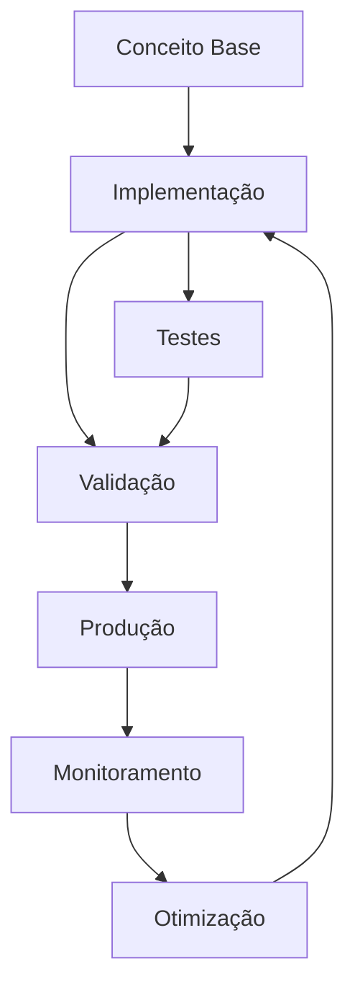

# Desenvolvimento Frontend

# Módulo 11 — Frontend: Interfaces Enterprise com Next.js

**Server Components, performance e acessibilidade.**

---


## Objetivos de Aprendizagem

Ao final deste modulo, voce sera capaz de:

- **Definir** os conceitos fundamentais de Module 11 Frontend
- **Explicar** as estrategias e padroes envolvidos
- **Aplicar** as tecnicas em cenarios reais de desenvolvimento
- **Analisar** as compensacoes (trade-offs) entre diferentes abordagens
- **Implementar** solucoes seguindo as melhores praticas do mercado


## 1. Next.js App Router — A Nova Forma de Pensar


> **Nota:** Este conceito é fundamental para o entendimento dos tópicos seguintes. Certifique-se de compreendê-lo antes de prosseguir.

> **Dica:** Ao implementar em projetos reais, comece com uma versão simplificada e iterativamente adicione complexidade.


O App Router do Next.js 13+ mudou fundamentalmente como construímos aplicações React.

### Server Components vs Client Components

```text
Server Component (padrão):
  ┌────────────────────────────────────┐
  │  Renderiza no servidor             │
  │  Envia HTML para o cliente         │
  │  Pode acessar banco, API, FS       │
  │  Menos JavaScript no cliente       │
  │  NÃO tem estado, effects, eventos  │
  └────────────────────────────────────┘

Client Component ("use client"):
  ┌────────────────────────────────────┐
  │  Renderiza no cliente              │
  │  Pode usar useState, useEffect     │
  │  Pode ter interatividade           │
  │  Mais JavaScript no cliente        │
  └────────────────────────────────────┘
```markdown



> **Diagrama 1:** Visão geral do fluxo de trabalho abordado neste módulo. O ciclo contínuo de implementação → validação → produção → monitoramento → otimização garante entregas de qualidade.


### Regra de ouro

> **Server Component por padrão. Client Component apenas quando precisar de interatividade.**

```typescript
// ✅ Server Component (padrão)
async function ProductList() {
  const products = await prisma.product.findMany();
  return (
    <div>
      {products.map(p => <ProductCard key={p.id} product={p} />)}
    </div>
  );
}

// ✅ Client Component (só quando precisar de interação)
'use client';
function AddToCartButton({ productId }: { productId: string }) {
  const [loading, setLoading] = useState(false);
  return (
    <button onClick={handleAdd} disabled={loading}>
      {loading ? 'Adicionando...' : 'Adicionar ao carrinho'}
    </button>
  );
}
```text

---

## 2. Data Fetching — Buscando Dados

### Server-side fetching (recomendado)

```typescript
// app/page.tsx — Server Component
async function DashboardPage() {
  // Fetch direto no servidor (sem useEffect!)
  const stats = await getDashboardStats();
  const recentOrders = await getRecentOrders();

  return (
    <div>
      <StatsCard data={stats} />
      <OrdersTable data={recentOrders} />
    </div>
  );
}

// utils/dashboard.ts
async function getDashboardStats(): Promise<Stats> {
  const [totalUsers, totalOrders, revenue] = await Promise.all([
    prisma.user.count(),
    prisma.order.count(),
    prisma.order.aggregate({ _sum: { total: true } }),
  ]);

  return { totalUsers, totalOrders, revenue: revenue._sum.total ?? 0 };
}
```markdown

### Cache e Revalidação

```typescript
// Cache estático (build time) — dados que raramente mudam
async function getCategories() {
  const categories = await prisma.category.findMany();
  return categories;
}
// Por padrão, dados em Server Components são cacheados

// Revalidação por tempo (ISR)
async function getProducts() {
  const products = await prisma.product.findMany();
  return products;
}
export const revalidate = 60; // revalidar a cada 60 segundos

// Revalidação sob demanda (após mutation)
// Na Server Action:
revalidatePath('/products');
revalidateTag('products');
```text

---

## 3. Loading, Error e Empty States

### Loading com Suspense

```typescript
// app/products/page.tsx
import { Suspense } from 'react';
import { ProductsList } from './products-list';
import { ProductsSkeleton } from './products-skeleton';

export default function ProductsPage() {
  return (
    <div>
      <h1>Produtos</h1>
      <Suspense fallback={<ProductsSkeleton />}>
        <ProductsList />
      </Suspense>
    </div>
  );
}

// Loading state visual
function ProductsSkeleton() {
  return (
    <div className="grid grid-cols-3 gap-4">
      {Array.from({ length: 6 }).map((_, i) => (
        <div key={i} className="animate-pulse space-y-2">
          <div className="h-48 bg-gray-200 rounded" />
          <div className="h-4 bg-gray-200 rounded w-3/4" />
          <div className="h-4 bg-gray-200 rounded w-1/2" />
        </div>
      ))}
    </div>
  );
}
```markdown

### Error Boundary

```typescript
// app/products/error.tsx
'use client';
export default function Error({
  error,
  reset,
}: {
  error: Error & { digest?: string };
  reset: () => void;
}) {
  return (
    <div className="flex flex-col items-center justify-center p-8">
      <h2 className="text-xl font-semibold">Algo deu errado</h2>
      <p className="text-gray-500 mt-2">{error.message}</p>
      <button
        onClick={reset}
        className="mt-4 px-4 py-2 bg-primary text-white rounded"
      >
        Tentar novamente
      </button>
    </div>
  );
}
```text

### Empty State

```typescript
function ProductsList({ products }: { products: Product[] }) {
  if (products.length === 0) {
    return (
      <div className="text-center py-12">
        <PackageIcon className="mx-auto h-12 w-12 text-gray-400" />
        <h3 className="mt-2 text-lg font-medium">Nenhum produto</h3>
        <p className="mt-1 text-gray-500">
          Comece adicionando seu primeiro produto.
        </p>
        <button className="mt-4 px-4 py-2 bg-primary text-white rounded">
          Adicionar produto
        </button>
      </div>
    );
  }

  return (
    <div className="grid grid-cols-3 gap-4">
      {products.map(p => <ProductCard key={p.id} product={p} />)}
    </div>
  );
}
```markdown

---

## 4. Formulários com Server Actions

```typescript
// app/products/actions.ts
'use server';
import { z } from 'zod';
import { revalidatePath } from 'next/cache';

const ProductSchema = z.object({
  name: z.string().min(3),
  price: z.number().positive(),
  description: z.string().min(10),
});

export async function createProduct(formData: FormData) {
  const data = Object.fromEntries(formData);
  const result = ProductSchema.safeParse(data);

  if (!result.success) {
    return { error: result.error.flatten().fieldErrors };
  }

  await prisma.product.create({ data: result.data });
  revalidatePath('/products');
  return { success: true };
}

// app/products/new/page.tsx
import { createProduct } from './actions';

export default function NewProductPage() {
  return (
    <form action={createProduct}>
      <input name="name" placeholder="Nome" required />
      <input name="price" type="number" placeholder="Preço" step="0.01" required />
      <textarea name="description" placeholder="Descrição" required />
      <button type="submit">Salvar</button>
    </form>
  );
}
```text

### Validação client-side + server-side

```typescript
'use client';
import { useFormState } from 'react-dom';
import { createProduct } from './actions';

const initialState = { error: null, success: false };

export function ProductForm() {
  const [state, formAction] = useFormState(createProduct, initialState);

  return (
    <form action={formAction} className="space-y-4">
      {state.error && (
        <div className="bg-red-50 text-red-600 p-3 rounded">
          {Object.entries(state.error).map(([field, messages]) => (
            <p key={field}>{field}: {(messages as string[]).join(', ')}</p>
          ))}
        </div>
      )}

      <input name="name" placeholder="Nome" required />
      <input name="price" type="number" placeholder="Preço" required />
      <textarea name="description" placeholder="Descrição" required />

      <button type="submit">Salvar</button>
    </form>
  );
}
```markdown

---

## 5. Gerenciamento de Estado

### Estado local (useState)

```typescript
'use client';
function Filters() {
  const [search, setSearch] = useState('');
  const [category, setCategory] = useState('all');
  const [sort, setSort] = useState<'asc' | 'desc'>('asc');

  return (
    <div>
      <input value={search} onChange={e => setSearch(e.target.value)} />
      <select value={category} onChange={e => setCategory(e.target.value)}>
        <option value="all">Todas</option>
        <option value="electronics">Eletrônicos</option>
      </select>
    </div>
  );
}
```text

### Estado global (Zustand)

```typescript
// store/cart.ts
import { create } from 'zustand';

interface CartItem {
  id: string;
  name: string;
  price: number;
  quantity: number;
}

interface CartStore {
  items: CartItem[];
  addItem: (item: CartItem) => void;
  removeItem: (id: string) => void;
  clearCart: () => void;
  total: () => number;
}

export const useCartStore = create<CartStore>((set, get) => ({
  items: [],

  addItem: (item) => set(state => {
    const existing = state.items.find(i => i.id === item.id);
    if (existing) {
      return {
        items: state.items.map(i =>
          i.id === item.id ? { ...i, quantity: i.quantity + 1 } : i
        ),
      };
    }
    return { items: [...state.items, item] };
  }),

  removeItem: (id) => set(state => ({
    items: state.items.filter(i => i.id !== id),
  })),

  clearCart: () => set({ items: [] }),

  total: () => get().items.reduce((acc, i) => acc + i.price * i.quantity, 0),
}));

// Uso
function CartBadge() {
  const items = useCartStore(state => state.items);
  return <span>{items.length}</span>;
}

function AddToCartButton({ product }: { product: Product }) {
  const addItem = useCartStore(state => state.addItem);
  return (
    <button onClick={() => addItem({
      id: product.id,
      name: product.name,
      price: product.price,
      quantity: 1,
    })}>
      Adicionar
    </button>
  );
}

function CartTotal() {
  const total = useCartStore(state => state.total());
  return <span>Total: R$ {total.toFixed(2)}</span>;
}
```markdown

---

## 6. TanStack Query — Cache de Servidor

```typescript
'use client';
import { useQuery } from '@tanstack/react-query';

// hooks/use-products.ts
export function useProducts(filters: ProductFilters) {
  return useQuery({
    queryKey: ['products', filters],
    queryFn: () => fetchProducts(filters),
    staleTime: 1000 * 60, // 1 minuto
  });
}

// Uso
function ProductsPage() {
  const [page, setPage] = useState(1);
  const { data, isLoading, error } = useProducts({ page });

  if (isLoading) return <ProductsSkeleton />;
  if (error) return <ErrorState />;

  return <ProductsTable data={data} />;
}
```text

---

## 7. Acessibilidade (WCAG 2.1)

### Princípios

```text
Perceptível:      Todo conteúdo deve ser percebível (alternativas para mídia)
Operável:         Toda interface deve ser operável (teclado, voz)
Compreensível:    Conteúdo e interface devem ser compreensíveis
Robusto:          Conteúdo deve funcionar em diferentes tecnologias
```markdown

### Práticas essenciais

```typescript
// ARIA labels em elementos interativos
<button aria-label="Fechar modal">
  <XIcon />
</button>

// Navegação por teclado
<button
  onKeyDown={(e) => {
    if (e.key === 'Enter' || e.key === ' ') handleClick();
  }}
>
  Confirmar
</button>

// Foco visível (não remover outline!)
<button className="focus:ring-2 focus:ring-primary">
  Salvar
</button>

// Labels em formulários
<label htmlFor="email">Email</label>
<input id="email" aria-describedby="email-hint" />
<p id="email-hint">Informe seu email corporativo</p>

// Anúncio de mudanças para screen readers
function Toast({ message }: { message: string }) {
  return (
    <div role="alert" aria-live="assertive">
      {message}
    </div>
  );
}
```markdown

---

## 8. Responsividade com Tailwind

### Mobile-first

```typescript
// Sempre comece com mobile, depois adicione breakpoints
<div className="
  grid
  grid-cols-1           /* mobile: 1 coluna */
  sm:grid-cols-2        /* sm: 2 colunas */
  lg:grid-cols-3        /* lg: 3 colunas */
  xl:grid-cols-4        /* xl: 4 colunas */
  gap-4
">
  {items.map(item => <Card key={item.id} {...item} />)}
</div>
```text

### Design responsivo prático

```typescript
// Sidebar que vira drawer em mobile
<aside className="
  fixed inset-y-0 left-0 w-64
  -translate-x-full              /* mobile: escondido */
  lg:translate-x-0               /* desktop: visível */
  lg:static                      /* desktop: posição normal */
  transform transition-transform
  z-30
">
  <SidebarContent />
</aside>

// Tabela que vira cards em mobile
<div className="
  hidden md:block                /* desktop: tabela */
">
  <table>...</table>
</div>
<div className="
  md:hidden                      /* mobile: cards */
">
  {items.map(item => <MobileCard key={item.id} item={item} />)}
</div>
```markdown

---

## 9. Otimização de Performance

### Imagens

```typescript
import Image from 'next/image';

// ✅ next/image otimiza automaticamente
<Image
  src="/product.jpg"
  alt="Produto"
  width={400}
  height={300}
  priority={isAboveFold}   // acima da dobra: carregar primeiro
  placeholder="blur"       // blur placeholder enquanto carrega
  blurDataURL="data:..."   // tiny placeholder (gerado pelo next)
/>
```text

### Fontes

```typescript
// app/layout.tsx
import { Inter } from 'next/font/google';

const inter = Inter({
  subsets: ['latin'],
  display: 'swap',          // evitar layout shift
});

export default function RootLayout({ children }) {
  return (
    <html className={inter.className}>
      <body>{children}</body>
    </html>
  );
}
```markdown

### Dynamic Import

```typescript
```
import dynamic from 'next/dynamic';

// Só carrega quando precisar
const HeavyChart = dynamic(() => import('./heavy-chart'), {
  loading: () => <ChartSkeleton />,
  ssr: false,   // não renderizar no servidor
});

function Dashboard() {
  const [showChart, setShowChart] = useState(false);

  return (
    <div>
      <button onClick={() => setShowChart(true)}>Mostrar gráfico</button>
      {showChart && <HeavyChart />}
    </div>
  );
}

| Conceito | Descrição | Aplicação |
|----------|-----------|-----------|
| Abordagem Principal | Estratégia central discutida no módulo | Implementação direta |
| Padrão Relacionado | Padrão complementar | Casos de uso específicos |
| Boa Prática | Recomendação de mercado | Cenários de produção |
| Anti-padrão | Prática a ser evitada | Consequências negativas |

## Exercícios: Prática

### Nível 1 — Fácil

1. Implemente uma versão simplificada do conceito abordado neste módulo.
   **Objetivo:** Fixar os fundamentos através de um exemplo prático guiado.

### Nível 2 — Intermediário

2. Estenda a implementação anterior adicionando tratamento de erros e validações.
   **Objetivo:** Aplicar boas práticas em um contexto mais realista.

### Nível 3 — Difícil

3. Projete e implemente uma solução completa integrando múltiplos conceitos do módulo.
   **Objetivo:** Demonstrar domínio dos tópicos em um cenário complexo.

**Gabarito:** As soluções dos exercícios estão disponíveis no diretório `exercicios/gabarito.md`.
**Critérios de correção:** Clareza da solução, uso correto dos padrões, tratamento de edge cases e qualidade do código.

## Quiz de Verificação

Responda as perguntas abaixo para verificar seu entendimento:

1. Qual a principal vantagem da abordagem apresentada?
   a) Simplicidade de implementação
   b) Escalabilidade horizontal
   c) Baixo custo operacional
   d) Todas as anteriores

2. Em qual cenário a estratégia discutida é mais recomendada?
   a) Aplicações monolíticas
   b) Sistemas distribuídos
   c) Aplicações desktop
   d) Scripts simples

3. Qual prática NÃO é recomendada ao implementar esta solução?
   a) Usar transações para garantir consistência
   b) Ignorar tratamento de erros
   c) Implementar logging adequado
   d) Testar em ambiente isolado

> **Respostas:** Consulte o arquivo `quiz/quiz.md` para conferir as respostas comentadas.

## Conclusão

Neste módulo, exploramos os conceitos e práticas fundamentais abordados. A aplicação correta desses princípios permite construir sistemas mais robustos, escaláveis e maintainíveis. Por exemplo, as estratégias discutidas podem ser aplicadas diretamente em projetos reais. Portanto, recomendamos revisar os exercícios propostos e aplicar o conhecimento adquirido em cenários práticos.

### Principais aprendizados

- Compreensão dos conceitos centrais e sua aplicação prática
- Capacidade de tomar decisões informadas sobre trade-offs
- Domínio das técnicas de implementação apresentadas
- Base sólida para avançar para tópicos mais complexos

## Referências

- Documentação oficial das tecnologias abordadas
- Artigos e publicações referenciados ao longo do módulo
- Código-fonte dos exemplos disponível no repositório do curso

