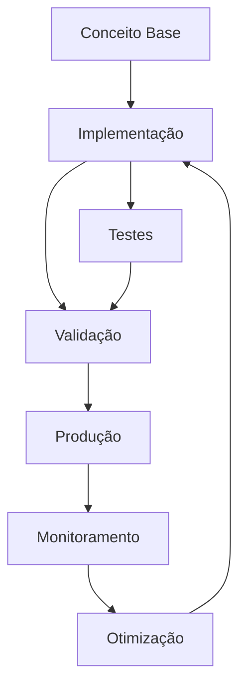

# Observabilidade

# Módulo 16 — Observabilidade: Logs, Métricas e Tracing

**Entendendo o que acontece em produção.**

---


## Objetivos de Aprendizagem

Ao final deste modulo, voce sera capaz de:

- **Definir** os conceitos fundamentais de Module 16 Observabilidade
- **Explicar** as estrategias e padroes envolvidos
- **Aplicar** as tecnicas em cenarios reais de desenvolvimento
- **Analisar** as compensacoes (trade-offs) entre diferentes abordagens
- **Implementar** solucoes seguindo as melhores praticas do mercado


## 1. O que é observabilidade?


> **Nota:** Este conceito é fundamental para o entendimento dos tópicos seguintes. Certifique-se de compreendê-lo antes de prosseguir.

> **Dica:** Ao implementar em projetos reais, comece com uma versão simplificada e iterativamente adicione complexidade.


Observabilidade é a capacidade de **entender o estado interno do sistema** a partir de seus outputs externos (logs, métricas, traces).

### Os 3 pilares

```text
LOGS                           MÉTRICAS                         TRACING
Eventos discretos              Dados agregados                  Fluxo de requisições
"O quê aconteceu?"             "Quantos/quanto tempo?"          "Por onde passou?"

Ex:                            Ex:                              Ex:
"Usuário X fez login"          "500 req/s, p95=200ms"           "GET /orders → Auth → DB"
"Falha no pagamento"            "Error rate: 0.5%"              "POST /payment → API → Queue"
```markdown



> **Diagrama 1:** Visão geral do fluxo de trabalho abordado neste módulo. O ciclo contínuo de implementação → validação → produção → monitoramento → otimização garante entregas de qualidade.


### Sem observabilidade

```text
Usuário: "O sistema está lento"
Dev:     "Onde? Quando? Quanto?"
Usuário: "Não sei, só está lento"
Dev:     "Não consigo reproduzir"

→ Sem dados, sem diagnóstico
```markdown

### Com observabilidade

```text
Grafana: "p95 response time subiu de 200ms para 2s às 14:30"
Logs:    "14:30:01 - DB query timeout"
Trace:   "14:30:01 - span database: 5s (normal: 50ms)"

→ Causa identificada em minutos
```markdown

---

## 2. Logs Estruturados

### Log em texto vs JSON

```typescript
// ❌ Log em texto (não searchável)
console.log('Usuário', userId, 'fez login de', ip);

// ✅ Log estruturado (JSON)
logger.info('Usuário autenticado', {
  userId: 'abc123',
  email: 'joao@email.com',
  ip: '192.168.1.1',
  timestamp: new Date().toISOString(),
});
```text

### Configuração com Winston

```typescript
import * as winston from 'winston';

export const logger = winston.createLogger({
  level: process.env.NODE_ENV === 'production' ? 'info' : 'debug',
  format: winston.format.combine(
    winston.format.timestamp(),
    winston.format.errors({ stack: true }),
    winston.format.json(),
  ),
  defaultMeta: { service: 'api' },
  transports: [
    new winston.transports.Console({
      format: process.env.NODE_ENV === 'production'
        ? winston.format.json()
        : winston.format.prettyPrint(),
    }),
    new winston.transports.File({
      filename: 'logs/error.log',
      level: 'error',
      maxsize: 10 * 1024 * 1024, // 10MB
      maxFiles: 5,
    }),
    new winston.transports.File({
      filename: 'logs/combined.log',
      maxsize: 10 * 1024 * 1024,
      maxFiles: 5,
    }),
  ],
});
```markdown

### Níveis de log

```text
error:   Algo quebrou (ação necessária)
warn:    Algo inesperado (mas não quebrou)
info:    Evento importante (login, criação)
debug:   Detalhes para diagnóstico
verbose: Tudo (usar apenas em dev)
```markdown

### O que logar

```typescript
// ✅ Logar sempre
logger.info('Pedido criado', { orderId, userId, total });
logger.warn('Tentativa de login com IP suspeito', { ip, email });
logger.error('Falha no processamento de pagamento', {
  orderId, error: err.message, stack: err.stack,
});

// ❌ NUNCA logar
logger.info('Usuário logado', { password: '123456' });     // Senha!
logger.info('Pagamento processado', { cvv: '123' });        // Dado sensível!
logger.info('Erro', { fullUser });                          // Objeto inteiro!
```text

---

## 3. Métricas

### Tipos de métricas

```text
Counter:      Valor que só aumenta (req total, errors total)
Gauge:        Valor que sobe e desce (memória, conexões ativas)
Histogram:    Distribuição de valores (response time p50, p95, p99)
Summary:      Similar ao histogram (latência, tamanho de resposta)
```markdown

### Métricas essenciais

```typescript
// API
http_requests_total{method, path, status}
http_request_duration_seconds{method, path}
http_errors_total{method, path, error_code}

// Database
db_queries_total{operation, table}
db_query_duration_seconds{operation, table}
db_connections_active
db_connections_idle

// Business
users_active_total
orders_created_total
orders_revenue_total

// System
process_cpu_seconds_total
process_resident_memory_bytes
nodejs_eventloop_lag_seconds
```markdown

### Implementação com Prometheus client

```typescript
import { Counter, Histogram, Gauge } from 'prom-client';

// Métricas
export const httpRequestsTotal = new Counter({
  name: 'http_requests_total',
  help: 'Total de requisições HTTP',
  labelNames: ['method', 'path', 'status'],
});

export const httpRequestDuration = new Histogram({
  name: 'http_request_duration_seconds',
  help: 'Duração das requisições HTTP',
  labelNames: ['method', 'path'],
  buckets: [0.01, 0.05, 0.1, 0.5, 1, 2, 5],
});

export const dbQueryDuration = new Histogram({
  name: 'db_query_duration_seconds',
  help: 'Duração de queries no banco',
  labelNames: ['operation', 'table'],
  buckets: [0.001, 0.005, 0.01, 0.05, 0.1, 0.5, 1],
});

export const activeConnections = new Gauge({
  name: 'http_connections_active',
  help: 'Conexões HTTP ativas',
});

// Middleware para capturar métricas
@Injectable()
export class MetricsInterceptor implements NestInterceptor {
  intercept(context: ExecutionContext, next: CallHandler): Observable<any> {
    const request = context.switchToHttp().getRequest();
    const { method, path } = request;
    const start = Date.now();

    activeConnections.inc();

    return next.handle().pipe(
      tap(() => {
        const duration = (Date.now() - start) / 1000;
        const response = context.switchToHttp().getResponse();
        const status = response.statusCode.toString();

        httpRequestsTotal.labels(method, path, status).inc();
        httpRequestDuration.labels(method, path).observe(duration);
        activeConnections.dec();
      }),
    );
  }
}
```text

---

## 4. Tracing Distribuído

### O que é tracing

```text
Requisição: POST /api/orders
  ┌─────────────────────────────────────────────────────┐
  │ Trace ID: abc123                                     │
  │                                                      │
  │  Span 1: Gateway (2ms)                               │
  │    ├── Span 2: Auth Service (5ms)                    │
  │    ├── Span 3: Order Service (150ms)                 │
  │    │   ├── Span 4: DB Query (100ms)                  │
  │    │   └── Span 5: Redis Cache (20ms)                │
  │    └── Span 6: Payment API (300ms)                   │
  │                                                      │
  │ Total: 457ms                                         │
  └─────────────────────────────────────────────────────┘
```markdown

### Implementação com OpenTelemetry

```typescript
import { NodeSDK } from '@opentelemetry/sdk-node';
import { OTLPTraceExporter } from '@opentelemetry/exporter-trace-otlp-http';
import { Resource } from '@opentelemetry/resources';
import { SemanticResourceAttributes } from '@opentelemetry/semantic-conventions';
import { getNodeAutoInstrumentations } from '@opentelemetry/auto-instrumentations-node';

const sdk = new NodeSDK({
  resource: new Resource({
    [SemanticResourceAttributes.SERVICE_NAME]: 'api',
    [SemanticResourceAttributes.SERVICE_VERSION]: '1.0.0',
  }),
  traceExporter: new OTLPTraceExporter({
    url: 'http://localhost:4318/v1/traces',
  }),
  instrumentations: [
    getNodeAutoInstrumentations({
      '@opentelemetry/instrumentation-http': {},
      '@opentelemetry/instrumentation-express': {},
      '@opentelemetry/instrumentation-nestjs-core': {},
      '@opentelemetry/instrumentation-pg': {},
      '@opentelemetry/instrumentation-redis': {},
    }),
  ],
});

sdk.start();
```markdown

### Span customizado

```typescript
import { trace } from '@opentelemetry/api';

const tracer = trace.getTracer('order-service');

class OrderService {
  async create(dto: CreateOrderDto): Promise<Order> {
    return tracer.startActiveSpan('createOrder', async (span) => {
      span.setAttribute('order.total', dto.total);
      span.setAttribute('order.items_count', dto.items.length);

      try {
        const user = await this.validateUser(dto.userId);
        const order = await this.saveOrder(dto);
        await this.processPayment(order);

        span.setStatus({ code: SpanStatusCode.OK });
        return order;
      } catch (error) {
        span.setStatus({
          code: SpanStatusCode.ERROR,
          message: error.message,
        });
        throw error;
      } finally {
        span.end();
      }
    });
  }
}
```text

---

## 5. Dashboards com Grafana

### Métricas essenciais no dashboard

```text
RED Method (Rate, Errors, Duration):

| Métrica               | Descrição                 | Tipo     |
|-----------------------|---------------------------|----------|
| Request Rate          | req/s por endpoint         | Counter  |
| Error Rate            | % de erros                 | Counter  |
| Latency (p50/p95/p99) | Tempo de resposta          | Histogram|
| Active Users          | Usuários simultâneos       | Gauge    |
| CPU/Memory            | Recursos do servidor       | Gauge    |
| DB Connections        | Conexões ativas no banco   | Gauge    |
| Query Duration        | Duração de queries         | Histogram|
| Error Logs Rate       | Quantidade de logs de erro | Counter  |
```markdown

### Painel de resposta rápida

```text
┌─────────────────────────────────────────────────────────────┐
│  STATUS: ✅ OPERACIONAL           Uptime: 99.97%            │
├──────────────────┬──────────────────┬──────────────────────┤
│  Request Rate    │  Error Rate      │  p95 Latency          │
│  1,234 req/s     │  0.05%           │  187ms                │
├──────────────────┴──────────────────┴──────────────────────┤
│  Latency by Endpoint (p95)                                  │
│  GET /products     45ms  ████████████                       │
│  POST /orders     320ms  ██████████████████████████         │
│  POST /payment    1.2s   ████████████████████████████████   │
├─────────────────────────────────────────────────────────────┤
│  Top Errors                                               │
│  14:30:01 - POST /payment - timeout (5x)                    │
│  14:29:00 - GET /products - connection refused (2x)         │
└─────────────────────────────────────────────────────────────┘
```markdown

---

## 6. Alertas

### O que alertar

```text
P0 (Resposta imediata):
  - Error rate > 5% nos últimos 5 min
  - p95 latency > 2s
  - Servidor down
  - Banco inacessível

P1 (Resposta em 1 hora):
  - Error rate > 1% nos últimos 15 min
  - p95 latency > 1s
  - Disco > 80%
  - Memória > 85%

P2 (Resposta em 24h):
  - Error rate > 0.5% no último dia
  - p99 latency > 3s
  - Cache hit rate < 50%
  - Queries lentas (> 500ms)
```markdown

### Exemplo de alerta (Prometheus + Alertmanager)

```yaml
groups:
  - name: api
    rules:
      - alert: HighErrorRate
        expr: |
          rate(http_errors_total[5m])
          /
          rate(http_requests_total[5m])
          > 0.05
        for: 5m
        labels:
          severity: critical
        annotations:
          summary: "Error rate above 5%"
          description: "Error rate is {{$value | humanize}}% for the last 5 minutes"

      - alert: HighLatency
        expr: |
          histogram_quantile(0.95,
            rate(http_request_duration_seconds_bucket[5m])
          ) > 2
        for: 5m
        labels:
          severity: critical
        annotations:
          summary: "p95 latency above 2s"
```markdown

---

## 7. Centralização de Logs (Loki + Grafana)

### Configuração

```yaml
# docker-compose.obs.yml
services:
  prometheus:
    image: prom/prometheus
    ports:
      - "9090:9090"
    volumes:
      - ./prometheus.yml:/etc/prometheus/prometheus.yml

  loki:
    image: grafana/loki
    ports:
      - "3100:3100"

  grafana:
    image: grafana/grafana
    ports:
      - "3000:3000"
    environment:
      - GF_AUTH_ANONYMOUS_ENABLED=true
```text

### Query de logs no Loki

```logql
# Buscar erros nos últimos 15 minutos
{service="api"} |= "error" |= "payment"

# Buscar logs de um usuário específico
{service="api"} |= "userId=abc123"

# Contar erros por endpoint
sum by (path) (count_over_time({service="api"} |= "error" [5m]))
```markdown

---

## Resumo

1. **Observabilidade** = Logs + Métricas + Tracing
2. **Logs estruturados** — JSON, níveis (error/warn/info/debug), nunca dados sensíveis
3. **Métricas** — RED method (Rate, Errors, Duration) com Prometheus
4. **Tracing** — OpenTelemetry para rastrear requisições entre serviços
5. **Dashboards** — Grafana com métricas essenciais
6. **Alertas** — P0/P1/P2 com thresholds e canais de notificação
7. **Centralização** — Loki + Grafana para logs searcháveis

## Exercícios: Prática

### Nível 1 — Fácil

1. Implemente uma versão simplificada do conceito abordado neste módulo.
   **Objetivo:** Fixar os fundamentos através de um exemplo prático guiado.

### Nível 2 — Intermediário

2. Estenda a implementação anterior adicionando tratamento de erros e validações.
   **Objetivo:** Aplicar boas práticas em um contexto mais realista.

### Nível 3 — Difícil

3. Projete e implemente uma solução completa integrando múltiplos conceitos do módulo.
   **Objetivo:** Demonstrar domínio dos tópicos em um cenário complexo.

**Gabarito:** As soluções dos exercícios estão disponíveis no diretório `exercicios/gabarito.md`.
**Critérios de correção:** Clareza da solução, uso correto dos padrões, tratamento de edge cases e qualidade do código.

## Quiz de Verificação

Responda as perguntas abaixo para verificar seu entendimento:

1. Qual a principal vantagem da abordagem apresentada?
   a) Simplicidade de implementação
   b) Escalabilidade horizontal
   c) Baixo custo operacional
   d) Todas as anteriores

2. Em qual cenário a estratégia discutida é mais recomendada?
   a) Aplicações monolíticas
   b) Sistemas distribuídos
   c) Aplicações desktop
   d) Scripts simples

3. Qual prática NÃO é recomendada ao implementar esta solução?
   a) Usar transações para garantir consistência
   b) Ignorar tratamento de erros
   c) Implementar logging adequado
   d) Testar em ambiente isolado

> **Respostas:** Consulte o arquivo `quiz/quiz.md` para conferir as respostas comentadas.

## Referências

- Documentação oficial das tecnologias abordadas
- Artigos e publicações referenciados ao longo do módulo
- Código-fonte dos exemplos disponível no repositório do curso

