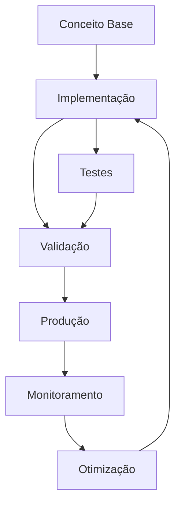

# Product Design Engineering


*Do Discovery ao Design System — Produtos Digitais que Resolvem Problemas Reais*


**Autor:** Ilvan Joaquim

**Idioma:** pt-BR

**Edição:** 1 — 2026


---


# Product Discovery

# Módulo 02 — Product Discovery: Validando Ideias Antes de Construir

**Descubra o que construir antes de construir.**

---


## Objetivos de Aprendizagem

Ao final deste modulo, voce sera capaz de:

- **Definir** os conceitos fundamentais de Module 02 Product Discovery
- **Explicar** as estrategias e padroes envolvidos
- **Aplicar** as tecnicas em cenarios reais de desenvolvimento
- **Analisar** as compensacoes (trade-offs) entre diferentes abordagens
- **Implementar** solucoes seguindo as melhores praticas do mercado


## 1. O que é Product Discovery?


> **Nota:** Este conceito é fundamental para o entendimento dos tópicos seguintes. Certifique-se de compreendê-lo antes de prosseguir.

> **Dica:** Ao implementar em projetos reais, comece com uma versão simplificada e iterativamente adicione complexidade.


Product Discovery é o processo de **entender problemas reais de usuários reais antes de escrever uma linha de código**. O objetivo não é entregar features, mas sim **decidir o que vale a pena ser construído**.

### Discovery vs Delivery

```text
DISCOVERY                             DELIVERY
"Construímos a coisa certa?"          "Construímos a coisa certo?"
Alta incerteza, baixo custo           Baixa incerteza, alto custo
Perguntas, hipóteses, experimentos    Requisitos, planejamento, código
Falsificável, iterativo               Definido, incremental
"Devo construir isso?"                "Como construir isso?"
```javascript



> **Diagrama 1:** Visão geral do fluxo de trabalho abordado neste módulo. O ciclo contínuo de implementação → validação → produção → monitoramento → otimização garante entregas de qualidade.


### Por que Discovery é importante?

```text
Sem Discovery:
  "O cliente pediu uma tela de relatório"
  → 3 sprints de desenvolvimento
  → Ninguém usa
  → 3 sprints perdidos

Com Discovery:
  "O cliente pediu uma tela de relatório"
  → Entrevista: "Qual problema você quer resolver?"
  → Descoberta: ele quer exportar dados pra planilha
  → Solução: botão de exportar CSV em 1 dia
  → Valida: ele testa, funciona, usa todo dia
```markdown

### Armadilha comum

```text
Time: "Vamos construir um chat bot!"
Discovery: Nenhum

3 meses depois:
Ninguém usa o chat bot.

Por quê?
- Ninguém perguntou se o problema era real
- Ninguém validou se chat bot era a melhor solução
- Ninguém testou com usuários antes de construir
```markdown


---

## 2. Processo de Discovery

O discovery não é linear — é um ciclo iterativo. O modelo mais comum tem 4 fases:

```text
OPORTUNIDADE → PESQUISA → IDEAÇÃO → PROTOTIPAÇÃO → VALIDAÇÃO
      │                                                 │
      └───────────────── (iterate) ────────────────────┘
```markdown


### 2.1 Oportunidades

Toda feature request, bug report, reclamação de cliente ou insight de analytics é uma **oportunidade**. O desafio é priorizá-las.

**Fontes de oportunidades:**
- Feedback de clientes (Zendesk, Intercom, surveys)
- Dados de uso (amplitude, mixpanel, GA4)
- Conversas com sales/suporte
- Análise concorrencial
- Visão do produto (OKRs, estratégia)
- Próprio time (dívida técnica, bugs recorrentes)

### 2.2 Pesquisa

Antes de pensar em solução, **entenda o problema**. Use técnicas qualitativas e quantitativas (ver seção 3).

### 2.3 Ideação

Gere múltiplas opções de solução, não apenas uma. Técnicas:
- **Crazy 8s** — 8 ideias em 8 minutos
- **Brainstorming** — quantidade > qualidade, sem julgamento
- **Design Sprint** — Google Ventures, 5 dias
- **How Might We** — reformular problema como pergunta

```text
Problema: "Usuários não completam o cadastro"
HMW: "Como poderíamos reduzir o atrito no cadastro?"
     → "Como poderíamos deixar o cadastro opcional?"
     → "Como poderíamos usar login social?"
     → "Como poderíamos pré-preencher dados?"
```markdown

### 2.4 Prototipação

Crie representações da solução com o mínimo esforço necessário para testar:

```text
Nível         Esforço    O que testa
───           ───────    ──────────
Sketch        Minutos    Fluxo macro
Wireframe     Horas      Layout, estrutura
Mockup        Dias       Visual, branding
Prototype     Dias       Interação, fluxo real
MVP           Semanas    Valor real no mercado
```markdown

### 2.5 Validação

Cada protótipo precisa ser testado com usuários reais. Se a hipótese não for validada, volte para ideação.

---

## 3. Técnicas de Pesquisa

### 3.1 Entrevistas com usuários

A ferramenta mais poderosa de discovery.

**Estrutura de uma entrevista:**

```text
1. Abertura (5min)
   "Obrigado por participar. Não estamos testando você.
    Queremos entender como você lida com [assunto].
    Pode ser sincero — críticas nos ajudam."

2. Contexto (10min)
   "Me conta como é seu dia a dia com [assunto]."
   "O que você mais usa hoje?"
   "O que te frustra?"

3. Profundidade (20min)
   "Me conta da última vez que você passou por [situação]."
   "O que você fez? O que aconteceu?"
   "Se pudesse mudar uma coisa, o que seria?"

4. Fechamento (5min)
   "Algo mais que gostaria de compartilhar?"
   "Posso voltar a te procurar se tiver mais perguntas?"
```text

**Regras de ouro:**
- Não faça perguntas indutoras ("Você não acha que X é melhor?")
- Não pergunte "você usaria?" (todo mundo diz sim)
- Pergunte sobre **comportamento passado**, não intenção futura
- Escute mais do que fala (ratio 80/20)

### 3.2 Surveys

Bom para validar achados qualitativos com escala.

```text
❌ "Você usaria uma funcionalidade de exportar relatórios?"
   (todo mundo diz sim — viés de cortesia)

✅ "Na última semana, quantas vezes você precisou exportar
    dados do sistema?"
   (comportamento real, mensurável)
```text

**Dicas de surveys:**
- Máximo 10 perguntas
- Escalas consistentes (Likert 1-5 ou 1-7)
- Sempre incluir pergunta aberta no final
- Ferramentas: Typeform, Google Forms, SurveyMonkey

### 3.3 Análise Concorrencial

```text
Concorrente A          Concorrente B            Concorrente C
──────────────────     ──────────────────       ──────────────────
Faz X bem              Faz Y bem                Faz Z bem
Não tem W              Tem W mas é confuso      Tem W excelente
Feedback: lento        Feedback: caro           Feedback: complexo

Oportunidade: X + W simples + preço acessível
```text

**O que analisar:**
- Proposta de valor
- Fluxos principais
- Pontos fortes e fracos
- Reviews (G2, Capterra, Play Store, App Store)
- Pricing e posicionamento

### 3.4 Analytics

Dados quantitativos não mentem — mas precisam de interpretação.

```text
Métricas de Discovery:

| Métrica                  | O que indica                             |
|--------------------------|------------------------------------------|
| Page views               | Interesse bruto                          |
| Bounce rate              | Não encontrou o que queria               |
| Drop-off por etapa       | Atrito no fluxo                          |
| Funil de conversão       | Onde os usuários desistem                |
| Retenção D1/D7/D30       | Valor entregue vs expectativa            |
| NPS / CSAT               | Satisfação geral                         |
| Search terms             | O que usuários procuram (e não acham)    |
| Feature usage            | O que realmente é usado                  |
```markdown

---

## 4. Frameworks de Discovery

### 4.1 JTBD — Jobs to be Done

JTBD parte da premissa: **usuários não compram produtos, eles contratam serviços para fazer um trabalho**.

```text
Exemplo:

Job: "Me manter informado sobre tecnologia"
──────────────────────────────────────────────

Opção A: Assinar newsletter        (R$ 0,  5min/dia)
Opção B: Seguir influencers         (R$ 0, 15min/dia)
Opção C: Assinar portal de tech    (R$ 30/mês, 30min/dia)
Opção D: Podcasts                  (R$ 0, 1h/dia no trânsito)

"Contratamos" a opção que melhor resolve o job
dado nosso contexto (tempo, dinheiro, momento)
```text

**Estrutura JTBD:**

```text
Quando [situação], eu quero [motivação] para [resultado esperado].

Exemplo:
"Quando estou começando um novo projeto, eu quero entender o
que outros times já tentaram antes, para não repetir erros."
```text

**Jobs principais vs jobs funcionais:**
- **Functional:** "Organizar tarefas do time"
- **Emocional:** "Me sentir no controle do projeto"
- **Social:** "Parecer competente para meu chefe"

### 4.2 Lean Canvas

Uma página que resume o modelo de negócio. Ideal para early stage.

```text
┌─────────────────┬────────────────┬─────────────────┬─────────────────┬─────────────────┐
│ PROBLEMA        │ SOLUÇÃO        │ PROPOSTA DE     │ VANTAGEM         │ SEGMENTO        │
│ Top 3 problemas │ Top 3 soluções │ VALOR           │ COMPETITIVA       │ DE CLIENTES     │
│                 │                │ Única           │ Não copiável      │                  │
│                 │                │ Mensagem clara  │ facilmente        │                  │
├─────────────────┼────────────────┼─────────────────┼─────────────────┼─────────────────┤
│ MÉTRICAS        │                │ CANAIS          │                   │                  │
│ CHAVE           │                │                 │                   │                  │
│ O que medir     │                │ Como chegar     │                   │                  │
│ para saber se   │                │ no cliente      │                   │                  │
│ está dando certo│                 │                 │                   │                  │
├─────────────────┴────────────────┴─────────────────┴─────────────────┴─────────────────┤
│ ESTRUTURA DE CUSTOS                                │ RECEITAS                         │
│ Fixos, variáveis, custo de aquisição               │ Como ganha dinheiro              │
└────────────────────────────────────────────────────┴─────────────────────────────────┘
```markdown

### 4.3 Value Proposition Canvas

Detalha o encaixe entre o cliente e o produto.

```text
VALUE PROPOSITION CANVAS

┌──────────────────────────────┬──────────────────────────────┐
│ PRODUTO                      │ CLIENTE                      │
│                              │                              │
│ ┌────────────────────────┐   │ ┌────────────────────────┐  │
│ │ Gain Creators          │   │ │ Gains                   │  │
│ │ O que entrega ganhos   │   │ │ Resultados desejados   │  │
│ │                        │   │ │                         │  │
│ ├────────────────────────┤   │ ├────────────────────────┤  │
│ │ Products & Services    │   │ │ Customer Jobs          │  │
│ │ O que oferecemos       │   │ │ O que ele quer fazer   │  │
│ │                        │   │ │                         │  │
│ ├────────────────────────┤   │ ├────────────────────────┤  │
│ │ Pain Relievers         │   │ │ Pains                   │  │
│ │ O que alivia dores     │   │ │ Frustrações, riscos    │  │
│ └────────────────────────┘   │ └────────────────────────┘  │
│                              │                              │
│         ENCAIXE: quando solutions > jobs + pains           │
└──────────────────────────────┴──────────────────────────────┘
```markdown

---

## 5. Mapeamento

### 5.1 Opportunity Solution Tree (Teresa Torres)

Árvore que conecta **oportunidades → soluções → experimentos**.

```text
RESULTADO ESPEREADO
(reduzir churn em 20%)
│
├── OPORTUNIDADE: Usuários não entendem o valor do produto
│   ├── SOLUÇÃO: Onboarding guiado
│   │   └── EXPERIMENTO: Teste A/B com novo onboarding vs atual
│   └── SOLUÇÃO: Vídeo de apresentação no primeiro login
│       └── EXPERIMENTO: Medir % que completa o vídeo
│
├── OPORTUNIDADE: Usuários não conseguem exportar dados
│   ├── SOLUÇÃO: Botão de exportar CSV
│   │   └── EXPERIMENTO: Protótipo clicável com 5 usuários
│   └── SOLUÇÃO: Integração com Google Sheets
│       └── EXPERIMENTO: Survey de interesse com clientes
│
└── OPORTUNIDADE: Produto é caro para PMEs
    ├── SOLUÇÃO: Plano "Starter" com funcionalidades limitadas
    └── EXPERIMENTO: Landing page com pricing e botão de compra
```text

**Como construir:**
1. Defina o **outcome** (resultado esperado, ex: "aumentar ativação em 30%")
2. Liste **oportunidades** (problemas/dores que impedem o outcome)
3. Para cada oportunidade, gere **soluções**
4. Para cada solução, defina um **experimento** para testar

### 5.2 User Story Mapping

Técnica de Jeff Patton que organiza o backlog em **atividades do usuário** de forma visual, ajudando o time a enxergar o produto como um fluxo.

```text
Jornada: "Gerenciar projetos"
────────────────────────────────────────────────────────────────────
              │  Semana 1     │  Semana 2    │  Semana 3      │
──────────────┼───────────────┼──────────────┼────────────────┤
Criar projeto │ Criar nome    │ Convidar     │                │
              │               │ membros      │                │
──────────────┼───────────────┼──────────────┼────────────────┤
Organizar     │ Criar         │ Adicionar    │ Arrastar       │
tarefas       │ colunas       │ cards        │ cards          │
──────────────┼───────────────┼──────────────┼────────────────┤
Acompanhar    │               │              │ Dashboard     │
progresso     │               │              │ de progresso   │
──────────────┴───────────────┴──────────────┴────────────────┘
  ↑ MVP (corta aqui)            ↑ Release 2          ↑ Release 3
```text

**Por que usar:**
- Mostra o produto como um **fluxo**, não uma lista
- Ajuda a identificar **gaps** no fluxo
- Facilita decisões de **MVP** (o corte vertical)
- Alinha time e stakeholders visualmente

---

## 6. Validação de Hipóteses

### Estrutura de hipótese

```text
HIPÓTESE:
Acreditamos que [solução] para [público]
resultará em [outcome].
Saberemos que estamos certos quando [métrica/meta].

Exemplo:
"Acreditamos que um onboarding guiado para novos usuários
resultará em 30% mais ativação no D7.
Saberemos que estamos certos quando a taxa de ativação
subir de 40% para 52% no teste A/B."
```markdown

### Tipos de experimento

```text
Experimento         | Esforço | Confiança | Quando usar
────────────────────|─────────|───────────|────────────────────────
Entrevista          | Baixo   | Média     | Entender problema
Landing page fake   | Baixo   | Alta      | Testar interesse real
Prototype test      | Médio   | Média     | Validar usabilidade
Teste A/B           | Médio   | Alta      | Comparar soluções
Concierge MVP       | Alto    | Alta      | Validar valor real
Wizard of Oz MVP    | Médio   | Alta      | Validar viabilidade
Single-feature MVP  | Médio   | Alta      | Testar feature isolada
Piecemeal MVP       | Baixo   | Média     | Validar sem construir
```markdown

### Exemplo: Landing page fake

```text
Ideia: "App que agenda reuniões automaticamente"

1. Criar landing page:
   "Agende reuniões sem trocar emails"

2. Botão: "Começar gratis →" (leva a página de "em breve")

3. Métricas:
   - Visitantes que chegam na página
   - % que clica no CTA      ← indicador de interesse real
   - % que deixa o email      ← lead qualificado

4. Resultado:
   Se < 5% clica → interesse baixo, repense a proposta
   Se > 15% clica → interesse real, continue
```markdown

### MVP não é produto mínimo

```text
MITO: MVP é a versão mais simples do produto final
REAL: MVP é o menor experimento que valida ou invalida uma hipótese

MVP serve para APRENDER, não para entregar valor.
Se você já sabe que funciona, não precisa de MVP.
```markdown

---

## 7. Product Discovery no Contexto Enterprise

Discovery em empresas grandes tem desafios específicos.

### Desafios Enterprise

```text
Desafio                    Impacto no Discovery
────────────────────────── ──────────────────────────────────
Muitos stakeholders        Múltiplas visões do que é "prioridade"
Processos burocráticos     Discovery lento, pouca iteração
Métrica de sucesso errada  Time mede output, não outcome
Times isolados             Descobertas não são compartilhadas
Gerenciamento de risco     Medo de errar → pouca experimentação
Orçamento anual fixo       Discovery não é orçado → não existe
```markdown

### Como fazer discovery em Enterprise

**1. Alinhe com OKRs**

```text
OKR da empresa: "Aumentar receita recorrente em 25%"

→ Opportunity: churn de 15% ao mês
→ Discovery: por que os clientes estão cancelando?
→ Outcome: reduzir churn pela metade
→ Backlog: funcionalidades que endereçam as causas
```text

**2. Discovery Sprints**

Reserve ciclos fixos para discovery (ex: 2 semanas a cada quarter).

```text
Sprint Discovery (2 semanas):
  Semana 1: Pesquisa (entrevistas, analytics, concorrência)
  Semana 2: Ideação, prototipação, testes com usuários
  Saída: Backlog priorizado para as próximas 6 semanas de delivery
```text

**3. Envolva stakeholders cedo**

```text
Stakeholder      | O que quer saber                   | Quando envolver
─────────────────|────────────────────────────────────|─────────────────
Diretor          | "Isso entrega o OKR?"              | Kickoff, review
Produto          | "Isso resolve o problema certo?"   | Discovery inteiro
Engenharia       | "Isso é viável tecnicamente?"      | Prototipação
Design           | "Isso é usável?"                    | Prototipação, teste
Comercial        | "O cliente pagaria por isso?"      | Pesquisa, validação
Sucesso do cl.   | "Isso reduz chamados?"             | Pesquisa
```text

**4. Discovery contínuo vs Discovery por projeto**

```text
Discovery Contínuo (recomendado):
  Discovery e Delivery rodam em paralelo
  Time sempre tem 20-30% do tempo para discovery
  Pipeline de oportunidades sempre abastecido

Discovery por Projeto (menos eficaz):
  Discovery só acontece no início do projeto
  Depois que o delivery começa, não se questiona mais
  Se descobrir algo errado no meio, é tarde demais
```markdown

### Cultura de Experimentação

Empresas maduras em discovery têm:

```text
Amazon:        "É mais fácil pedir desculpas do que permissão"
Netflix:       Testa tudo, aprende rápido, falha barato
Spotify:       Squads têm autonomia para discovery
Google:        Data beats opinions
Airbnb:        Design ops com discovery contínuo

Cultura que NÃO funciona:
  "Quem decide é o VP"
  "A gente sabe o que o cliente quer"
  "Se deu trabalho, vamos lançar mesmo assim"
```markdown

---

## 8. Saídas do Discovery

O discovery não termina sem artefatos. As saídas principais são:

### 8.1 Backlog Refinado

Um backlog que não é só lista de desejos — é priorizado por evidência.

```text
Antes do Discovery:
  - [ ] Tela de relatórios (pedido pelo stakeholder)
  - [ ] Exportar para PDF (ideia do PO)
  - [ ] Modo escuro (sugestão do dev)
  - [ ] Integração com Slack (pedido de 1 cliente)

Depois do Discovery:
  - [ ] Exportar CSV (validado: 78% dos usuários precisam)
  - [ ] Relatório de vendas (validado: resolve job #2)
  - [ ] Tema escuro (despriorizado: 12% pediram)
  - [ ] Integração Slack (despriorizado: 3 clientes, custo alto)
```markdown

### 8.2 Proto-personas

Persona provisória baseada em hipóteses, não em pesquisa extensa.

```text
Proto-persona: Analista de Dados
───────────────────────────────────────────────────────────────
Nome fictício:   Carla, 32 anos
Cargo:           Analista de BI Sênior
Contexto:        Trabalha em empresa de médio porte, time pequeno
Objetivo:        Extrair insights rápido para tomar decisões
Dores:           1. Dados espalhados (planilhas, BI, ERP)
                 2. Demora dias para gerar um relatório
                 3. Não confia na qualidade dos dados
Comportamento:   Usa Excel, Tableau, SQL (básico)
Job to be done:  "Quando preciso responder uma pergunta de negócio,
                  quero encontrar os dados certos em minutos, para
                  não perder credibilidade com o diretor."
```markdown

### 8.3 User Stories

Histórias baseadas em evidência, não em suposição.

```text
❌ Sem Discovery:
"Como usuário, quero uma tela de relatórios."

✅ Com Discovery:
"Como analista de BI, quero exportar dados em CSV
para poder analisar no Excel, porque meu time não
tem acesso direto ao banco."

Critérios de aceite:
- Botão de exportar na tela de search
- Formato CSV com encoding UTF-8
- Arquivo baixa em até 10s (para < 100k linhas)
- Colunas traduzidas para pt-BR
- Nome do arquivo: `export-{tipo}-{data}.csv`
```markdown

### 8.4 Opportunity Backlog

Um backlog de oportunidades (não de soluções).

```text
ID  | Oportunidade                              | Evidência              | Tamanho | Prioridade
────|───────────────────────────────────────────|────────────────────────|─────────|───────────
O01 | Usuários não encontram dados no sistema   | 45% dos chamados       | Grande  | P0
O02 | Demora para gerar relatórios              | Survey: 78% citaram    | Médio   | P0
O03 | Não confiabilidade dos dados              | NPS: 4.2 (crítico)     | Grande  | P1
O04 | Integração com ferramentas externas       | 3 clientes enterprise  | Médio   | P2
```markdown

---

## Resumo

1. **Product Discovery** é o processo de validar problemas e soluções antes de construir
2. **Discovery vs Delivery**: uma decide o que construir, a outra constrói
3. **Ciclo**: Oportunidade → Pesquisa → Ideação → Prototipação → Validação
4. **Pesquisa**: entrevistas, surveys, análise concorrencial, analytics
5. **Frameworks**: JTBD, Lean Canvas, Value Proposition Canvas
6. **Mapeamento**: Opportunity Solution Tree, User Story Mapping
7. **Hipóteses**: estruture, meça, aprenda (MVP = experimento, não produto)
8. **Enterprise**: alinhe com OKRs, envolva stakeholders, cultura de experimentação
9. **Saídas**: backlog refinado, proto-personas, user stories, opportunity backlog

## Exercícios: Prática

### Nível 1 — Fácil

1. Implemente uma versão simplificada do conceito abordado neste módulo.
   **Objetivo:** Fixar os fundamentos através de um exemplo prático guiado.

### Nível 2 — Intermediário

2. Estenda a implementação anterior adicionando tratamento de erros e validações.
   **Objetivo:** Aplicar boas práticas em um contexto mais realista.

### Nível 3 — Difícil

3. Projete e implemente uma solução completa integrando múltiplos conceitos do módulo.
   **Objetivo:** Demonstrar domínio dos tópicos em um cenário complexo.

**Gabarito:** As soluções dos exercícios estão disponíveis no diretório `exercicios/gabarito.md`.
**Critérios de correção:** Clareza da solução, uso correto dos padrões, tratamento de edge cases e qualidade do código.

## Quiz de Verificação

Responda as perguntas abaixo para verificar seu entendimento:

1. Qual a principal vantagem da abordagem apresentada?
   a) Simplicidade de implementação
   b) Escalabilidade horizontal
   c) Baixo custo operacional
   d) Todas as anteriores

2. Em qual cenário a estratégia discutida é mais recomendada?
   a) Aplicações monolíticas
   b) Sistemas distribuídos
   c) Aplicações desktop
   d) Scripts simples

3. Qual prática NÃO é recomendada ao implementar esta solução?
   a) Usar transações para garantir consistência
   b) Ignorar tratamento de erros
   c) Implementar logging adequado
   d) Testar em ambiente isolado

> **Respostas:** Consulte o arquivo `quiz/quiz.md` para conferir as respostas comentadas.

## Referências

- Documentação oficial das tecnologias abordadas
- Artigos e publicações referenciados ao longo do módulo
- Código-fonte dos exemplos disponível no repositório do curso


# Design Thinking

# Módulo 03 — Design Thinking: Inovação Centrada no Usuário

**Uma abordagem human-centered para resolver problemas complexos.**

---


## Objetivos de Aprendizagem

Ao final deste modulo, voce sera capaz de:

- **Definir** os conceitos fundamentais de Module 03 Design Thinking
- **Explicar** as estrategias e padroes envolvidos
- **Aplicar** as tecnicas em cenarios reais de desenvolvimento
- **Analisar** as compensacoes (trade-offs) entre diferentes abordagens
- **Implementar** solucoes seguindo as melhores praticas do mercado


## 1. O que é Design Thinking


> **Nota:** Este conceito é fundamental para o entendimento dos tópicos seguintes. Certifique-se de compreendê-lo antes de prosseguir.

> **Dica:** Ao implementar em projetos reais, comece com uma versão simplificada e iterativamente adicione complexidade.


Design Thinking é uma abordagem **centrada no ser humano** para solução de problemas que combina empatia, criatividade e racionalidade. Diferente de métodos tradicionais que partem de uma solução técnica, o Design Thinking começa com o **usuário** e suas necessidades reais.

### Origem

| Ano | Marco |
|-----|-------|
| 1969 | Herbert Simon publica "The Sciences of the Artificial" — primeiras bases |
| 1987 | Peter Rowe usa o termo "Design Thinking" em livro de arquitetura |
| 1991 | David Kelley funda a IDEO, que populariza o método |
| 2005 | D.School de Stanford sistematiza o processo em 5 fases |
| 2010+ | Adoção em larga escala por empresas como Apple, Google, IBM |


### Mindset do Design Thinking

```text
┌─────────────────────────────────────────────────┐
│                MINDSET DT                        │
│                                                   │
│  • Centrado no ser humano                         │
│  • Colaborativo e multidisciplinar                │
│  • Orientado à ação (aprender fazendo)            │
│  • Tolerante ao erro (falhe rápido, aprenda logo) │
│  • Otimista (toda solução é possível)             │
│  • Iterativo (nunca está pronto)                  │
└─────────────────────────────────────────────────┘
```markdown


> **Diagrama 1:** Visão geral do fluxo de trabalho abordado neste módulo. O ciclo contínuo de implementação → validação → produção → monitoramento → otimização garante entregas de qualidade.


### Abordagem tradicional vs Design Thinking

```text
TRADICIONAL:                                   DESIGN THINKING:
Problema → Análise → Solução → Entrega        Problema → Empatia → Definir → Ideias → Protótipo → Teste
                                                                                            ↻
```markdown

Enquanto a abordagem tradicional busca a **solução certa** de primeira, o Design Thinking busca **entender o problema certo** antes de solucionar, iterando quantas vezes for necessário.

---

## 2. As 5 Fases do Design Thinking

O processo é dividido em 5 fases **não-lineares** — você pode (e deve) voltar a fases anteriores conforme aprende.

```text
                        ┌─────────────┐
                        │   EMPATIZAR  │
                        └──────┬──────┘
                               ↓
                        ┌─────────────┐
                        │   DEFINIR   │
                        └──────┬──────┘
                               ↓
                        ┌─────────────┐
                        │   IDEIAR    │
                        └──────┬──────┘
                               ↓
                   ┌─────────────────────┐
                   │     PROTOTIPAR      │
                   └──────────┬──────────┘
                              ↓
                   ┌─────────────────────┐
                   │       TESTAR        │←──── Iteração
                   └─────────────────────┘
```text

Cada fase responde a uma pergunta central:

| Fase | Pergunta |
|------|----------|
| Empatizar | **O quê** o usuário sente, pensa e precisa? |
| Definir | **Qual** é o problema real? |
| Ideiar | **Quantas** soluções podemos gerar? |
| Prototipar | **Como** tornar a solução tangível? |
| Testar | **Funciona** na prática com o usuário? |

---

## 3. Fase 1: Empatizar

### Por que empatizar?

Sem empatia, você constrói soluções baseadas em **suposições**. Com empatia, você constrói baseado em **fatos** sobre o que o usuário realmente vive.

### Técnicas de empatia

#### 3.1 Entrevistas com usuários

```markdown
# Roteiro de entrevista — Exemplo

## Abertura (5 min)
- "Conte um pouco sobre seu trabalho/dia a dia"
- "Como você lida com [tópico] atualmente?"

## Exploração (15 min)
- "Me conte a última vez que você precisei fazer [ação]"
- "O que foi mais frustrante nesse processo?"
- "O que você fez para contornar?"

## Aprofundamento (10 min)
- "Por que isso é importante para você?"
- "O que aconteceria se você não conseguisse fazer isso?"
- "Como você descreveria a solução ideal?"

## Fechamento (5 min)
- "Mais alguma coisa que gostaria de compartilhar?"
- "Posso voltar a falar com você se surgir mais dúvidas?"
```text

**Regras de ouro para entrevistas:**

```text
✅ Faça:
  • Perguntas abertas ("Me conte sobre...")
  • Escute mais do que fala (proporção 80/20)
  • Pergunte "por quê?" repetidamente (técnica dos 5 porquês)
  • Observe linguagem corporal e tom de voz
  • Registre com autorização (áudio/anotações)

❌ Não faça:
  • Perguntas direcionadas ("Você não acha que...")
  • Perguntas fechadas ("Você usa X? Sim ou não?")
  • Interromper o usuário
  • Defender ideias ou justificar o sistema atual
  • Buscar validação para sua solução
```markdown

#### 3.2 Observação contextual

A observação revela o que as pessoas **realmente fazem** (vs. o que dizem fazer).

```typescript
// Framing da observação
interface Observacao {
  usuario: string;
  contexto: string;
  tarefa: string;
  acoes: Array<{
    timestamp: string;
    acao: string;
    tempo: number;      // segundos
    frustracao: 1 | 2 | 3 | 4 | 5;
    observacao: string;
  }>;
  workarounds: string[];
  insights: string[];
}
```text

**Exemplo de observação:**

```text
Usuário: Maria (Analista de BI)
Tarefa: Gerar relatório mensal de vendas

09:01 → Abre sistema, digita login — 12s
09:02 → Navega por 4 telas até encontrar "Relatórios" — 45s
09:03 → Seleciona filtros (mês, região, produto) — 30s
09:05 → Sistema trava ao carregar 3 meses de dados — frustração: 4/5
09:07 → Chama o suporte, enquanto isso abre Excel e começa a fazer manual
```markdown

**Insight:** A usuária prefere fazer manual no Excel (30 min) do que esperar o sistema travar repetidamente.

#### 3.3 Imersão

A imersão coloca o time **na pele do usuário**. Você experimenta o problema em primeira pessoa.

- **Imersão direta:** Use o sistema como se fosse o usuário
- **Imersão indireta:** Acompanhe o usuário por um dia (shadowing)
- **Auto-imersão:** Passe um dia sem a solução atual e documente as dificuldades

### Mapa de Empatia

```text
┌─────────────────────────────────────────────────────────────────┐
│                    MAPA DE EMPATIA                              │
├─────────────────────────────────────────────────────────────────┤
│                                                                  │
│  O QUE ELE              O QUE ELE                               │
│  FALA?                  FAZ?                                     │
│  "Isso é muito            • Abre Excel direto                    │
│   complicado"             • Pede ajuda no WhatsApp              │
│  "Perco muito             • Tenta 3x antes de desistir          │
│   tempo nisso"                                                     │
├──────────────────────┬──────────────────────────────────────────┤
│                                                                  │
│  O QUE ELE           │   O QUE ELE                               │
│  OUVE?               │   PENSA E SENTE?                          │
│  Gerente: "Preciso   │   "Deve ter um jeito mais fácil"         │
│    do relatório"     │   "Sou burro por não conseguir?"         │
│  Colega: "Sistema    │   "Isso me estressa"                     │
│    é horrível"       │   "Se eu aprender Python resolvo"        │
├──────────────────────┴──────────────────────────────────────────┤
│                                                                  │
│  DORES (Frustrações)            GANHOS (Desejos)                │
│  • Sistema lento                • Relatório em 1 clique         │
│  • Curva de aprendizado alta     • Automação de tarefas         │
│  • Falta de suporte humano      • Interface intuitiva           │
│  • Retrabalho constante         • Reconhecimento do chefe       │
└─────────────────────────────────────────────────────────────────┘
```markdown

---

## 4. Fase 2: Definir

### Do problema amplo ao ponto de vista

Na fase de Definir, você sintetiza tudo que aprendeu na empatia para criar um **ponto de vista** (POV) claro.

### Problem Statement

Uma boa declaração de problema segue esta estrutura:

```text
[USUÁRIO] precisa de [NECESSIDADE] porque [INSIGHT]
```text

**Exemplos:**

```text
❌ Ruim: "O sistema de relatórios é lento"
    (focado na solução, não no usuário)

✅ Bom: "Maria, analista de BI, precisa gerar relatórios
    semanais sem depender do time de TI porque cada
    solicitação leva em média 3 dias para ser atendida"
    (focado no usuário, necessidade e motivo real)

✅ Enterprise: "João, gerente de operações, precisa
    consolidar dados de 5 fontes diferentes em tempo
    real porque as decisões baseadas em dados de
    ontem já não são competitivas"
```markdown

### How Might We (HMW)

As perguntas **How Might We** transformam o problem statement em oportunidades de solução.

```text
HMW = How Might We (Como Poderíamos)

How  → Assume que é possível (mente aberta)
Might → Permite tentativa e erro (não precisa acertar)
We   → É colaborativo (não é individual)
```text

**Técnica:** Para cada problem statement, gere 5-10 HMWs em diferentes direções:

```markdown
Problem Statement: Maria precisa gerar relatórios sem o time de TI

HMWs:
1. HMW tornar a criação de relatórios tão fácil quanto escrever um email?
2. HMW permitir que Maria combine dados sem saber SQL?
3. HMW reduzir o tempo de relatório de 3 dias para 5 minutos?
4. HMW usar IA para sugerir relatórios que Maria nem sabia que precisava?
5. HMW fazer o time de TI responder em minutos em vez de dias?
6. HMW eliminar a necessidade de relatórios manuais completamente?
7. HMW transformar Maria em power-user que ajuda outros colegas?
8. HMW integrar as 5 fontes em um único dashboard em tempo real?
```text

### Matriz de Priorização

```text
                    ALTO IMPACTO
                        │
    ┌───────────────────┼───────────────────┐
    │                   │                   │
    │   FAÇA PRIMEIRO   │   FAÇA DEPOIS     │
    │   (Quick Wins)    │   (Big Bets)      │
    │                   │                   │
    │   HMW #3          │   HMW #4          │
    │   HMW #5          │   HMW #8          │
    │                   │                   │
    ├───────────────────┼───────────────────┤
    │                   │                   │
    │   FAÇA SE SOBRAR  │   EVITE           │
    │   (Fill-ins)      │   (Money Pits)    │
    │                   │                   │
    │   HMW #1          │   HMW #6          │
    │   HMW #7          │                   │
    │                   │                   │
    └───────────────────┼───────────────────┘
                        │
                    BAIXO IMPACTO
   BAIXO ESFORÇO ─────────────────── ALTO ESFORÇO
```markdown

---

## 5. Fase 3: Ideiar

### Princípios do brainstorming

```text
REGRAS DO BRAINSTORMING:
1. ⭐ Quantidade gera qualidade — quanto mais ideias, melhor
2. 🚫 Não critique — julgamento só depois
3. 🚀 Construa sobre ideias alheias ("Sim, e...")
4. 🌊 Busque ideias selvagens — as mais loucas viram as melhores
5. 🎯 Seja visual — desenhe, rabisque, use post-its
6. ⏱ Tempo curto — 15-30 minutos no máximo
7. 🗂 Um tópico por vez
```markdown

### Crazy 8

Crazy 8 é uma técnica de **divergência rápida**: cada pessoa dobra uma folha A4 em 8 partes e tem 8 minutos para preencher **8 ideias diferentes** (1 minuto por ideia).

```text
┌──────────┬──────────┬──────────┬──────────┐
│ Ideia 1  │ Ideia 2  │ Ideia 3  │ Ideia 4  │
│          │          │          │          │
│ (esboço) │ (esboço) │ (esboço) │ (esboço) │
├──────────┼──────────┼──────────┼──────────┤
│ Ideia 5  │ Ideia 6  │ Ideia 7  │ Ideia 8  │
│          │          │          │          │
│ (esboço) │ (esboço) │ (esboço) │ (esboço) │
└──────────┴──────────┴──────────┴──────────┘
```markdown

**Por que funciona:** A pressão do tempo impede o perfeccionismo e força o cérebro a criar conexões inesperadas.

### Matriz Impacto x Esforço

Após o brainstorming, organize as ideias para priorizar:

| Esforço ↓ / Impacto → | **Baixo Impacto** | **Alto Impacto** |
|------------------------|-------------------|------------------|
| **Baixo Esforço** | Quick Wins menores | **Implemente agora** |
| **Alto Esforço** | Evite | Big Bets (planeje) |

```markdown
Exemplo de priorização para um sistema de onboarding:

| Ideia                                   | Impacto | Esforço | Prioridade |
|-----------------------------------------|---------|---------|------------|
| Tutorial interativo na primeira tela    | Alto    | Baixo   | 1º         |
| Integração com LinkedIn para preencher  | Baixo   | Alto    | 4º         |
| Chat ao vivo com suporte                | Alto    | Alto    | 2º (Big Bet) |
| Remover campos obrigatórios desnecessários | Alto | Baixo   | 1º         |
| Gamificação com badges                  | Baixo   | Médio   | 3º         |
```markdown

### Outras técnicas de ideação

| Técnica | Como funciona | Quando usar |
|---------|--------------|-------------|
| Brainwriting | Cada pessoa escreve ideias em silêncio, depois passa para o próximo | Grupos grandes ou times tímidos |
| SCAMPER | Substitute, Combine, Adapt, Modify, Put to another use, Eliminate, Reverse | Melhorar solução existente |
| Analogias | "Como a Netflix resolveria isso?" | Buscar perspectivas diferentes |
| Storyboarding | Desenhar cenas do usuário usando a solução | Validar fluxo de uso |

---

## 6. Fase 4: Prototipar

### Por que prototipar?

> "Um protótipo vale mais que mil reuniões."

Prototipar transforma ideias abstratas em algo **tangível** que pode ser testado, discutido e melhorado.

### Níveis de fidelidade

```text
BAIXA FIDELIDADE                        ALTA FIDELIDADE
├─────────────────────────────────────────────────────┤
  Papel → Wireframe → Mockup → Protótipo clicável → MVP
```markdown

#### Protótipos de baixa fidelidade

Feitos com papel, post-its, ou ferramentas simples. **Rápidos e descartáveis.**

```markdown
Vantagens:
• Leva minutos para criar
• Qualquer um pode fazer
• Ninguém se apega (fácil de descartar)
• Foco no conceito, não na estética
• Baixíssimo custo

Materiais: Papel, caneta, post-it, tesoura, celular para filmar
```text

#### Protótipos de média fidelidade (Wireframes)

```typescript
interface WireframeElement {
  tipo: 'header' | 'footer' | 'card' | 'form' | 'button' | 'modal';
  posicao: { x: number; y: number; w: number; h: number };
  conteudo: string;
  estado?: 'normal' | 'hover' | 'error' | 'loading' | 'empty' | 'success';
}
```yaml

Ferramentas: Figma, Balsamiq, Whimsical, Miro.

#### Protótipos de alta fidelidade

Interativos, simulam a experiência real. Podem ser confundidos com o produto final.

```markdown
Ferramentas:
• Figma (com prototipagem interativa)
• Axure RP
• Framer
• ProtoPie
• Código real (HTML/CSS/React)

Use quando:
• Precisa testar interações complexas
• Stakeholders precisam visualizar o produto final
• Vai apresentar para clientes
```text

### Exemplo: Protótipo de baixa fidelidade para app mobile

```text
┌──────────────────────┐
│ 📱 09:41          ≡ │  ← Header com hora e menu
├──────────────────────┤
│                      │
│  Buscar produtos...  │  ← Campo de busca
│                      │
│  ┌────────────────┐  │
│  │ 🏆 Promoções   │  │  ← Card de categoria
│  │ do dia         │  │
│  └────────────────┘  │
│                      │
│  ┌────┬────┬────┬──┐ │
│  │ 📦 │ 👟 │ 💻 │ 📚│ │  ← Grid de categorias
│  │Livs│Calç│Elet│Liv│ │
│  └────┴────┴────┴──┘ │
│                      │
│  Produtos em alta     │
│  ┌────┬────┬────┬──┐ │
│  │ P1  │ P2  │ P3  │ │  ← Lista horizontal
│  └────┴────┴────┴──┘ │
│                      │
├──────────────────────┤
│ 🏠  🔍  🛒  👤     │  ← Navigation bar
└──────────────────────┘
```markdown

### Dicas para prototipar

```text
✅ FAÇA:
  • Prototipe apenas o essencial para testar a hipótese
  • Use papel primeiro (5 min vs 5h no Figma)
  • Dê nomes às telas (facilita discussão)
  • Mostre estados: loading, empty, error, success
  • Teste com usuários reais o mais cedo possível

❌ NÃO FAÇA:
  • Prototipar o sistema inteiro de uma vez
  • Gastar horas em detalhes visuais antes de validar
  • Apresentar protótipo como "quase pronto"
  • Pular etapas (papel → direto para código)
```markdown

---

## 7. Fase 5: Testar

### O ciclo de teste

```text
┌─────────────────────────────────────────────────────────┐
│                                                          │
│   PROTÓTIPO → TESTAR → APRENDER → ITERAR → PROTÓTIPO    │
│                                                          │
│                    (e recomeça)                           │
└─────────────────────────────────────────────────────────┘
```markdown

### Tipos de teste

| Tipo | O que testa | Participantes | Formato |
|------|-------------|---------------|---------|
| Teste de usabilidade | Navegação, compreensão | 5 usuários | Presencial/remoto |
| Teste A/B | Qual versão performa melhor | Centenas/milhares | Online |
| Teste de conceito | A ideia faz sentido? | 10-20 pessoas | Entrevista |
| Teste de wizard of Oz | Backend simulado por humano | 3-5 usuários | Controlado |
| Teste de protótipo | Fluxo e interações | 5 usuários | Moderado |

### Conduzindo um teste de usabilidade

```markdown
## Setup

1. Defina as tarefas que o usuário deve executar
2. Prepare o protótipo (papel, figma, código)
3. Configure gravação (tela + áudio + câmera)
4. Prepare o roteiro de moderação

## Roteiro (20-30 min)

1. Aquecimento (3 min):
   - "Conte um pouco sobre você"
   - "O que você entende que esse sistema faz?"

2. Tarefas (15 min):
   - "Você quer comprar um presente para sua mãe. Como faria?"
   - "Você percebeu que o endereço está errado. Como corrige?"
   - "Quanto custou seu último pedido?"

3. Exploração livre (5 min):
   - "Navegue à vontade e me diga o que está pensando"

4. Fechamento (5 min):
   - "O que mais gostou? O que menos gostou?"
   - "Se pudesse mudar uma coisa, o que seria?"

## O que observar

✓ O usuário conseguiu completar a tarefa?
✓ Quanto tempo levou?
✓ Onde ele hesitou?
✓ Onde ele errou?
✓ O que ele verbalizou? (pensar em voz alta)
✓ Expressões faciais e linguagem corporal

## Erro comum: explicar o protótipo

❌ Moderador: "Aqui você clica nesse botão e abre um modal..."
✅ Moderador: "O que você faria agora?"
```markdown

### Feedback Loop

```text
COLETA                  SÍNTESE                  AÇÃO
─────────────────────────────────────────────────────────
Gravações              Agrupar padrões          Definir o que
Anotações              Priorizar problemas      mudar no protótipo
Métricas (tempo,       Identificar              Iterar e testar
taxa de sucesso)       insights                 novamente
```text

Documente os achados com:

```markdown
## Relatório de teste — Sprint 3

| # | Problema | Gravidade | Frequência | Solução proposta |
|---|----------|-----------|------------|------------------|
| 1 | Usuário não encontra o botão "Finalizar" | Alta | 4/5 | Mover para o topo da página |
| 2 | Confunde "Salvar" com "Enviar" | Média | 3/5 | Renomear botões |
| 3 | Campos de data aceitam formato errado | Baixa | 5/5 | Adicionar máscara e validação |
```text

---

## 8. Design Thinking + Ágil

### Integração com Scrum e Kanban

Design Thinking e Métodos Ágeis são **complementares**, não concorrentes.

```text
DESIGN THINKING                         SCRUM
───────────────────────────            ───────────────────────────
Emponder (descobrir)       ───────→    Sprint 0 / Discovery Sprint
Definir (problema)         ───────→    Product Backlog (PBI bem definidos)
Ideiar (soluções)          ───────→    Sprint Planning (discutir abordagens)
Prototipar (testar)        ───────→    Sprint (desenvolvimento)
Testar (validar)           ───────→    Sprint Review (feedback do usuário)
                         ↻
```markdown

#### Discovery Sprints

Antes de começar a codificar, dedique 1-2 semanas para as fases de Empatizar + Definir + Ideiar.

```markdown
Sprint 0 / Discovery Sprint (2 semanas):

Semana 1 — Empatizar + Definir
  Seg: Planejamento da pesquisa, recrutamento de usuários
  Ter-Qua: Entrevistas com 5-8 usuários
  Qui: Sessão de síntese, mapas de empatia
  Sex: Definição do problem statement e HMWs

Semana 2 — Ideiar + Prototipar
  Seg: Sessão de brainstorming + Crazy 8
  Ter: Priorização (matriz impacto x esforço)
  Qua: Prototipação de baixa fidelidade
  Qui: Teste do protótipo com 3-5 usuários
  Sex: Iteração + apresentação para stakeholders
```markdown

#### Kanban com Design Thinking

Adicione colunas de Discovery no Kanban:

```text
┌──────────┬──────────┬──────────┬──────────┬──────────┬──────────┐
│  BACKLOG │ DISCOVERY│  IDEATION│  PROTOT. │   DEV    │   DONE   │
│  (Ideias)│ (Empatia)│ (Definir)│ (Testar) │ (Sprint) │          │
├──────────┼──────────┼──────────┼──────────┼──────────┼──────────┤
│          │          │          │          │          │          │
│  Item A  │  Item B  │  Item C  │  Item D  │  Item E  │  Item F  │
│  Item G  │  HMW #2  │  HMW #1  │  Wirefr. │  Dev #3  │  Valid.  │
│          │          │          │          │          │          │
└──────────┴──────────┴──────────┴──────────┴──────────┴──────────┘
```markdown

### Ritmo: Discovery + Delivery

Empresas maduras separam em dois tracks paralelos:

```text
TRACK 1 — DISCOVERY (Design Thinking)
├── Pesquisa com usuários
├── Prototipação e testes
└── Validação de hipóteses
         │
         ▼ (hipóteses validadas viram PBIs)
         │
TRACK 2 — DELIVERY (Ágil)
├── Sprint Planning
├── Desenvolvimento
└── Sprint Review
```markdown

---

## 9. Design Thinking em Enterprise

### Desafios de escala

Em empresas de grande porte, Design Thinking enfrenta desafios específicos:

| Desafio | Impacto | Como mitigar |
|---------|---------|--------------|
| **Stakeholders demais** | Decisões lentas, conflitos de interesse | Mapear influenciadores, sessões de alinhamento |
| **Processos engessados** | Dificuldade de iterar rápido | Criar espaços protegidos (innovation lab) |
| **Usuários internos complexos** | Múltiplos perfis com necessidades conflitantes | Segmentar personas, design por jornada |
| **Regulamentação** | Restrições legais para testes | Envolver compliance desde o início |
| **Escala global** | Diferenças culturais | Pesquisas localizadas, design inclusivo |
| **ROI difícil de medir** | Dificuldade de justificar investimento | Métricas de aprendizado vs. entrega |

### Escalando a abordagem

#### 1. DesignOps

Assim como DevOps escala engenharia, **DesignOps** escala design:

```markdown
DesignOps — O que faz:
• Cria processos padronizados de pesquisa
• Mantém repositório de insights e personas
• Define métricas de sucesso de design
• Treina times em Design Thinking
• Gerencia ferramentas e assets compartilhados
• Facilita comunicação entre design e negócio
```text

#### 2. Workshops de Design Thinking

Workshops são a principal ferramenta de adoção em Enterprise.

**Kit do workshop facilitador:**

```markdown
📋 Checklist para facilitar workshops:

ANTES (1-2 semanas):
  [ ] Definir objetivo e outcomes esperados
  [ ] Recrutar participantes diversos (devs, PO, UX, negócios)
  [ ] Preparar materiais: post-its, canetas, flipchart, timer
  [ ] Preparar templates (mapa de empatia, matriz, HMW)
  [ ] Reservar sala com paredes livres e projetor
  [ ] Enviar briefing prévio para participantes

DURANTE:
  [ ] Check-in inicial (5 min)
  [ ] Contexto e objetivo (10 min)
  [ ] Atividade 1: Empatizar (30 min)
  [ ] Atividade 2: Definir + HMW (30 min)
  [ ] Pausa (10 min)
  [ ] Atividade 3: Crazy 8 (15 min)
  [ ] Atividade 4: Priorização (20 min)
  [ ] Atividade 5: Prototipação em papel (30 min)
  [ ] Apresentação e feedback (20 min)
  [ ] Próximos passos e check-out (10 min)

DEPOIS:
  [ ] Digitalizar e documentar resultados
  [ ] Compartilhar com stakeholders ausentes
  [ ] Agendar follow-up para validação
  [ ] Medir impacto (o que mudou depois do workshop?)
```markdown

#### 3. Enterprise Design Thinking (IBM)

A IBM criou uma adaptação própria chamada **Enterprise Design Thinking**, que adiciona:

```text
Princípios IBM:
1. Foco no resultado do usuário (não nas funcionalidades)
2. Times multidisciplinares (não silos)
3. Iteração contínua (não entregas gigantes)

Hills (Metas):
  → Diferente de épicos/user stories, Hills descrevem uma
     mudança de comportamento do usuário em linguagem humana

  Exemplo:
    "Um gerente de operações consegue identificar gargalos
     logísticos em tempo real e tomar ações corretivas
     antes que impactem o cliente final"
```markdown

---

## 10. Anti-padrões em Design Thinking

```text
❌ Pular a fase de empatia
   "Já conhecemos nossos usuários" — Não, você não conhece.
   Consequência: Solução para o problema errado.

❌ Brainstorming sem regras
   Sem moderação, líderes dominam e ideias tímidas morrem.
   Consequência: Mesmas soluções de sempre.

❌ Protótipo fotorrealista antes da hora
   Gastar dias no Figma antes de validar a ideia com papel.
   Consequência: Apego à solução, resistência a mudanças.

❌ Testar com amigos e familiares
   Eles querem te agradar, não vão criticar.
   Consequência: Feedback enviesado, falsa validação.

❌ Design Thinking como caixa preta
   "Vamos fazer um workshop de DT e sai uma solução mágica"
   Consequência: Falta de engajamento, resultados superficiais.

❌ Tratar DT como processo linear
   "Já testamos, passamos para a próxima fase"
   Consequência: Perde-se o principal benefício: a iteração.
```markdown

---

## Resumo

1. **Design Thinking** é uma abordagem human-centered para resolver problemas complexos
2. **5 fases não-lineares:** Empatizar → Definir → Ideiar → Prototipar → Testar
3. **Empatia** é a base — entrevistas, observação e imersão revelam necessidades reais
4. **Definir** sintetiza aprendizados em problem statement e perguntas HMW
5. **Ideiar** prioriza quantidade com brainstorming, Crazy 8 e matriz impacto x esforço
6. **Prototipar** vai do papel ao código, do rápido ao refinado
7. **Testar** valida com usuários reais e alimenta o ciclo de iteração
8. **Design Thinking + Ágil** funciona com Discovery Sprints e Kanban com discovery track
9. **Em Enterprise**, DesignOps e workshops estruturados escalam a prática
10. **Anti-padrões** incluem pular empatia, prototipar cedo demais e testar com amigos

## Exercícios: Prática

### Nível 1 — Fácil

1. Implemente uma versão simplificada do conceito abordado neste módulo.
   **Objetivo:** Fixar os fundamentos através de um exemplo prático guiado.

### Nível 2 — Intermediário

2. Estenda a implementação anterior adicionando tratamento de erros e validações.
   **Objetivo:** Aplicar boas práticas em um contexto mais realista.

### Nível 3 — Difícil

3. Projete e implemente uma solução completa integrando múltiplos conceitos do módulo.
   **Objetivo:** Demonstrar domínio dos tópicos em um cenário complexo.

**Gabarito:** As soluções dos exercícios estão disponíveis no diretório `exercicios/gabarito.md`.
**Critérios de correção:** Clareza da solução, uso correto dos padrões, tratamento de edge cases e qualidade do código.

## Quiz de Verificação

Responda as perguntas abaixo para verificar seu entendimento:

1. Qual a principal vantagem da abordagem apresentada?
   a) Simplicidade de implementação
   b) Escalabilidade horizontal
   c) Baixo custo operacional
   d) Todas as anteriores

2. Em qual cenário a estratégia discutida é mais recomendada?
   a) Aplicações monolíticas
   b) Sistemas distribuídos
   c) Aplicações desktop
   d) Scripts simples

3. Qual prática NÃO é recomendada ao implementar esta solução?
   a) Usar transações para garantir consistência
   b) Ignorar tratamento de erros
   c) Implementar logging adequado
   d) Testar em ambiente isolado

> **Respostas:** Consulte o arquivo `quiz/quiz.md` para conferir as respostas comentadas.

## Referências

- Documentação oficial das tecnologias abordadas
- Artigos e publicações referenciados ao longo do módulo
- Código-fonte dos exemplos disponível no repositório do curso


# UX Research & Design

# Módulo 04 — UX: Experiência do Usuário

**Design centrado no usuário não é opcional — é o que separa produtos que vendem de produtos que acumulam poeira.**

---


## Objetivos de Aprendizagem

Ao final deste modulo, voce sera capaz de:

- **Definir** os conceitos fundamentais de Module 04 Ux
- **Explicar** as estrategias e padroes envolvidos
- **Aplicar** as tecnicas em cenarios reais de desenvolvimento
- **Analisar** as compensacoes (trade-offs) entre diferentes abordagens
- **Implementar** solucoes seguindo as melhores praticas do mercado


## 1. O que é UX?


> **Nota:** Este conceito é fundamental para o entendimento dos tópicos seguintes. Certifique-se de compreendê-lo antes de prosseguir.

> **Dica:** Ao implementar em projetos reais, comece com uma versão simplificada e iterativamente adicione complexidade.


UX (User Experience) é a **percepção geral que uma pessoa tem ao interagir com um produto, sistema ou serviço**. Não se trata apenas de telas bonitas — envolve emoções, eficiência, acessibilidade e satisfação.

### UX vs UI

```text
UX                                        UI
Experiência completa                      Superfície visual
"Como o usuário se sente?"               "Como o produto se parece?"
Pesquisa, arquitetura, fluxo             Cores, tipografia, ícones
Funcionalidade e usabilidade             Estética e identidade
Ciência + Design                         Design + Arte
```markdown


> **Diagrama 1:** Visão geral do fluxo de trabalho abordado neste módulo. O ciclo contínuo de implementação → validação → produção → monitoramento → otimização garante entregas de qualidade.


> UI sem UX é como um carro bonito sem motor. UX sem UI é como um motor potente sem carroceria.

### Os 5 Planos de Jesse James Garrett

O modelo mais clássico para estruturar UX, de baixo (abstrato) para cima (concreto):

```text
┌─────────────────────────────────────────────┐
│ 5. SUPERFÍCIE      Visual Design            │  ← UI, cores, ícones
├─────────────────────────────────────────────┤
│ 4. ESQUELETO       Interface / Navegação    │  ← Layout, botões, inputs
├─────────────────────────────────────────────┤
│ 3. ESTRUTURA       Interação / Info Arch    │  ← Fluxos, jornadas
├─────────────────────────────────────────────┤
│ 2. ESCOPO          Funcionalidades          │  ← Features, conteúdo
├─────────────────────────────────────────────┤
│ 1. ESTRATÉGIA      Necessidades do negócio  │  ← Objetivos, dores
└─────────────────────────────────────────────┘
```text

| Plano | Pergunta central | Entregável típico |
|-------|------------------|-------------------|
| Estratégia | "Por que estamos fazendo isso?" | Visão do produto, OKRs |
| Escopo | "O que vamos construir?" | Backlog, requisitos |
| Estrutura | "Como as coisas se relacionam?" | Fluxogramas, IA |
| Esqueleto | "Onde cada coisa aparece?" | Wireframes, protótipos |
| Superfície | "Qual a aparência final?" | Design system, UI |

**Para devs:** entender os 5 planos significa saber que um bug de frontend pode estar no plano da estrutura (fluxo errado) e não no da superfície (CSS feio).

---

## 2. Pesquisa com Usuários

Pesquisa não é opcional — é o que impede você de construir a feature errada.

### Entrevistas

```text
❌ "Você usaria um botão de exportar CSV?"
✅ "Me conta como você faz para gerar relatórios hoje."
```text

**Estrutura de uma entrevista:**

```text
1. Abertura (5min) — "Não estamos testando você, queremos aprender"
2. Contexto (10min) — "Me conta seu dia a dia com..."
3. Tarefa (15min) — "Você pode tentar fazer X enquanto pensa em voz alta?"
4. Exploração (10min) — "Por que você fez isso? O que esperava que acontecesse?"
5. Fechamento (5min) — "Algo mais que não perguntei?"
```text

**Bons hábitos:**
- Pergunte sobre **comportamento passado** (não intenção futura)
- Fale 20% do tempo, ouça 80%
- Não faça perguntas indutoras ("Você não achou confuso?")
- Grave com permissão

### Testes de Usabilidade

Peça para o usuário **realizar uma tarefa** enquanto observa:

```typescript
// Exemplo de roteiro de teste
const tasks = [
  {
    id: 'cadastro',
    instrucao: 'Você é um novo usuário. Crie uma conta.',
    sucesso: 'consegue finalizar o cadastro em < 3 min',
  },
  {
    id: 'pedido',
    instrucao: 'Faça um pedido do produto X.',
    sucesso: 'conclui a compra sem ajuda',
  },
  {
    id: 'suporte',
    instrucao: 'Você precisa cancelar seu pedido. Onde procuraria?',
    sucesso: 'encontra a opção em < 2 cliques',
  },
];
```text

**Métricas de usabilidade:**
| Métrica | O que mede |
|---------|-----------|
| Success Rate | % de usuários que completam a tarefa |
| Time on Task | Tempo médio para completar |
| Error Rate | Quantidade de erros cometidos |
| SUS Score | Percepção subjetiva de usabilidade |
| NPS | Probabilidade de recomendação |

### Card Sorting

Técnica para **entender como usuários organizam informações**:

- **Aberto:** usuários criam suas próprias categorias
- **Fechado:** usuários classificam itens em categorias pré-definidas
- **Híbrido:** pode sugerir novas categorias

> Use card sorting quando for definir a navegação do seu produto. O resultado pode destruir (ou validar) a arquitetura que seu time inventou.

---

## 3. Arquitetura da Informação (IA)

Arquitetura da Informação é a **organização estrutural do conteúdo** — como as informações são categorizadas, rotuladas e navegadas.

### Os 4 componentes da IA

```text
1. ORGANIZAÇÃO      — Como o conteúdo é agrupado
   ├── Hierárquica  (ex: categorias e subcategorias)
   ├── Sequencial   (ex: wizard de cadastro)
   └── Matricial    (ex: tags, filtros)

2. NAVEGAÇÃO        — Como o usuário se movimenta
   ├── Global       (menu principal)
   ├── Local        (links internos de uma seção)
   ├── Contextual   (links no corpo do texto)
   └── Facetada     (filtros dinâmicos)

3. LABELING         — Nomes e rótulos
   ├── "Minha Conta" vs "Perfil"
   ├── "Gestão de Usuários" vs "Team"
   └── Consistência é mais importante que criatividade

4. BUSCA            — Sistema de busca interna
   ├── Autocomplete
   ├── Filtros
   └── Resultados relevantes
```markdown

### Princípios de IA

| Princípio | Descrição |
|-----------|-----------|
| Revelância | Mostre o suficiente para o usuário saber o que existe |
| Exemplos | Mostre exemplos do que está por trás de um link |
| Portas de entrada | Permita chegar ao mesmo conteúdo por caminhos diferentes |
| Classificação múltipla | Ofereça diferentes formas de organizar (data, relevância, alfabética) |
| Navegação focada | Evite misturar navegação principal com conteúdo |

**Para devs:** AO definir rotas de API e URLs, pense na IA:
```typescript
// ❌ IA fraca, URLs confusas
/products/list?type=all
/user/info

// ✅ IA clara, URLs previsíveis
/produtos
/produtos/:id
/minha-conta/dados
/minha-conta/pedidos
```markdown

---

## 4. Jornada do Usuário

A jornada mapeia **cada passo que o usuário dá** ao interagir com o produto, incluindo emoções, canais e pontos de dor.

### User Journey Map

```text
FASE          AÇÕES                   EMOÇÃO     OPORTUNIDADE
─────────     ─────────────────────   ─────────   ─────────────────
DESCOBERTA    "Pesquisei 'SaaS CRM'"  😕 Confuso  SEO melhor
              "Li review no Google"   🤔 Curioso  Comparativo claro
              "Acessei landing page"  😐 Neutro   CTAs mais claros

AVALIAÇÃO     "Preenchi formulário"   😤 Irritado Formulário menor
              "Agendei demo"          🙂 Ok       Auto-agendamento
              "Testei 14 dias"        😊 Animado  Onboarding guiado

ATIVAÇÃO      "Convidei time"         😰 Ansioso  Convite em massa
              "Configurei dados"      😩 Frust.   Importação fácil
              "Primeiro relatório"    😃 Feliz    Template pronto

RETENÇÃO      "Uso semanal"           😊 Satisf.  Notificações
              "Preciso de ajuda"      😠 Irrit.   Chat + FAQ
              "Renovei contrato"      😍 Leal     Programa de fidelidade
```markdown

### Service Blueprint

Vai além do User Journey Map: **inclui a visão do backstage** (o que o sistema e o time fazem).

```text
CLIENTE         Ações visíveis ao usuário
                    ↓
FRONTSTAGE      Interações com o sistema (UI, API calls)
                    ↓
BACKSTAGE       Ações internas invisíveis ao usuário
                    ↓
PROCESSOS       Sistemas, jobs, integrações
```text

**Exemplo (simplificado de uma compra):**

| Fase | Cliente | Frontstage | Backstage | Processos |
|------|---------|------------|-----------|-----------|
| Carrinho | Adiciona item | UI atualiza | Calcula frete | API de frete |
| Pagamento | Preenche dados | Formulário | Valida antifraude | Gateway |
| Confirmação | Recebe email | Tela de sucesso | Gera nota fiscal | ERP |
| Entrega | Rastreia | Tracking page | Logística | Transportadora |

**Para devs:** Service Blueprint mostra que seu código é apenas uma camada. Falhas na integração com ERP, no job de email ou no gateway de pagamento são **falhas de UX** também.

---

## 5. Personas

Personas são **personagens fictícios baseados em dados reais** que representam segmentos de usuários.

### Proto-personas vs Data-driven

```text
Proto-persona                        Data-driven persona
Baseada em hipóteses do time         Baseada em dados reais
Rápida (1 workshop)                  Leva semanas
"Eu acho que o usuário..."           "Os dados mostram que..."
Valida: "Erramos, vamos pesquisar"   Valida: "Confirmamos nossas hipóteses"
```markdown

### Estrutura de uma persona

```yaml
nome:   Dr. Carlos
idade:  42
cargo:  Diretor de TI em empresa de médio porte
stack:  Legado (Java 8, Oracle, mainframe)

Objetivos:
  - Modernizar infra sem parar produção
  - Justificar ROI para o CFO
  - Reduzir em 30% os incidentes críticos

Dores:
  - "Toda mudança é um risco"
  - "Não consigo atrair devs bons por causa do legado"
  - "Pressão da diretoria para inovar"

Frustrações:
  - Ferramentas "modernas" não integram com o legacy
  - Fornecedores não entendem o contexto enterprise
  - Falta tempo para aprender novas stacks

Comportamento digital:
  - Pesquisa no Google antes de comprar
  - Lê relatórios do Gartner e Forrester
  - Participa de webinar, não de evento presencial
```text

### Anti-personas

Usuários que **não são seu público-alvo**. Importante para não desperdiçar esforço.

```text
Anti-persona: "Usuário Free"
- Usa só o plano gratuito
- Abre 3 tickets de suporte por mês
- Dá nota 2 no NPS porque "falta recurso premium"
- Gera custo operacional sem retorno financeiro

O que NÃO fazer: não projetar para ele.
```markdown

### Para devs: personas no código

```typescript
// Mapeamento de personas para feature flags
type Persona = 'admin' | 'dev_individual' | 'gestor_enterprise' | 'suporte';

interface FeatureFlag {
  persona: Persona[];
  rollout: number; // % de usuários
}

const flags: Record<string, FeatureFlag> = {
  'export-csv': {
    persona: ['gestor_enterprise', 'admin'],
    rollout: 100,
  },
  'ai-suggestions': {
    persona: ['dev_individual', 'gestor_enterprise'],
    rollout: 10, // Lançamento gradual
  },
};
```markdown

---

## 6. Acessibilidade (a11y)

Acessibilidade não é um plus — é **requisito legal e moral**. No Brasil, a **Lei Brasileira de Inclusão (LBI)** exige que sites e apps sejam acessíveis.

### WCAG (Web Content Accessibility Guidelines)

As diretrizes se organizam em 4 princípios:

```text
P
├── Perceptível     — O conteúdo deve ser percebível
│   ├── Alternativas textuais para imagens
│   ├── Legendas para vídeos
│   └── Contraste suficiente
│
O
├── Operável        — A interface deve ser operável
│   ├── Navegação por teclado
│   ├── Tempo suficiente para ler
│   └── Não causar convulsões (flash)
│
U
├── Compreensível   — A interface deve ser compreensível
│   ├── Idioma identificado
│   ├── Comportamento previsível
│   └── Tratamento de erros claro
│
R
├── Robusto         — Deve funcionar com tecnologias assistivas
│   ├── HTML semântico
│   ├── ARIA labels
│   └── Funciona com screen readers
```markdown

### Níveis de conformidade

| Nível | Descrição | Exemplo |
|-------|-----------|---------|
| A | Mínimo obrigatório | Alt text em imagens |
| AA | Recomendado (padrão legal) | Contraste 4.5:1 |
| AAA | Avançado | Linguagem de sinais em vídeos |

### Contraste

```text
✅ Bom contraste (AA):
   #333333 sobre #FFFFFF   — texto normal
   #000000 sobre #FFFFFF   — texto grande
   #FFFFFF sobre #0055CC   — botões

❌ Contraste insuficiente:
   #CCCCCC sobre #FFFFFF   — texto cinza claro
   #999999 sobre #EEEEEE   — links desativados
   #FFCC00 sobre #FFFFFF   — alertas amarelos
```markdown

### Navegação por teclado

```typescript
// ❌ Botão que não recebe foco
<div onClick={handleClick}>Salvar</div>

// ✅ Botão nativo com foco
<button onClick={handleClick}>Salvar</button>

// ✅ Se precisar de div, adicione ARIA
<div
  role="button"
  tabIndex={0}
  onClick={handleClick}
  onKeyDown={(e) => e.key === 'Enter' && handleClick()}
>
  Salvar
</div>
```text

### Screen Readers

```html
<!-- ❌ Imagem decorativa sem alt -->


<!-- ✅ Imagem funcional com alt descritivo -->


<!-- ❌ Ícone sem contexto -->
<button><i class="icon-cog"></i></button>

<!-- ✅ Ícone com aria-label -->
<button aria-label="Configurações"><i class="icon-cog"></i></button>

<!-- ❌ Tabela sem escopo -->
<td>Nome</td>

<!-- ✅ Tabela com scopo -->
<th scope="col">Nome</th>
```markdown

### Para devs: checklist de acessibilidade no código

```typescript
interface A11yChecklist {
  semanticHtml: boolean;    // Usa tags nativas (<nav>, <main>, <button>)
  keyboardNav: boolean;     // Tudo operável por teclado
  focusVisible: boolean;    // Focus ring visível
  ariaLabels: boolean;      // Labels para ações não textuais
  colorContrast: boolean;   // 4.5:1 mínimo (AA)
  reducedMotion: boolean;   // Respeita prefers-reduced-motion
  zoomTested: boolean;      // Funciona com zoom até 200%
}

const checkA11y: A11yChecklist = {
  semanticHtml: false, // ❌ div onclick no lugar de button
  keyboardNav: false,  // ❌ dropdown não abre com Enter
  // ...
};
```text

---

## 7. UX Writing

UX Writing é a **criação de textos para interfaces** que guiam o usuário de forma clara e humana.

### Microtexto

```typescript
// ❌ Texto focado no sistema
"Erro 0x87E50007: Falha na autenticação do certificado"

// ✅ Texto focado no usuário
"Seu login expirou. Faça login novamente para continuar."

// ❌ Técnico e genérico
"Requisição inválida"

// ✅ Claro e acionável
"Preencha todos os campos obrigatórios antes de continuar."
```markdown

### Tom de voz

| Situação | Tom | Exemplo |
|----------|-----|---------|
| Sucesso | Positivo | "Conta criada com sucesso! 🎉" |
| Erro | Empático | "Algo deu errado. Não se preocupe, seus dados estão seguros." |
| Alerta | Direto | "Sua sessão vai expirar em 5 minutos." |
| Confirmação | Neutro | "Tem certeza que deseja excluir este projeto?" |

### Mensagens de erro

```text
❌ "Falha ao processar requisição"
❌ "Ocorreu um erro inesperado"
❌ "Campos inválidos"

✅ "E-mail ou senha incorretos. Tente novamente."
✅ "O servidor não respondeu. Seu rascunho foi salvo automaticamente."
✅ "O campo 'CNPJ' precisa ter 14 dígitos."
```markdown

### Para devs: UX Writing no frontend

```typescript
// ❌ Mensagens de erro hardcoded e genéricas
const errorMessagesOld = {
  400: 'Bad Request',
  401: 'Unauthorized',
  500: 'Internal Server Error',
};

// ✅ Mensagens humanas centralizadas
const errorMessages = {
  400: 'Verifique os dados enviados e tente novamente.',
  401: 'Sua sessão expirou. Faça login novamente.',
  403: 'Você não tem permissão para essa ação.',
  404: 'O recurso solicitado não foi encontrado.',
  409: 'Já existe um registro com esses dados.',
  422: 'Corrija os campos destacados e tente novamente.',
  429: 'Muitas requisições. Aguarde alguns segundos.',
  500: 'Erro interno. Nossa equipe foi notificada.',
  502: 'Serviço temporariamente indisponível. Tente novamente.',
  503: 'Manutenção programada. Volte em instantes.',
};
```text

### Princípios de UX Writing

```text
CLARO          → "Salvar" (não "Persistir alterações no repositório")
CONCISO        → "E-mail inválido" (não "O endereço de e-mail digitado não é válido")
ÚTIL           → "Digite seu e-mail corporativo" (orienta, não só rotula)
CONSISTENTE    → Sempre "Excluir", não "Excluir"/"Remover"/"Deletar" aleatoriamente
HUMANO         → "Algo deu errado, mas já estamos cuidando disso"
```javascript

---

## 8. Heurísticas de Nielsen

As 10 heurísticas são **critérios de usabilidade** que funcionam como checklist para avaliar qualquer interface.

### As 10 Heurísticas

```text
1. VISIBILIDADE DO STATUS DO SISTEMA
   "O sistema deve sempre informar o que está acontecendo."
   ❌ Clica em "Salvar" e nada acontece por 10s
   ✅ Spinner + "Salvando..." + "Salvo!" com timestamp

2. CORRESPONDÊNCIA COM O MUNDO REAL
   "Use linguagem do usuário, não do sistema."
   ❌ "Diretório raiz do repositório"
   ✅ "Pasta principal do projeto"

3. CONTROLE E LIBERDADE DO USUÁRIO
   "O usuário deve poder desfazer ações."
   ❌ Excluiu sem confirmação, sem undo
   ✅ "Excluir → Confirmar → Desfazer (5s)"

4. CONSISTÊNCIA E PADRÕES
   "Mesma palavra = mesma ação em todo o sistema."
   ❌ "Excluir" em um lugar, "Apagar" em outro
   ✅ Sempre "Excluir" + ícone de lixeira

5. PREVENÇÃO DE ERROS
   "Melhor que uma boa mensagem de erro é nenhum erro."
   ❌ Data digitada livremente e depois valida
   ✅ Datepicker que já impede data inválida

6. RECONHECIMENTO EM VEZ DE RECORDAÇÃO
   "Mostre opções, não force o usuário a lembrar."
   ❌ Campo "Categoria" em branco
   ✅ Dropdown com as categorias existentes

7. FLEXIBILIDADE E EFICIÊNCIA DE USO
   "Atenda novatos e experts."
   ❌ Mesmo fluxo para todos
   ✅ Atalhos de teclado para experts, wizard para novatos

8. DESIGN ESTÉTICO E MINIMALISTA
   "Cada informação extra compete com a informação relevante."
   ❌ Dashboard com 20 gráficos
   ✅ Top 5 métricas que importam

9. AJUDE USUÁRIOS A RECONHECER, DIAGNOSTICAR E RECUPERAR DE ERROS
   "Mensagens de erro claras e acionáveis."
   ❌ "Erro 500"
   ✅ "Serviço indisponível. Tente novamente em alguns minutos."

10. AJUDA E DOCUMENTAÇÃO
    "Se o usuário precisa de ajuda, ela deve estar disponível."
    ❌ Documentação escondida
    ✅ "?" contextual + FAQ + chat
```markdown

### Como avaliar com as heurísticas

```typescript
type HeuristicSeverity = 0 | 1 | 2 | 3 | 4;

interface HeuristicEvaluation {
  heuristic: string;
  severity: HeuristicSeverity;
  finding: string;
  suggestion: string;
}

// Severidade:
// 0 = não é problema
// 1 = problema cosmético
// 2 = problema menor
// 3 = problema grave (deve ser corrigido)
// 4 = catástrofe (uso impossível)

const evaluation: HeuristicEvaluation[] = [
  {
    heuristic: '1. Visibilidade do status',
    severity: 3,
    finding: 'Botão "Exportar" não mostra progresso',
    suggestion: 'Adicionar barra de progresso + notificação ao finalizar',
  },
  {
    heuristic: '9. Mensagens de erro',
    severity: 4,
    finding: 'Erro 500 sem mensagem ao usuário',
    suggestion: 'Mensagem amigável + log no backend',
  },
];
```markdown

---

## 9. UX para Devs

### Mentalidade centrada no usuário

```text
ANTES                             DEPOIS
"O usuário vai aprender"          "Como tornar isso intuitivo?"
"Está no requisito"              "O usuário realmente precisa disso?"
"Funciona no meu ambiente"       "Funciona para o usuário real?"
"O design está errado"           "Qual problema estamos resolvendo?"
```markdown

### Como colaborar com designers

| Situação | Faça | Não faça |
|----------|------|----------|
| Recebeu um design | Pergunte "qual o fluxo do usuário?" | Comece a codificar sem entender |
| Conflito de implementação | Mostre dados (tempo, performance) | Fale "não dá pra fazer" sem alternativas |
| Review de design | Aponte violações de acessibilidade | Critique cor ou fonte |
| Entrega de funcionalidade | Valide com teste rápido de usabilidade | Considere pronto só porque compilou |
| Refinamento | Leve dados de analytics/feedback | Apenas "o PO pediu" |

### Checklist para devs

```markdown
## Antes de codificar
- [ ] Entendi o problema do usuário (não só a solução)
- [ ] Verifiquei se existem dados/entrevistas que embasam a demanda
- [ ] Questionei: "essa é a melhor forma de resolver?"

## Durante o código
- [ ] Componentes são acessíveis (teclado, screen reader)
- [ ] Mensagens de erro são humanas e acionáveis
- [ ] Estados vazios, loading e erro estão tratados
- [ ] Contraste mínimo 4.5:1
- [ ] Microinterações informam o status do sistema

## Antes do deploy
- [ ] Testei com teclado apenas (sem mouse)
- [ ] Testei com zoom de 200%
- [ ] Textos estão consistentes (mesmo label para mesma ação)
- [ ] Performance: < 3s para carregar (mobile)
```text

### Exemplo prático: refatorando uma feature com mentalidade UX

```typescript
// ❌ Antes: feature-centrica
function TelaRelatorios() {
  const [relatorios] = useQuery(GET_RELATORIOS);
  return <Table data={relatorios} />;
  // Usuário: "e agora? o que eu faço com isso?"
}

// ✅ Depois: centrada no usuário
function TelaRelatorios() {
  const [relatorios, { loading, error }] = useQuery(GET_RELATORIOS);
  const [search, setSearch] = useState('');
  const filtered = relatorios.filter(r => r.name.includes(search));

  if (loading) return <Skeleton lines={5} aria-label="Carregando relatórios" />;
  if (error) return <ErrorAlert message="Não foi possível carregar. Tente novamente." />;
  if (filtered.length === 0) return <EmptyState message="Nenhum relatório encontrado. Crie o primeiro." />;

  return (
    <Page>
      <SearchInput
        value={search}
        onChange={setSearch}
        placeholder="Buscar relatório por nome..."
        aria-label="Buscar relatórios"
      />
      <Table
        data={filtered}
        emptyMessage="Nenhum resultado para essa busca"
      />
    </Page>
  );
}
```markdown

### Perguntas que todo dev deveria fazer

```text
1. "Qual o objetivo do usuário nesta tela?"
2. "O que acontece se der erro?"
3. "Como um usuário novato se sentiria aqui?"
4. "Isso funciona sem JavaScript?"
5. "O usuário consegue desfazer essa ação?"
6. "Onde o usuário vai procurar essa funcionalidade?"
7. "Em quanto tempo isso carrega no 3G?"
```markdown

---

## Resumo

| Tópico | Principal aprendizado |
|--------|-----------------------|
| UX vs UI | UX é a experiência completa; UI é a superfície visual |
| 5 Planos | Estratégia → Escopo → Estrutura → Esqueleto → Superfície |
| Pesquisa | Entreviste para entender, não para validar |
| IA | Organize conteúdo como o usuário espera |
| Jornada | Mapeie emoções, não só cliques |
| Personas | Baseie em dados, não em achismo |
| Acessibilidade | WCAG AA é o mínimo legal |
| UX Writing | Mensagens claras, concisas e humanas |
| Heurísticas | 10 critérios para avaliar qualquer interface |
| Dev + UX | Pergunte "por quê" antes de codificar |

## Exercícios: Prática

### Nível 1 — Fácil

1. Implemente uma versão simplificada do conceito abordado neste módulo.
   **Objetivo:** Fixar os fundamentos através de um exemplo prático guiado.

### Nível 2 — Intermediário

2. Estenda a implementação anterior adicionando tratamento de erros e validações.
   **Objetivo:** Aplicar boas práticas em um contexto mais realista.

### Nível 3 — Difícil

3. Projete e implemente uma solução completa integrando múltiplos conceitos do módulo.
   **Objetivo:** Demonstrar domínio dos tópicos em um cenário complexo.

**Gabarito:** As soluções dos exercícios estão disponíveis no diretório `exercicios/gabarito.md`.
**Critérios de correção:** Clareza da solução, uso correto dos padrões, tratamento de edge cases e qualidade do código.

## Quiz de Verificação

Responda as perguntas abaixo para verificar seu entendimento:

1. Qual a principal vantagem da abordagem apresentada?
   a) Simplicidade de implementação
   b) Escalabilidade horizontal
   c) Baixo custo operacional
   d) Todas as anteriores

2. Em qual cenário a estratégia discutida é mais recomendada?
   a) Aplicações monolíticas
   b) Sistemas distribuídos
   c) Aplicações desktop
   d) Scripts simples

3. Qual prática NÃO é recomendada ao implementar esta solução?
   a) Usar transações para garantir consistência
   b) Ignorar tratamento de erros
   c) Implementar logging adequado
   d) Testar em ambiente isolado

> **Respostas:** Consulte o arquivo `quiz/quiz.md` para conferir as respostas comentadas.

## Referências

- Documentação oficial das tecnologias abordadas
- Artigos e publicações referenciados ao longo do módulo
- Código-fonte dos exemplos disponível no repositório do curso


# Wireframes e Prototipação

# Módulo 05 — Wireframes

**Esboçar telas antes de codar. Validar antes de investir.**

---


## Objetivos de Aprendizagem

Ao final deste modulo, voce sera capaz de:

- **Definir** os conceitos fundamentais de Module 05 Wireframes
- **Explicar** as estrategias e padroes envolvidos
- **Aplicar** as tecnicas em cenarios reais de desenvolvimento
- **Analisar** as compensacoes (trade-offs) entre diferentes abordagens
- **Implementar** solucoes seguindo as melhores praticas do mercado


## 1. O que são Wireframes


> **Nota:** Este conceito é fundamental para o entendimento dos tópicos seguintes. Certifique-se de compreendê-lo antes de prosseguir.

> **Dica:** Ao implementar em projetos reais, comece com uma versão simplificada e iterativamente adicione complexidade.


Wireframe é o **esqueleto visual** de uma tela. É a representação estrutural da interface, focando em **layout, hierarquia, conteúdo e funcionalidade** — sem nenhum polimento visual (cores, fontes, imagens).

### Propósito

```text
Wireframe serve para:
┌──────────────────────────────────────────────┐
│  Validar fluxo e navegação antes do design   │
│  Alinhar time sobre a estrutura da tela      │
│  Identificar inconsistências cedo            │
│  Servir de contrato entre produto e dev      │
│  Acelerar o ciclo de iteração                │
└──────────────────────────────────────────────┘
```markdown


> **Diagrama 1:** Visão geral do fluxo de trabalho abordado neste módulo. O ciclo contínuo de implementação → validação → produção → monitoramento → otimização garante entregas de qualidade.


### Níveis de Fidelidade

| Fidelidade | Aparência | Quando usar | Prós | Contras |
|------------|-----------|-------------|------|---------|
| **Baixa** | Esboço à mão, traços simples | Brainstorming, ideação, sprints | Rápido, barato, encoraja iteração | Pouco realista, difícil compartilhar remotamente |
| **Média** | Grey box, tons de cinza, formas definidas | Validação de fluxo, testes remotos | Clara distinção de hierarquia, boa para testar | Ainda não testa apelo visual |
| **Alta** | Quase real, com grid definido, tipografia aproximada | Handoff, aprovação de stakeholders | Mínima ambiguidade, base para protótipo | Leva mais tempo, pode ser confundida com design final |

```typescript
// Representação de níveis de fidelidade
type Fidelity = 'low' | 'medium' | 'high';

interface WireframeSpec {
  fidelity: Fidelity;
  elements: WireframeElement[];
  interactions?: Interaction[];
}

interface WireframeElement {
  type: 'header' | 'hero' | 'card' | 'form' | 'button' | 'footer';
  boundingBox: { x: number; y: number; w: number; h: number };
  placeholder: string; // "imagem do produto", "título"
}
```text

---

## 2. Wireframe vs Mockup vs Protótipo

É comum confundir os três. A diferença está no **nível de detalhe** e no **propósito**.

```text
                  DETALHE VISUAL
                  ──────────────▶
  Wireframe ───▶  Mockup ───▶  Protótipo
  Estrutura        Visual        Interação
  ────────         ──────        ─────────
  Caixas           Cores         Clica
  Hierarquia       Fontes        Navega
  Fluxo            Ícones        Anima
  Sem estilo       Imagens       Testa
```markdown

### Comparação

| Aspecto | Wireframe | Mockup | Protótipo |
|---------|-----------|--------|-----------|
| **O que é** | Esqueleto estrutural | Representação estática final | Simulação interativa |
| **Fidelidade** | Baixa/média | Alta | Alta |
| **Interativo?** | Não | Não | Sim |
| **Cores?** | Não (tons de cinza) | Sim (design final) | Sim |
| **Tempo de criação** | Minutos | Horas | Dias |
| **Objetivo** | Alinhar estrutura | Aprovar visual | Testar usabilidade |
| **Quem usa** | Produto + Dev + Design | Stakeholders | Time + Usuários |

### Quando usar cada um

```typescript
interface DesignStage {
  phase: string;
  artifact: 'wireframe' | 'mockup' | 'prototype';
  goal: string;
  participants: string[];
  estimatedTime: string;
}

const stages: DesignStage[] = [
  {
    phase: 'Descoberta',
    artifact: 'wireframe',
    goal: 'Validar fluxo e estrutura com o time',
    participants: ['PO', 'Designer', 'Dev'],
    estimatedTime: '30 min — 2h',
  },
  {
    phase: 'Definição',
    artifact: 'mockup',
    goal: 'Aprovar estilo visual com stakeholder',
    participants: ['Designer', 'PO', 'Cliente'],
    estimatedTime: '1 — 3 dias',
  },
  {
    phase: 'Validação',
    artifact: 'prototype',
    goal: 'Testar usabilidade com usuários reais',
    participants: ['Designer', 'Dev', 'Usuários'],
    estimatedTime: '2 — 5 dias',
  },
];
```markdown

---

## 3. Princípios de Layout

Wireframe eficiente segue princípios de design visual, mesmo sem cores.

### Grid

O grid é a **espinha dorsal** do layout. Ele garante alinhamento, consistência e ritmo.

```typescript
interface Grid {
  columns: number;       // ex: 12
  gutter: number;        // ex: 16px (espaço entre colunas)
  margin: number;        // ex: 24px (margem lateral)
  breakpoints: Record<string, number>;
}

const desktopGrid: Grid = {
  columns: 12,
  gutter: 16,
  margin: 24,
  breakpoints: { sm: 640, md: 768, lg: 1024, xl: 1280 },
};

// Utilitário para calcular largura de coluna
function colWidth(cols: number, grid: Grid): number {
  const contentWidth = 1200 - grid.margin * 2;
  const totalGutter = (grid.columns - 1) * grid.gutter;
  const colSize = (contentWidth - totalGutter) / grid.columns;
  return colSize * cols + (cols - 1) * grid.gutter;
}
```text

```text
Wireframe com grid de 12 colunas:
┌──────────────────────────────────────────────────┐
│   Header (12 col)                                │
├──────┬──────────┬──────────┬──────────┬──────────┤
│ 3col │    3col  │   3col   │   3col   │          │
├──────┴──────────┴──────────┴──────────┴──────────┤
│   Content (8 col)        │   Sidebar (4 col)     │
├──────────────────────────┴───────────────────────┤
│   Footer (12 col)                                │
└──────────────────────────────────────────────────┘
```javascript

### Hierarquia Visual

Organize os elementos por **importância**. O olho do usuário deve saber para onde olhar primeiro.

```text
Hierarquia no wireframe:
─────────────────────────
1. Hero / Título principal   (maior box, posição central)
2. Chamada para ação (CTA)   (destacado, contraste de forma)
3. Seções de conteúdo         (blocos médios, organizados)
4. Navegação secundária       (menor, no topo ou sidebar)
5. Footer                     (menor destaque, no final)
```markdown

### Espaçamento

```typescript
// Sistema de espaçamento (8px grid)
const space = {
  xxs: 4,   // 4px  — ícones, badges
  xs: 8,    // 8px  — padding interno compacto
  sm: 16,   // 16px — entre elementos relacionados
  md: 24,   // 24px — entre seções
  lg: 32,   // 32px — entre blocos maiores
  xl: 48,   // 48px — entre seções principais
  xxl: 64,  // 64px — margens de página
};

// Regra: elementos relacionados ficam mais próximos (8-16px)
// Seções diferentes ficam mais distantes (32-48px)
```markdown

### Proporção

Use proporções familiares para criar harmonia visual:

```text
╔══════════════════════════════════════╗
║  16:9  — Hero/Banner (widescreen)   ║
║  4:3   — Cards de conteúdo          ║
║  1:1   — Avatares, thumbnails       ║
║  3:2   — Imagens de destaque        ║
║  2:1   — Painéis e dashboards       ║
╚══════════════════════════════════════╝
```markdown

---

## 4. Ferramentas

### Comparação

| Ferramenta | Tipo | Fidelidade | Curva | Colaboração | Preço |
|------------|------|-----------|-------|-------------|-------|
| **Papel e caneta** | Físico | Baixa | Zero | Presencial | Grátis |
| **Excalidraw** | Web | Baixa | 5 min | Tempo real (link) | Grátis |
| **Balsamiq** | Desktop/Web | Baixa-média | 30 min | Compartilhamento | Pago (~$12/mês) |
| **Figma** | Web | Média-alta | 2h | Tempo real + comentários | Grátis (inicio) |
| **Whimsical** | Web | Baixa-média | 15 min | Link compartilhável | Grátis (limitado) |
| **Miro** | Web | Baixa | 10 min | Quadro infinito + templates | Grátis (limitado) |

### Quando usar qual

```text
📝 Papel e caneta
  → Brainstorming individual ou em dupla
  → Sprint de design (Google Design Sprint)

✏️ Excalidraw / Whimsical
  → Esboço remoto rápido
  → Wireframes de baixa fidelidade colaborativos

🎨 Balsamiq
  → Wireframes de média fidelidade
  → Prototipação rápida sem distração visual

🖌️ Figma
  → Wireframes de média/alta fidelidade
  → Componentes reutilizáveis
  → Handoff para devs
  → Protótipos interativos
```markdown

### Excalidraw — Exemplo rápido

```typescript
// Representação de um wireframe no Excalidraw
interface ExcalidrawElement {
  type: 'rectangle' | 'text' | 'arrow' | 'diamond';
  x: number;
  y: number;
  width: number;
  height: number;
  backgroundColor: 'transparent' | '#ffffff' | '#cccccc';
  strokeStyle: 'solid' | 'dashed' | 'dotted';
}

const loginWireframe: ExcalidrawElement[] = [
  { type: 'rectangle', x: 0, y: 0, width: 400, height: 60, backgroundColor: '#cccccc', strokeStyle: 'solid' },
  { type: 'text', x: 10, y: 20, width: 200, height: 20, backgroundColor: 'transparent', strokeStyle: 'solid' },
  // ...mais elementos
];
```text

> 💡 **Dica Enterprise**: Figma é o padrão da indústria. Invista em aprender componentes, auto-layout e variants. Balsamiq é ótimo para documentação regulatória (foco em estrutura, não em visual).

---

## 5. Técnicas de Wireframing

### Esboço Rápido (Crazy 8s)

Técnica de **divergência criativa**: dobre uma folha em 8 partes, desenhe 8 variações diferentes de uma mesma tela em **8 minutos** (1 minuto cada).

```text
Como fazer:
1. Defina o problema: "Tela de dashboard pós-login"
2. Configure timer de 8 minutos
3. Desenhe 8 versões diferentes (sem repetir)
4. Ao final, vote na melhor ideia
5. Refine a vencedora em um wireframe único
```markdown

### Grey Box

Técnica de wireframing que usa **apenas caixas cinzas** para representar os elementos. Foco total na estrutura, sem distrações.

```text
Exemplo de Grey Box:
┌─────────────────────────────────────────────────┐
│  [LOGO]          [Nav1] [Nav2] [Nav3]  [Login]  │  ← header (cinza escuro)
├─────────────────────────────────────────────────┤
│                                                   │
│   ┌─────────────────────────────────────┐         │
│   │  ████████████████████████████████  │         │  ← hero (cinza médio)
│   │  ████████████████████████████████  │         │
│   └─────────────────────────────────────┘         │
│                                                   │
│   ┌──────┐  ┌──────┐  ┌──────┐                   │
│   │      │  │      │  │      │                    │  ← cards (cinza claro)
│   │      │  │      │  │      │                    │
│   └──────┘  └──────┘  └──────┘                   │
│                                                   │
├─────────────────────────────────────────────────┤
│  [Links]         [Contato]         © 2025       │  ← footer (cinza escuro)
└─────────────────────────────────────────────────┘
```markdown

### Wireflow

Combinação de **wireframe + fluxograma**. Cada tela é conectada por setas que mostram a navegação.

```text
Wireflow de cadastro:
┌──────────┐   clicou   ┌──────────┐   sucesso   ┌──────────┐
│ Tela     │ ────────▶ │ Tela     │ ──────────▶ │ Dashboard │
│ Login    │           │ Cadastro │              │           │
└──────────┘           └──────────┘              └──────────┘
    │                       │
    │ erro                  │ cancelou
    ▼                       ▼
┌──────────┐           ┌──────────┐
│ Toast:   │           │ Tela     │
│ "Email"  │           │ Login    │
└──────────┘           └──────────┘
```text

```typescript
interface Wireflow {
  screens: WireframeSpec[];
  transitions: Transition[];
}

interface Transition {
  from: string;          // id da tela de origem
  to: string;            // id da tela de destino
  trigger: 'click' | 'submit' | 'error' | 'success' | 'timeout';
  element?: string;      // elemento que dispara (ex: "btn-login")
  condition?: string;    // condição (ex: "campos válidos")
}
```markdown

### Sketching (Desenho à mão)

Desenhar à mão força o **foco na estrutura** e elimina a tentação de polir visualmente. Além disso:

```text
Vantagens do sketching:
├── Velocidade: 10x mais rápido que digital
├── Baixo comprometimento: fácil descartar e recomeçar
├── Qualquer um participa: não precisa saber ferramenta
└── Memorável: estudos mostram que esboços manuais
    geram mais feedback honesto que protótipos polidos
```markdown

---

## 6. Anatomia de uma Tela

Toda tela segue uma estrutura comum. Conhecer a anatomia ajuda a criar wireframes consistentes.

```text
Anatomia padrão de uma página:
┌──────────────────────────────────────────────────────┐
│  HEADER                                               │
│  ┌──────┐  ┌──────────────────────┐  ┌────┐ ┌────┐  │
│  │ LOGO │  │ Nav: Prod | Preços   │  │ Bus│ │User│  │
│  └──────┘  └──────────────────────┘  └────┘ └────┘  │
├──────────────────────────────────────────────────────┤
│                                                       │
│  HERO                                                 │
│  ┌────────────────────────────────────────────────┐  │
│  │  Título principal (H1)                         │  │
│  │  Subtítulo de apoio (até 2 linhas)             │  │
│  │  [CTA Primário]  [CTA Secundário]              │  │
│  │  ┌──────────────────────────────────────────┐  │  │
│  │  │         Imagem / Ilustração              │  │  │
│  │  └──────────────────────────────────────────┘  │  │
│  └────────────────────────────────────────────────┘  │
│                                                       │
│  CONTEÚDO                                             │
│  ┌──────────┐  ┌──────────┐  ┌──────────┐           │
│  │ Card 1   │  │ Card 2   │  │ Card 3   │           │
│  │ Título   │  │ Título   │  │ Título   │           │
│  │ Descrição│  │ Descrição│  │ Descrição│           │
│  └──────────┘  └──────────┘  └──────────┘           │
│                                                       │
│  ┌────────────────────────────────────────────────┐  │
│  │  Formulário:                                   │  │
│  │  [Nome ______________]                         │  │
│  │  [Email _____________]                         │  │
│  │  [Enviar]                                      │  │
│  └────────────────────────────────────────────────┘  │
│                                                       │
├──────────────────────────────────────────────────────┤
│  FOOTER                                               │
│  ┌──────┐  ┌──────────────┐  ┌──────────────────┐  │
│  │ Links│  │ Redes sociais│  │ © 2025 Company   │  │
│  └──────┘  └──────────────┘  └──────────────────┘  │
└──────────────────────────────────────────────────────┘
```markdown

### Detalhamento dos elementos

| Elemento | Função | Wireframe |
|----------|--------|-----------|
| **Header** | Identidade + navegação global | Box superior com logo à esquerda, nav ao centro/direita |
| **Hero** | Primeira impressão, valor principal | Box grande com título, subtítulo e CTA |
| **Conteúdo** | Informação principal | Grid de cards, listas, formulários |
| **CTA** | Ação desejada (primário/secundário) | Botão destacado (maior, posição estratégica) |
| **Navegação** | Explorar o produto | Menu horizontal, sidebar, breadcrumb |
| **Footer** | Links secundários, legais | Box inferior com informações complementares |

```typescript
// Definição programática de uma tela
interface ScreenAnatomy {
  header: {
    logo: string;
    navItems: NavItem[];
    ctaButton?: { label: string; action: string };
  };
  hero: {
    headline: string;
    subheadline?: string;
    primaryCta: { label: string; action: string };
    secondaryCta?: { label: string; action: string };
    mediaType: 'image' | 'video' | 'illustration';
  };
  content: ContentSection[];
  footer: {
    links: { label: string; url: string }[];
    legal: string;
  };
}

interface NavItem {
  label: string;
  active: boolean;
  children?: NavItem[];
}
```text

### Padrões de layout comuns

```text
┌─────────────────┐  ┌──────────┬──────────────┐  ┌──────────┬─────────┐
│   Single        │  │   Sidebar               │  │   Dashboard          │
│   Column        │  │   + Content             │  │   Cards              │
│                 │  │                          │  │                      │
│   Landing       │  │   [Menu] │  Conteúdo     │  │  ┌───┐ ┌───┐ ┌───┐ │
│   page          │  │   [Sub]  │  principal    │  │  │   │ │   │ │   │ │
│                 │  │   [Sub]  │  da página    │  │  └───┘ └───┘ └───┘ │
│   Foco total    │  │          │               │  │  ┌───┐ ┌───┐ ┌───┐ │
│   no conteúdo   │  │          │               │  │  │   │ │   │ │   │ │
│                 │  │          │               │  │  └───┘ └───┘ └───┘ │
└─────────────────┘  └──────────┴──────────────┘  └─────────────────────┘
```javascript

---

## 7. Interação — Estados e Transições

Wireframes de média/alta fidelidade devem representar **estados da interface**.

### Estados de Componentes

Cada componente pode estar em um dos seguintes estados:

```typescript
type ComponentState = 'loading' | 'empty' | 'error' | 'success' | 'disabled' | 'default' | 'hover' | 'active';

interface StatefulComponent {
  name: string;
  states: Record<ComponentState, WireframeElement>;
}
```markdown

### Como representar cada estado no wireframe

| Estado | Representação visual | O que mostra |
|--------|---------------------|--------------|
| **Default** | Elemento normal, tons de cinza | Estado neutro |
| **Loading** | Skeleton boxes (retângulos com animação sugerida) | Dados estão carregando |
| **Empty** | Box vazio com texto "Nenhum item encontrado" + CTA | Não há dados |
| **Error** | Box com borda tracejada/vermelha + mensagem | Algo deu errado |
| **Success** | Confirmação visual (checkmark, toast) | Ação concluída |
| **Disabled** | Elemento opaco, sem contraste | Ação indisponível |

### Skeleton Loading

```typescript
// Componente de skeleton para wireframe
interface SkeletonBox {
  width: number | string;  // '100%' | '300px'
  height: number | string;
  borderRadius: number;
  lines?: number;          // para texto simulado
}
```text

```text
Wireframe de estado loading (skeleton):
┌──────────────────────────────────────┐
│  ┌────────────────────────────────┐  │
│  │  ▓▓▓▓▓▓▓▓▓▓▓▓▓▓▓▓▓▓▓▓▓▓▓▓  │  │  ← skeleton hero
│  │  ▓▓▓▓▓▓▓▓▓▓▓▓▓▓▓▓▓▓▓▓▓▓▓▓  │  │
│  └────────────────────────────────┘  │
│                                       │
│  ┌──────────┐  ┌──────────┐          │
│  │ ▓▓▓▓▓▓▓  │  │ ▓▓▓▓▓▓▓  │          │  ← skeleton cards
│  │ ▓▓▓▓▓    │  │ ▓▓▓▓▓    │          │
│  └──────────┘  └──────────┘          │
└──────────────────────────────────────┘
```markdown

### Estado Empty

```text
Wireframe de estado vazio (empty):
┌──────────────────────────────────────┐
│                                       │
│          ┌──────────────┐            │
│          │   📦 (ícone) │            │
│          └──────────────┘            │
│                                       │
│    Nenhum projeto encontrado         │
│                                       │
│    Crie seu primeiro projeto para     │
│    começar a organizar suas tarefas.  │
│                                       │
│    [Criar Projeto]                    │
│                                       │
└──────────────────────────────────────┘
```markdown

### Transições

Wireframes podem (e devem) indicar transições entre telas:

```typescript
interface Transition {
  type: 'push' | 'modal' | 'toast' | 'slide' | 'fade';
  duration: number;  // ms
  trigger: string;   // ação do usuário
}
```text

```text
Representação de transição no wireframe:
┌────────────┐      push(300ms)      ┌────────────┐
│  Tela A    │ ────────────────────▶ │  Tela B    │
│            │                      │            │
│  [Login]───┤                      │ Dashboard  │
└────────────┘                      └────────────┘
        │
        │ error(modal)
        ▼
┌────────────┐
│ ┌────────┐ │
│ │ Erro:  │ │
│ │ "Email"│ │
│ │ [OK]   │ │
│ └────────┘ │
└────────────┘
```markdown

---

## 8. Validação de Wireframes

Wireframe não é o destino — é um **meio para validar**.

### Clickable Wireframes

Transforme wireframes estáticos em protótipos clicáveis para testar fluxo:

```typescript
interface ClickableWireframe {
  screens: WireframeSpec[];
  hotspots: Hotspot[];
}

interface Hotspot {
  screenId: string;
  area: { x: number; y: number; w: number; h: number };
  action: 'navigate' | 'showModal' | 'showToast';
  target: string; // id da tela ou ação
}
```text

Ferramentas para criar clickable wireframes:
- **Figma** — Prototyping mode (conecta frames com setas)
- **Balsamiq** — Link entre telas
- **Excalidraw** — Setas + links
- **Miro** — Conecta boards com setas

### Teste de wireframe com usuários

```text
Roteiro de teste de wireframe:
──────────────────────────────

1. Contexto
   "Aqui está um esboço de uma tela. Não está finalizado.
    Queremos entender se o fluxo faz sentido."

2. Tarefa
   "Mostre como você faria para criar um novo projeto."

3. Observe
   - Onde o usuário clica primeiro?
   - Ele hesita em algum lugar?
   - Ele encontra o CTA?

4. Pergunte
   - "O que você acha que esse elemento faz?"
   - "O que você esperaria ao clicar aqui?"
   - "Faltou alguma informação?"
```markdown

### Iteração

O ciclo ideal:
```typescript
Esboçar → Validar → Aprender → Refinar → (repetir)
```text

```typescript
interface IterationCycle {
  version: number;
  changes: string[];
  validatedBy: string[];
  feedbackThemes: string[];
  nextSteps: string[];
}

const cycle: IterationCycle = {
  version: 3,
  changes: [
    'Moveu CTA para o centro da tela',
    'Adicionou breadcrumb na navegação',
    'Reduziu formulário de 8 para 4 campos',
  ],
  validatedBy: ['PO', '2 usuários'],
  feedbackThemes: [
    'CTA não era visível',
    'Formulário muito longo',
    'Falta indicador de volta',
  ],
  nextSteps: ['Testar versão 4 com 5 usuários'],
};
```markdown

---

## 9. Wireframes em Enterprise

Em contexto enterprise, wireframes vão além do esboço — eles se tornam **documentos de especificação**.

### Documentação

Cada wireframe deve incluir metadados:

```typescript
interface WireframeDocumentation {
  // Metadados
  id: string;                    // "WF-001"
  title: string;                 // "Tela de Login"
  module: string;                // "Autenticação"
  version: string;               // "1.3"
  author: string;                // "Maria Silva"
  createdAt: string;             // ISO date
  updatedAt: string;             // ISO date

  // Rastreabilidade
  userStoryId: string;           // "US-042"
  epicId: string;                // "EPIC-07"

  // Conteúdo
  elements: WireframeElement[];
  states: StatefulComponent[];
  interactions: Interaction[];
  notes: string;                 // Observações para dev

  // Aprovações
  approvals: Approval[];
}

interface Approval {
  role: 'PO' | 'DesignLead' | 'TechLead';
  name: string;
  date: string;
  status: 'pending' | 'approved' | 'changes_requested';
  comments?: string;
}
```text

### Handoff para Devs

O handoff é o momento em que o wireframe vira código. Para que seja eficiente:

```markdown
Checklist de handoff (wireframe → dev):
──────────────────────────────────────────
[ ] Grid definido (colunas, gutters, margens)
[ ] Medidas exatas dos elementos (largura, altura)
[ ] Espaçamentos documentados (padding, margin)
[ ] Estados mapeados (loading, empty, error, success)
[ ] Comportamento em breakpoints (responsivo)
[ ] Fluxo de navegação diagramado (wireflow)
[ ] Anotações em elementos não óbvios
[ ] Nomes de componentes consistentes com o design system
```text

```typescript
// Especificação de handoff
interface HandoffSpec {
  screen: WireframeDocumentation;
  responsiveBreakpoints: {
    mobile: WireframeSpec;
    tablet: WireframeSpec;
    desktop: WireframeSpec;
  };
  componentReferences: {
    [componentName: string]: string; // "Button" → "ds-button"
  };
  apiContracts: {
    endpoint: string;
    method: string;
    requestFields: string[];
    responseFields: string[];
  }[];
}
```markdown

### Versionamento

Wireframes em enterprise precisam de versionamento igual a código.

```text
Estratégia de versionamento:
─────────────────────────────

Figma:
  - Branching: crie branches para variações
  - Version history: Figma salva automaticamente
  - Nomeie versões: "v1.0 - Aprovado PO", "v1.1 - Revisão dev"

Arquivos:
  wireframe-tela-login-v1.0.fig
  wireframe-tela-login-v1.1.fig
  wireframe-tela-login-v2.0.fig

Convenção: {componente}-{tela}-v{major}.{minor}.{tipo}

Boas práticas:
  ├── Congele versões aprovadas (não mexa)
  ├── Versão major = mudança estrutural
  ├── Versão minor = ajuste de layout
  └── Mantenha changelog por versão
```markdown

### Exemplo de Changelog de Wireframe

```typescript
```

## Exercícios: Prática

### Nível 1 — Fácil

1. Implemente uma versão simplificada do conceito abordado neste módulo.
   **Objetivo:** Fixar os fundamentos através de um exemplo prático guiado.

### Nível 2 — Intermediário

2. Estenda a implementação anterior adicionando tratamento de erros e validações.
   **Objetivo:** Aplicar boas práticas em um contexto mais realista.

### Nível 3 — Difícil

3. Projete e implemente uma solução completa integrando múltiplos conceitos do módulo.
   **Objetivo:** Demonstrar domínio dos tópicos em um cenário complexo.

**Gabarito:** As soluções dos exercícios estão disponíveis no diretório `exercicios/gabarito.md`.
**Critérios de correção:** Clareza da solução, uso correto dos padrões, tratamento de edge cases e qualidade do código.

## Quiz de Verificação

Responda as perguntas abaixo para verificar seu entendimento:

1. Qual a principal vantagem da abordagem apresentada?
   a) Simplicidade de implementação
   b) Escalabilidade horizontal
   c) Baixo custo operacional
   d) Todas as anteriores

2. Em qual cenário a estratégia discutida é mais recomendada?
   a) Aplicações monolíticas
   b) Sistemas distribuídos
   c) Aplicações desktop
   d) Scripts simples

3. Qual prática NÃO é recomendada ao implementar esta solução?
   a) Usar transações para garantir consistência
   b) Ignorar tratamento de erros
   c) Implementar logging adequado
   d) Testar em ambiente isolado

> **Respostas:** Consulte o arquivo `quiz/quiz.md` para conferir as respostas comentadas.

## Conclusão

Neste módulo, exploramos os conceitos e práticas fundamentais abordados. A aplicação correta desses princípios permite construir sistemas mais robustos, escaláveis e maintainíveis. Por exemplo, as estratégias discutidas podem ser aplicadas diretamente em projetos reais. Portanto, recomendamos revisar os exercícios propostos e aplicar o conhecimento adquirido em cenários práticos.

### Principais aprendizados

- Compreensão dos conceitos centrais e sua aplicação prática
- Capacidade de tomar decisões informadas sobre trade-offs
- Domínio das técnicas de implementação apresentadas
- Base sólida para avançar para tópicos mais complexos

## Referências

- Documentação oficial das tecnologias abordadas
- Artigos e publicações referenciados ao longo do módulo
- Código-fonte dos exemplos disponível no repositório do curso


# UI Design

# Módulo 06 — UI Design

**Transformar wireframes em interfaces funcionais, acessíveis e visualmente consistentes.**

---


## Objetivos de Aprendizagem

Ao final deste modulo, voce sera capaz de:

- **Definir** os conceitos fundamentais de Module 06 Ui Design
- **Explicar** as estrategias e padroes envolvidos
- **Aplicar** as tecnicas em cenarios reais de desenvolvimento
- **Analisar** as compensacoes (trade-offs) entre diferentes abordagens
- **Implementar** solucoes seguindo as melhores praticas do mercado


## 1. O que é UI Design


> **Nota:** Este conceito é fundamental para o entendimento dos tópicos seguintes. Certifique-se de compreendê-lo antes de prosseguir.

> **Dica:** Ao implementar em projetos reais, comece com uma versão simplificada e iterativamente adicione complexidade.


UI (User Interface) Design é a disciplina responsável pela **aparência e comportamento visual** de um produto digital. Enquanto UX define a estrutura e a experiência, UI traduz essa estrutura em pixels — cores, tipografia, espaçamento, componentes e animações.

### UI ≠ UX

```text
UI (User Interface)              UX (User Experience)
─────────────────────             ─────────────────────
Aparência visual                 Experiência completa
Cores, tipografia, ícones        Pesquisa, jornada, AI
Layout e componentes             Fluxo e arquitetura
Microinterações                  Emoção e usabilidade
"Como vê?"                       "Como se sente?"
```markdown


> **Diagrama 1:** Visão geral do fluxo de trabalho abordado neste módulo. O ciclo contínuo de implementação → validação → produção → monitoramento → otimização garante entregas de qualidade.


UI é a **camada de superfície** dos 5 Planos de Garrett. É o que o usuário vê e com o que interage diretamente.

### A relação UI + UX

```text
UX sem UI: ideia sem forma, impossível de usar
UI sem UX: bonito mas inútil, frustrante
UI + UX: útil, usável e desejável
```markdown

O papel do dev é implementar a UI com **fidelidade ao design**, respeitando decisões de UX embutidas nos componentes.

---

## 2. Princípios de Design Visual — CRAP

CRAP é um acrônimo para os 4 princípios fundamentais do design visual.

### Contraste

Elementos diferentes devem **parecer diferentes**. Use contraste para destacar o que é importante.

```typescript
// ❌ Botão primário vs secundário quase iguais
const bad = { primary: '#4A90D9', secondary: '#5BA0E9' };

// ✅ Contraste claro entre ações
const good = { primary: '#1A73E8', secondary: '#E8F0FE' };
```text

- Contraste de **cor**: fundo vs texto, botão primário vs secundário
- Contraste de **tamanho**: título vs corpo
- Contraste de **peso**: bold vs regular
- Contraste de **forma**: botão preenchido vs outline

### Repetição

Repita estilos visuais para criar consistência.

```text
Mesma cor de link        → usuário reconhece que é clicável
Mesmo padding nos cards  → ritmo visual previsível
Mesmo border-radius      → identidade visual consistente
```markdown

### Alinhamento

Nada deve ser colocado arbitrariamente. Cada elemento tem conexão visual com outro.

```typescript
// ❌ Alinhamento solto
const misaligned = {
  title: { marginLeft: 16 },
  body: { marginLeft: 20 },
  action: { marginLeft: 12 },
};

// ✅ Alinhamento consistente
const aligned = {
  title: { marginLeft: 16 },
  body: { marginLeft: 16 },
  action: { marginLeft: 16 },
};
```markdown

### Proximidade

Itens relacionados devem ficar **próximos** visualmente. Itens não relacionados, separados.

```text
❌ Agrupamento confuso:
  [Nome] [Email] [Telefone]
  [Senha] [Confirmar Senha]

✅ Agrupamento lógico por proximidade:
  [Nome] [Email]          ← Dados pessoais
  [Telefone]              ← Contato
  [Senha] [Confirmar]     ← Segurança
```markdown

---

## 3. Cor

### Teoria das Cores

Cores comunicam significado e emoção. No contexto enterprise, a escolha deve ser funcional, não apenas estética.

| Cor | Significado comum | Uso em UI enterprise |
|-----|------------------|---------------------|
| Azul | Confiança, segurança | Primary action, links |
| Verde | Sucesso, conclusão | Confirmação, status OK |
| Vermelho | Erro, perigo | Erro, ação destrutiva |
| Amarelo | Atenção, aviso | Warning, alerta |
| Cinza | Neutro, secundário | Background, disabled |

### Paletas de cor no Design System

```typescript
interface ColorPalette {
  primary: string;
  primaryHover: string;
  primaryLight: string;
  secondary: string;
  success: string;
  warning: string;
  error: string;
  info: string;
  neutral: {
    50: string;   // background mais claro
    100: string;
    200: string;
    300: string;
    400: string;
    500: string;  // cor neutra base
    600: string;
    700: string;
    800: string;
    900: string;  // texto mais escuro
  };
}

const enterprisePalette: ColorPalette = {
  primary: '#1A73E8',
  primaryHover: '#1557B0',
  primaryLight: '#E8F0FE',
  secondary: '#5F6368',
  success: '#34A853',
  warning: '#FBBC04',
  error: '#EA4335',
  info: '#4285F4',
  neutral: {
    50: '#F8F9FA',
    100: '#F1F3F4',
    200: '#E8EAED',
    300: '#DADCE0',
    400: '#BDC1C6',
    500: '#9AA0A6',
    600: '#80868B',
    700: '#5F6368',
    800: '#3C4043',
    900: '#202124',
  },
};
```text

### Acessibilidade e Contraste

WCAG 2.2 define ratios mínimos de contraste:

| Tipo | Ratio mínimo (AA) | Ratio mínimo (AAA) |
|------|------------------|-------------------|
| Texto normal (< 18px) | 4.5:1 | 7:1 |
| Texto grande (>= 18px bold ou 24px) | 3:1 | 4.5:1 |
| Componentes ativos (ícones, inputs) | 3:1 | — |

```typescript
// Utilitário de contraste
function isAccessible(foreground: string, background: string, level: 'AA' | 'AAA' = 'AA'): boolean {
  const ratio = getContrastRatio(foreground, background); // implementação do módulo 04
  const threshold = level === 'AA' ? 4.5 : 7;
  return ratio >= threshold;
}

// Uso na validação do tema
const theme = {
  textPrimary: '#202124',
  bgPrimary: '#FFFFFF',
};

console.log(isAccessible(theme.textPrimary, theme.bgPrimary)); // true
```markdown

### Cor e Branding

No contexto enterprise, a paleta primária reflete a marca, mas a paleta **funcional** (success, error, warning, info) deve seguir padrões culturais. Nunca use verde para erros ou vermelho para sucesso.

```typescript
interface BrandTokens {
  colors: ColorPalette;
  usage: {
    primaryAction: string;
    dangerAction: string;
    link: string;
    border: string;
    surface: {
      page: string;
      card: string;
      modal: string;
      sidebar: string;
    };
    text: {
      primary: string;
      secondary: string;
      disabled: string;
      inverse: string;
    };
  };
}
```text

---

## 4. Tipografia

### Hierarquia Tipográfica

A hierarquia guia o olho do usuário: o que é mais importante deve ser visualmente mais proeminente.

```typescript
interface TypographyScale {
  display: { size: number; lineHeight: number; weight: number };
  heading1: { size: number; lineHeight: number; weight: number };
  heading2: { size: number; lineHeight: number; weight: number };
  heading3: { size: number; lineHeight: number; weight: number };
  body: { size: number; lineHeight: number; weight: number };
  bodySmall: { size: number; lineHeight: number; weight: number };
  caption: { size: number; lineHeight: number; weight: number };
}

const enterpriseTypography: TypographyScale = {
  display:    { size: 32, lineHeight: 40, weight: 700 },
  heading1:   { size: 24, lineHeight: 32, weight: 700 },
  heading2:   { size: 20, lineHeight: 28, weight: 600 },
  heading3:   { size: 16, lineHeight: 24, weight: 600 },
  body:       { size: 14, lineHeight: 20, weight: 400 },
  bodySmall:  { size: 12, lineHeight: 16, weight: 400 },
  caption:    { size: 11, lineHeight: 16, weight: 400 },
};
```markdown

### Escalas Modulares

Use uma escala modular (ex: 1.25 ou 1.333) para garantir proporções harmônicas.

```text
Escala 1.25 (Major Second):
11 → 14 → 16 → 20 → 24 → 32 → 40

Escala 1.333 (Major Third):
12 → 16 → 20 → 24 → 32 → 40 → 48
```markdown

### Legibilidade

- **Largura de linha**: 45–75 caracteres por linha (ideal ~66)
- **Line-height**: 1.4–1.6 para body text
- **Font-weight**: 400 para body, 600+ para headings
- **Font-family**: system-ui ou fonte carregada via CDN

```typescript
// Stack de fontes para enterprise
const fontStack = {
  sans: `'Inter', -apple-system, BlinkMacSystemFont, 'Segoe UI', Roboto, sans-serif`,
  mono: `'JetBrains Mono', 'Fira Code', 'Cascadia Code', Consolas, monospace`,
};

// Uso no CSS-in-JS
const bodyStyle = {
  fontFamily: fontStack.sans,
  fontSize: 14,
  lineHeight: 1.5,
  maxWidth: '66ch', // controle de largura
};
```text

---

## 5. Espaçamento e Grid

### Box Model e Spacing Consistente

Use uma escala de espaçamento, não valores arbitrários.

```typescript
const spacing = {
  xxs:  2,   // 2px  — divider finíssimo
  xs:   4,   // 4px  — ícone pequeno, gap mínimo
  sm:   8,   // 8px  — padding interno de inputs
  md:   12,  // 12px — gap entre label e input
  lg:   16,  // 16px — padding de cards, seções
  xl:   24,  // 24px — margem entre seções
  xxl:  32,  // 32px — padding de página
  xxxl: 48,  // 48px — seções grandes no layout
};
```text

```typescript
// ❌ Espaçamento arbitrário
const badCard = { padding: 17, gap: 11 };

// ✅ Espaçamento da escala
const goodCard = { padding: spacing.lg, gap: spacing.md };
```text

### Grid Systems

| Grid | Colunas | Gutters | Uso |
|------|---------|---------|-----|
| Mobile | 4 | 16px | Telas < 768px |
| Tablet | 8 | 24px | 768px–1024px |
| Desktop | 12 | 24px | > 1024px |

```typescript
interface GridConfig {
  columns: number;
  gutter: number;
  margin: number;
  maxWidth: number;
}

const grid: Record<string, GridConfig> = {
  mobile:  { columns: 4,  gutter: 16, margin: 16, maxWidth: 480 },
  tablet:  { columns: 8,  gutter: 24, margin: 24, maxWidth: 960 },
  desktop: { columns: 12, gutter: 24, margin: 0,  maxWidth: 1200 },
};

// Utility: cálculo de coluna
function colWidth(columns: number, totalColumns: number, gutter: number): string {
  const fraction = columns / totalColumns;
  return `calc(${fraction * 100}% - ${gutter}px)`;
}
```markdown

### Layout Patterns

```text
Dashboard:
┌──────────────┬──────────┬──────────┐
│   Sidebar    │   Main   │  Panel   │
│   240px      │   1fr    │  320px   │
└──────────────┴──────────┴──────────┘

Single Column (formulários):
┌────────────────────────────────────────┐
│              Content (max 720px)       │
└────────────────────────────────────────┘

Split Screen:
┌────────────────────┬───────────────────┐
│    List (1fr)      │   Detail (1fr)    │
└────────────────────┴───────────────────┘
```markdown

---

## 6. Componentes de UI

### Botões

```typescript
type ButtonVariant = 'primary' | 'secondary' | 'outline' | 'ghost' | 'danger';
type ButtonSize = 'sm' | 'md' | 'lg';

interface ButtonProps {
  variant: ButtonVariant;
  size: ButtonSize;
  disabled?: boolean;
  loading?: boolean;
  icon?: React.ReactNode;
  children: React.ReactNode;
}

// Mapa de cores por variante
const buttonStyles: Record<ButtonVariant, { bg: string; color: string; border: string }> = {
  primary:   { bg: '#1A73E8', color: '#FFFFFF', border: 'transparent' },
  secondary: { bg: '#E8F0FE', color: '#1A73E8', border: 'transparent' },
  outline:   { bg: 'transparent', color: '#1A73E8', border: '#1A73E8' },
  ghost:     { bg: 'transparent', color: '#5F6368', border: 'transparent' },
  danger:    { bg: '#EA4335', color: '#FFFFFF', border: 'transparent' },
};
```text

### Inputs e Formulários

```typescript
interface InputProps {
  label: string;
  placeholder?: string;
  error?: string;
  hint?: string;
  disabled?: boolean;
  required?: boolean;
  leftIcon?: React.ReactNode;
}

// Estados do input
const inputStates = {
  default: { border: '#DADCE0', bg: '#FFFFFF' },
  hover:   { border: '#9AA0A6', bg: '#FFFFFF' },
  focus:   { border: '#1A73E8', bg: '#FFFFFF', boxShadow: '0 0 0 3px #E8F0FE' },
  error:   { border: '#EA4335', bg: '#FFFFFF' },
  disabled: { border: '#E8EAED', bg: '#F1F3F4', color: '#9AA0A6' },
};
```markdown

### Cards

```typescript
interface CardProps {
  padding?: keyof typeof spacing;
  variant?: 'default' | 'elevated' | 'outlined';
  onClick?: () => void;
}

const cardVariants = {
  default:  { bg: '#FFFFFF', border: '1px solid #E8EAED', boxShadow: 'none' },
  elevated: { bg: '#FFFFFF', border: 'none', boxShadow: '0 1px 3px rgba(0,0,0,0.1), 0 1px 2px rgba(0,0,0,0.06)' },
  outlined: { bg: '#FFFFFF', border: '1px solid #DADCE0', boxShadow: 'none' },
};
```text

### Modais

```typescript
interface ModalProps {
  isOpen: boolean;
  onClose: () => void;
  title: string;
  size: 'sm' | 'md' | 'lg';
  children: React.ReactNode;
  footer?: React.ReactNode;
}

const modalSizes = {
  sm: { width: 400 },
  md: { width: 560 },
  lg: { width: 720 },
};

// Overlay deve fechar o modal
const overlayStyles = {
  position: 'fixed',
  inset: 0,
  bg: 'rgba(0, 0, 0, 0.5)',
  display: 'flex',
  alignItems: 'center',
  justifyContent: 'center',
  zIndex: 1000,
};
```markdown

### Tabelas

```typescript
interface Column<T> {
  key: keyof T;
  header: string;
  width?: number;
  align?: 'left' | 'center' | 'right';
  render?: (value: T[keyof T], row: T) => React.ReactNode;
  sortable?: boolean;
}

interface TableProps<T> {
  columns: Column<T>[];
  data: T[];
  loading?: boolean;
  emptyMessage?: string;
  onRowClick?: (row: T) => void;
}
```text

### Dropdowns e Selects

```typescript
interface Option {
  value: string;
  label: string;
  disabled?: boolean;
  group?: string;
}

interface SelectProps {
  options: Option[];
  value: string;
  onChange: (value: string) => void;
  placeholder?: string;
  searchable?: boolean;
  clearable?: boolean;
}
```markdown

---

## 7. Design Patterns

### Navegação

| Tipo | Quando usar | Exemplo |
|------|------------|---------|
| Sidebar | Muitas seções, hierarquia profunda | Dashboards |
| Top nav | Poucas seções, conteúdo horizontal | Sites institucionais |
| Tabs | Seções relacionadas, mesma página | Detalhes de registro |
| Breadcrumb | Hierarquia profunda, orientação | E-commerce, docs |
| Stepper | Fluxo sequencial | Wizard, checkout |

```typescript
interface BreadcrumbItem {
  label: string;
  href?: string;
  isCurrent?: boolean;
}

function Breadcrumb({ items }: { items: BreadcrumbItem[] }) {
  return (
    <nav aria-label="Breadcrumb">
      {items.map((item, i) => (
        <span key={i}>
          {i > 0 && <ChevronRightIcon />}
          {item.isCurrent
            ? <span aria-current="page">{item.label}</span>
            : <a href={item.href}>{item.label}</a>
          }
        </span>
      ))}
    </nav>
  );
}
```text

### Formulários

Patterns que melhoram a experiência de formulários:

```typescript
// ✅ Label visível e associado
<label htmlFor="email">Email</label>
<input id="email" type="email" aria-describedby="email-hint" />
<span id="email-hint">Usaremos seu email para login</span>

// ✅ Validação inline
function validateField(value: string): string | null {
  if (!value) return 'Campo obrigatório';
  if (value.length < 3) return 'Mínimo de 3 caracteres';
  return null;
}

// ✅ Máscara de formatação
function formatPhone(value: string): string {
  const digits = value.replace(/\D/g, '').slice(0, 11);
  if (digits.length <= 2) return `(${digits}`;
  if (digits.length <= 7) return `(${digits.slice(0, 2)}) ${digits.slice(2)}`;
  return `(${digits.slice(0, 2)}) ${digits.slice(2, 7)}-${digits.slice(7)}`;
}
```markdown

### Feedback

| Situação | Componente | Exemplo |
|----------|-----------|---------|
| Sucesso | Toast/snackbar | "Projeto salvo" |
| Erro | Alert + inline error | "Email inválido" |
| Carregando | Skeleton / Spinner | Skeleton de 3 linhas |
| Vazio | Empty state | "Nenhum projeto ainda" |
| Confirmação | Modal/dialog | "Tem certeza?" |

### Onboarding

```typescript
interface OnboardingStep {
  target: string;        // seletor do elemento alvo
  title: string;
  content: string;
  position: 'top' | 'bottom' | 'left' | 'right';
}

const onboarding: OnboardingStep[] = [
  {
    target: '#create-project-btn',
    title: 'Criar projeto',
    content: 'Clique aqui para criar seu primeiro projeto',
    position: 'bottom',
  },
  {
    target: '#sidebar',
    title: 'Navegação',
    content: 'Use o menu lateral para acessar todas as seções',
    position: 'right',
  },
];
```text

### Empty States

Nunca mostre uma tela em branco. Todo empty state deve ter:

1. **Ilustração** ou ícone representativo
2. **Título** claro do que falta
3. **Descrição** do que fazer
4. **CTA** para a ação principal

```typescript
const emptyState = {
  title: 'Nenhum projeto encontrado',
  description: 'Crie seu primeiro projeto para começar a organizar suas tarefas.',
  action: { label: 'Criar projeto', href: '/projects/new' },
};
```markdown

---

## 8. Microinterações

Microinterações são **pequenos momentos de feedback** que comunicam o resultado de uma ação.

### Estados Visuais

```css
/* Botão — todos os estados */
.button {
  background: #1A73E8;
  transition: background 0.15s ease, box-shadow 0.15s ease;
  cursor: pointer;
}

.button:hover {
  background: #1557B0; /* escurece 10-15% */
}

.button:active {
  background: #0D47A1; /* escurece mais */
  transform: scale(0.98);
}

.button:focus-visible {
  outline: none;
  box-shadow: 0 0 0 3px #E8F0FE;
}

.button:disabled {
  background: #E8EAED;
  color: #9AA0A6;
  cursor: not-allowed;
  transform: none;
}
```text

### Animações

```typescript
interface AnimationTokens {
  duration: {
    instant:  '50ms';
    fast:     '150ms';
    normal:   '200ms';
    slow:     '300ms';
  };
  easing: {
    default:  'ease';
    enter:    'cubic-bezier(0.0, 0.0, 0.2, 1)';
    exit:     'cubic-bezier(0.4, 0.0, 1, 1)';
    spring:   'cubic-bezier(0.34, 1.56, 0.64, 1)';
  };
}

// Modal enter/exit
const modalAnimation = {
  enter: {
    opacity: [0, 1],
    transform: ['translateY(8px)', 'translateY(0)'],
    duration: 200,
    easing: 'cubic-bezier(0.0, 0.0, 0.2, 1)',
  },
  exit: {
    opacity: [1, 0],
    transform: ['translateY(0)', 'translateY(4px)'],
    duration: 150,
    easing: 'cubic-bezier(0.4, 0.0, 1, 1)',
  },
};
```markdown

### Microinterações Essenciais

```text
Elemento        | Interação       | Feedback
─────────────────────────────────────────────────
Botão           | Click           | Scale 0.98 + cor
Toggle          | Toggle          | Animação do thumb + bg
Input           | Focus           | Borda azul + box-shadow
Dropdown        | Open            | Fade in + slide
Toast           | Appear          | Slide in da direita
Skeleton        | Load            | Pulse shimmer
Link            | Hover           | Underline aparece
Checkbox        | Toggle          | Check animado
```markdown

---

## 9. Dark Mode

### Estratégia de Implementação

Dark mode não é apenas inverter cores — é um **tema alternativo** com paleta própria.

```typescript
type ThemeMode = 'light' | 'dark';

interface Theme {
  mode: ThemeMode;
  colors: {
    background: {
      primary: string;
      secondary: string;
      elevated: string;
      modal: string;
    };
    text: {
      primary: string;
      secondary: string;
      disabled: string;
      inverse: string;
    };
    border: {
      default: string;
      hover: string;
      focus: string;
    };
    action: {
      primary: string;
      primaryHover: string;
      secondary: string;
    };
  };
}

const lightTheme: Theme = {
  mode: 'light',
  colors: {
    background: {
      primary: '#FFFFFF',
      secondary: '#F8F9FA',
      elevated: '#FFFFFF',
      modal: '#FFFFFF',
    },
    text: {
      primary: '#202124',
      secondary: '#5F6368',
      disabled: '#9AA0A6',
      inverse: '#FFFFFF',
    },
    border: {
      default: '#DADCE0',
      hover: '#9AA0A6',
      focus: '#1A73E8',
    },
    action: {
      primary: '#1A73E8',
      primaryHover: '#1557B0',
      secondary: '#E8F0FE',
    },
  },
};

const darkTheme: Theme = {
  mode: 'dark',
  colors: {
    background: {
      primary: '#1F1F1F',
      secondary: '#2C2C2C',
      elevated: '#333333',
      modal: '#2C2C2C',
    },
    text: {
      primary: '#E8EAED',
      secondary: '#9AA0A6',
      disabled: '#5F6368',
      inverse: '#202124',
    },
    border: {
      default: '#3C4043',
      hover: '#5F6368',
      focus: '#8AB4F8',
    },
    action: {
      primary: '#8AB4F8',
      primaryHover: '#A8C7FA',
      secondary: '#3C4043',
    },
  },
};
```text

### Contraste no Dark Mode

O contraste absoluto não muda, mas a **percepção** sim. Ajustes necessários:

- Evite pretos puros (`#000000`) — use `#1F1F1F`
- Prefira branco suave (`#E8EAED`) em vez de branco puro (`#FFFFFF`)
- Sombras viram luz (elevation vira tom mais claro que o fundo)
- Cores vibrantes (primary) devem ser dessaturadas para evitar fadiga

```text
Light mode:          Dark mode:
┌────────────┐      ┌────────────┐
│ #FFFFFF    │      │ #1F1F1F    │
│  bg        │      │  bg        │
├────────────┤      ├────────────┤
│ #202124    │      │ #E8EAED    │
│  text      │      │  text      │
├────────────┤      ├────────────┤
│ #1A73E8    │      │ #8AB4F8    │
│  primary   │      │  primary   │
└────────────┘      └────────────┘
```markdown

### Implementação com Context

```typescript
const ThemeContext = React.createContext<{
  theme: Theme;
  toggleTheme: () => void;
}>({
  theme: lightTheme,
  toggleTheme: () => {},
});

function ThemeProvider({ children }: { children: React.ReactNode }) {
  const [mode, setMode] = useState<ThemeMode>('light');

  const toggleTheme = () => {
    setMode(prev => prev === 'light' ? 'dark' : 'light');
  };

  const theme = mode === 'light' ? lightTheme : darkTheme;

  return (
    <ThemeContext.Provider value={{ theme, toggleTheme }}>
      <div data-theme={mode} style={{ background: theme.colors.background.primary }}>
        {children}
      </div>
    </ThemeContext.Provider>
  );
}
```markdown

---

## 10. UI para Devs

### Inspeção no Figma

Ao inspecionar um layout no Figma, extraia:

```text
Elemento     | O que inspecionar
──────────────────────────────────────
Botão        | width, height, padding, border-radius, font-size, bg
Input        | padding, border, border-radius, font-size, label position
Card         | padding, border-radius, box-shadow, gap entre filhos
Text         | font-family, font-size, line-height, letter-spacing, color
Spacing      | margin, gap, top/left/bottom/right values
```markdown

### Medidas e Densidade

```typescript
// Prefira valores da escala de espaçamento
const badImplementation = {
  padding: '13px 22px', // arbitrário
};

const faithfulImplementation = {
  padding: 12, // da escala: spacing.sm
  gap: 8,      // da escala: spacing.xs
};
```text

### Implementação Fiel

Checklist para implementar um componente com fidelidade:

```typescript
interface UIInspectionChecklist {
  layout: {
    dimensions: boolean;      // width, height, min/max
    padding: boolean;         // internal spacing
    margin: boolean;          // external spacing
    alignment: boolean;       // flex, grid, absolute
  };
  typography: {
    fontFamily: boolean;
    fontSize: boolean;
    fontWeight: boolean;
    lineHeight: boolean;
    letterSpacing: boolean;
    textAlign: boolean;
  };
  visuals: {
    backgroundColor: boolean;
    border: boolean;          // width, style, color, radius
    boxShadow: boolean;
    opacity: boolean;
  };
  states: {
    hover: boolean;
    active: boolean;
    focus: boolean;
    disabled: boolean;
    error: boolean;
  };
  responsive: {
    mobile: boolean;
    tablet: boolean;
    desktop: boolean;
  };
  accessibility: {
    contrast: boolean;        // WCAG AA
    focusVisible: boolean;
    ariaLabels: boolean;
    keyboardNav: boolean;
  };
}

function checkFidelity(inspection: UIInspectionChecklist): number {
  const items = Object.values(inspection).flatMap(category =>
    Object.values(category)
  );
  const total = items.length;
  const passed = items.filter(Boolean).length;
  return Math.round((passed / total) * 100);
}
```markdown

### Densidade de Informação

Produtos enterprise geralmente precisam de mais densidade que produtos B2C.

```typescript
```

## Exercícios: Prática

### Nível 1 — Fácil

1. Implemente uma versão simplificada do conceito abordado neste módulo.
   **Objetivo:** Fixar os fundamentos através de um exemplo prático guiado.

### Nível 2 — Intermediário

2. Estenda a implementação anterior adicionando tratamento de erros e validações.
   **Objetivo:** Aplicar boas práticas em um contexto mais realista.

### Nível 3 — Difícil

3. Projete e implemente uma solução completa integrando múltiplos conceitos do módulo.
   **Objetivo:** Demonstrar domínio dos tópicos em um cenário complexo.

**Gabarito:** As soluções dos exercícios estão disponíveis no diretório `exercicios/gabarito.md`.
**Critérios de correção:** Clareza da solução, uso correto dos padrões, tratamento de edge cases e qualidade do código.

## Quiz de Verificação

Responda as perguntas abaixo para verificar seu entendimento:

1. Qual a principal vantagem da abordagem apresentada?
   a) Simplicidade de implementação
   b) Escalabilidade horizontal
   c) Baixo custo operacional
   d) Todas as anteriores

2. Em qual cenário a estratégia discutida é mais recomendada?
   a) Aplicações monolíticas
   b) Sistemas distribuídos
   c) Aplicações desktop
   d) Scripts simples

3. Qual prática NÃO é recomendada ao implementar esta solução?
   a) Usar transações para garantir consistência
   b) Ignorar tratamento de erros
   c) Implementar logging adequado
   d) Testar em ambiente isolado

> **Respostas:** Consulte o arquivo `quiz/quiz.md` para conferir as respostas comentadas.

## Conclusão

Neste módulo, exploramos os conceitos e práticas fundamentais abordados. A aplicação correta desses princípios permite construir sistemas mais robustos, escaláveis e maintainíveis. Por exemplo, as estratégias discutidas podem ser aplicadas diretamente em projetos reais. Portanto, recomendamos revisar os exercícios propostos e aplicar o conhecimento adquirido em cenários práticos.

### Principais aprendizados

- Compreensão dos conceitos centrais e sua aplicação prática
- Capacidade de tomar decisões informadas sobre trade-offs
- Domínio das técnicas de implementação apresentadas
- Base sólida para avançar para tópicos mais complexos

## Referências

- Documentação oficial das tecnologias abordadas
- Artigos e publicações referenciados ao longo do módulo
- Código-fonte dos exemplos disponível no repositório do curso


# Design System

# Módulo 07 — Design System: Consistência em Escala

**Um Design System não é um projeto. É um produto que serve outros produtos.**

---


## Objetivos de Aprendizagem

Ao final deste modulo, voce sera capaz de:

- **Definir** os conceitos fundamentais de Module 07 Design System
- **Explicar** as estrategias e padroes envolvidos
- **Aplicar** as tecnicas em cenarios reais de desenvolvimento
- **Analisar** as compensacoes (trade-offs) entre diferentes abordagens
- **Implementar** solucoes seguindo as melhores praticas do mercado


## 1. O que é Design System


> **Nota:** Este conceito é fundamental para o entendimento dos tópicos seguintes. Certifique-se de compreendê-lo antes de prosseguir.

> **Dica:** Ao implementar em projetos reais, comece com uma versão simplificada e iterativamente adicione complexidade.


Design System é um **conjunto integrado de padrões, componentes, diretrizes e ferramentas** que orientam a criação de interfaces digitais de forma consistente e escalável.

### Design System vs Style Guide vs Component Library

```text
Style Guide:                    Component Library:              Design System:
"Guia de estilos"               "Biblioteca de componentes"    "Sistema integrado"
─────────────────────           ─────────────────────           ────────────────────
Cores, tipografia,              Botões, inputs, modais,         Tudo acima +
grid, regras de uso             tabelas, cards                  processos, governance,
                                                                documentação,
─ Estático                      ─ Dinâmico                      tooling, princípios
─ PDF/doc                       ─ npm package                   ─ Ecossistema vivo
─ "O que usar"                  ─ "O que implementar"           ─ "Como pensar"

Exemplo:                        Exemplo:                        Exemplo:
Manual de marca                 Material UI                     Shopify Polaris
```markdown


> **Diagrama 1:** Visão geral do fluxo de trabalho abordado neste módulo. O ciclo contínuo de implementação → validação → produção → monitoramento → otimização garante entregas de qualidade.


### Propósito

```typescript
interface DesignSystemPurpose {
  consistencia:  'Mesma aparência e comportamento em todo o ecossistema';
  eficiencia:    'Devs e designers produzem mais rápido, sem recriar o óbvio';
  escalabilidade:'Novos produtos/heranças adotam o sistema sem retrabalho';
  qualidade:     'Componentes testados, acessíveis, documentados';
  colaboracao:   'Linguagem comum entre devs, designers, PMs, QA';
}
```text

> "Design Systems are how we scale design decisions across an organization." — Nathan Curtis

---

## 2. Atomic Design

Criado por **Brad Frost**, o Atomic Design é uma metodologia que divide interfaces em **níveis hierárquicos** de complexidade.

### Os 5 níveis

```text
Átomos ─→ Moléculas ─→ Organismos ─→ Templates ─→ Páginas
  │            │             │             │            │
  │          Combina       Junta         Define       Aplica
  │          átomos        moléculas     layout       conteúdo
  ▼            ▼             ▼             ▼            ▼
Botão      Input +       Formulário    Página de     Página de
Ícone      Label +       + Header +    cadastro      cadastro
Label      Error =       Sidebar +     (vazia,       (com dados
Tag        Campo de      Footer =      estrutura)    reais)
Cor        texto         Página
Tipografia
Espaçamento
```markdown

#### Átomos

```typescript
// Átomo: Label
interface LabelProps {
  text: string;
  variant: 'default' | 'required' | 'optional';
  size: 'sm' | 'md';
}

function Label({ text, variant, size }: LabelProps) {
  const variants = {
    default: 'text-gray-700',
    required: 'text-red-600 after:content-["*"] after:ml-0.5',
    optional: 'text-gray-400',
  };
  return (
    <span className={`${variants[variant]} text-${size === 'sm' ? 'xs' : 'sm'} font-medium`}>
      {text}
    </span>
  );
}
```markdown

#### Moléculas

```typescript
// Molécula: Campo de texto (Label + Input + ErrorMessage)
interface TextFieldProps {
  label: string;
  name: string;
  value: string;
  onChange: (value: string) => void;
  error?: string;
  required?: boolean;
}

function TextField({ label, name, value, onChange, error, required }: TextFieldProps) {
  return (
    <div className="flex flex-col gap-1.5">
      <Label text={label} variant={required ? 'required' : 'default'} size="md" />
      <Input
        name={name}
        value={value}
        onChange={onChange}
        hasError={!!error}
      />
      {error && <ErrorMessage text={error} />}
    </div>
  );
}
```text

#### Organismos

```typescript
// Organismo: Formulário de cadastro
interface SignupFormProps {
  onSubmit: (data: SignupData) => Promise<void>;
}

function SignupForm({ onSubmit }: SignupFormProps) {
  const [email, setEmail] = useState('');
  const [password, setPassword] = useState('');

  return (
    <form onSubmit={(e) => { e.preventDefault(); onSubmit({ email, password }); }}
      className="flex flex-col gap-4 max-w-md">
      <TextField label="Email" name="email" value={email} onChange={setEmail} required />
      <TextField label="Senha" name="password" value={password} onChange={setPassword} required />
      <Button type="submit" variant="primary" fullWidth>Cadastrar</Button>
    </form>
  );
}
```markdown

#### Templates e Páginas

```typescript
// Template: estrutura da página (sem dados reais)
function AuthTemplate({ children }: { children: React.ReactNode }) {
  return (
    <div className="min-h-screen flex items-center justify-center bg-gray-50">
      <div className="w-full max-w-md p-8 bg-white rounded-xl shadow-sm">
        <Logo />
        {children}
      </div>
    </div>
  );
}

// Página: template + dados reais
function SignupPage() {
  return (
    <AuthTemplate>
      <h1 className="text-2xl font-bold mb-6">Crie sua conta</h1>
      <SignupForm onSubmit={handleSignup} />
    </AuthTemplate>
  );
}
```text

### Por que Atomic Design no Enterprise?

```text
Sem Atomic Design:                         Com Atomic Design:
"Onde está o botão primary?"               "Button: variant=primary"
"Este input tem o mesmo estilo             "Input segue o Field token"
  que aquele?"                               (sempre consistente)
"Este formulário quebrou porque            "Mudei o Input, todos os
  mudei o Input em 10 lugares"               formulários atualizam"
```markdown

---

## 3. Design Tokens

Design Tokens são as **variáveis visuais** do sistema. Eles abstraem decisões de design em valores únicos e reutilizáveis.

### Definição em TypeScript

```typescript
// tokens/colors.ts
export const colors = {
  brand: {
    primary:    { 50: '#eff6ff', 100: '#dbeafe', 200: '#bfdbfe',
                  300: '#93c5fd', 400: '#60a5fa', 500: '#3b82f6',
                  600: '#2563eb', 700: '#1d4ed8', 800: '#1e40af',
                  900: '#1e3a8a', 950: '#172554' },
    secondary:  { 50: '#faf5ff', 100: '#f3e8ff', 500: '#8b5cf6',
                  600: '#7c3aed', 700: '#6d28d9' },
  },
  semantic: {
    success: '#10b981',
    warning: '#f59e0b',
    error:   '#ef4444',
    info:    '#3b82f6',
  },
  neutral: {
    white:  '#ffffff',
    50:     '#f9fafb',
    100:    '#f3f4f6',
    200:    '#e5e7eb',
    300:    '#d1d5db',
    400:    '#9ca3af',
    500:    '#6b7280',
    600:    '#4b5563',
    700:    '#374151',
    800:    '#1f2937',
    900:    '#111827',
    black:  '#000000',
  },
} as const;

export type ColorToken = keyof typeof colors.semantic;
```markdown

### Tipografia

```typescript
// tokens/typography.ts
export const typography = {
  fontFamily: {
    sans: "'Inter', -apple-system, BlinkMacSystemFont, 'Segoe UI', sans-serif",
    mono: "'JetBrains Mono', 'Fira Code', monospace",
  },
  scale: {
    'display-xl': { fontSize: '4.5rem', lineHeight: '5rem', fontWeight: 700, letterSpacing: '-0.02em' },
    'display-lg':  { fontSize: '3.75rem', lineHeight: '4.25rem', fontWeight: 700, letterSpacing: '-0.02em' },
    'display':     { fontSize: '3rem', lineHeight: '3.5rem', fontWeight: 700, letterSpacing: '-0.01em' },
    'heading-xl':  { fontSize: '2.25rem', lineHeight: '2.75rem', fontWeight: 600, letterSpacing: '-0.01em' },
    'heading-lg':  { fontSize: '1.875rem', lineHeight: '2.375rem', fontWeight: 600 },
    'heading':     { fontSize: '1.5rem', lineHeight: '2rem', fontWeight: 600 },
    'heading-sm':  { fontSize: '1.25rem', lineHeight: '1.75rem', fontWeight: 600 },
    'body-lg':     { fontSize: '1.125rem', lineHeight: '1.75rem', fontWeight: 400 },
    'body':        { fontSize: '1rem', lineHeight: '1.5rem', fontWeight: 400 },
    'body-sm':     { fontSize: '0.875rem', lineHeight: '1.25rem', fontWeight: 400 },
    'caption':     { fontSize: '0.75rem', lineHeight: '1rem', fontWeight: 400 },
    'overline':    { fontSize: '0.75rem', lineHeight: '1rem', fontWeight: 500, textTransform: 'uppercase', letterSpacing: '0.08em' },
  },
} as const;
```text

### Spacing

```typescript
// tokens/spacing.ts
export const spacing = {
  0:   '0px',
  0.5: '2px',
  1:   '4px',
  2:   '8px',
  3:   '12px',
  4:   '16px',
  5:   '20px',
  6:   '24px',
  8:   '32px',
  10:  '40px',
  12:  '48px',
  16:  '64px',
  20:  '80px',
  24:  '96px',
} as const;

export type SpacingToken = keyof typeof spacing;
```markdown

### Shadows, Border Radius e Breakpoints

```typescript
// tokens/effects.ts
export const shadows = {
  none:   'none',
  sm:     '0 1px 2px 0 rgba(0, 0, 0, 0.05)',
  md:     '0 4px 6px -1px rgba(0, 0, 0, 0.1), 0 2px 4px -2px rgba(0, 0, 0, 0.1)',
  lg:     '0 10px 15px -3px rgba(0, 0, 0, 0.1), 0 4px 6px -4px rgba(0, 0, 0, 0.1)',
  xl:     '0 20px 25px -5px rgba(0, 0, 0, 0.1), 0 8px 10px -6px rgba(0, 0, 0, 0.1)',
} as const;

export const borderRadius = {
  none:   '0px',
  sm:     '4px',
  md:     '8px',
  lg:     '12px',
  xl:     '16px',
  full:   '9999px',
} as const;

// tokens/breakpoints.ts
export const breakpoints = {
  sm: 640,
  md: 768,
  lg: 1024,
  xl: 1280,
  '2xl': 1536,
} as const;

// Uso: breakpoints como media queries
export const mediaQueries = {
  sm:  `@media (min-width: ${breakpoints.sm}px)`,
  md:  `@media (min-width: ${breakpoints.md}px)`,
  lg:  `@media (min-width: ${breakpoints.lg}px)`,
  xl:  `@media (min-width: ${breakpoints.xl}px)`,
  '2xl': `@media (min-width: ${breakpoints['2xl']}px)`,
} as const;
```text

### CSS Custom Properties a partir dos Tokens

```typescript
// tokens/toCSS.ts
import { colors } from './colors';
import { spacing } from './spacing';
import { shadows, borderRadius } from './effects';

export function generateCSSVariables(): string {
  let css = ':root {\n';

  // Colors
  for (const [brand, shades] of Object.entries(colors.brand)) {
    for (const [shade, value] of Object.entries(shades)) {
      css += `  --color-${brand}-${shade}: ${value};\n`;
    }
  }

  // Spacing
  for (const [key, value] of Object.entries(spacing)) {
    css += `  --spacing-${key}: ${value};\n`;
  }

  // Shadows
  for (const [key, value] of Object.entries(shadows)) {
    css += `  --shadow-${key}: ${value};\n`;
  }

  // Border radius
  for (const [key, value] of Object.entries(borderRadius)) {
    css += `  --radius-${key}: ${value};\n`;
  }

  css += '}\n';
  return css;
}

// Saída gerada:
// :root {
//   --color-primary-50: #eff6ff;
//   --spacing-4: 16px;
//   --shadow-md: 0 4px 6px -1px rgba(0, 0, 0, 0.1);
//   --radius-md: 8px;
// }
```markdown

---

## 4. Componentes

Componentes são a **implementação concreta** dos tokens. Cada componente deve ser:
- **Padronizado** — props consistentes entre componentes
- **Documentado** — spec, variantes, exemplos
- **Acessível** — ARIA, teclado, contraste
- **Testado** — unitário, visual, acessibilidade

### Botão

```typescript
// components/Button/Button.tsx
import { ButtonHTMLAttributes, forwardRef } from 'react';

type ButtonVariant = 'primary' | 'secondary' | 'outline' | 'ghost' | 'danger';
type ButtonSize = 'sm' | 'md' | 'lg';

interface ButtonProps extends ButtonHTMLAttributes<HTMLButtonElement> {
  variant?: ButtonVariant;
  size?: ButtonSize;
  loading?: boolean;
  fullWidth?: boolean;
  leftIcon?: React.ReactNode;
  rightIcon?: React.ReactNode;
}

const variantStyles: Record<ButtonVariant, string> = {
  primary:   'bg-[var(--color-primary-600)] text-white hover:bg-[var(--color-primary-700)] focus:ring-[var(--color-primary-500)]',
  secondary: 'bg-gray-100 text-gray-900 hover:bg-gray-200 focus:ring-gray-500',
  outline:   'border border-gray-300 text-gray-700 hover:bg-gray-50 focus:ring-[var(--color-primary-500)]',
  ghost:     'text-gray-600 hover:bg-gray-100 focus:ring-gray-500',
  danger:    'bg-[var(--color-semantic-error)] text-white hover:bg-red-700 focus:ring-red-500',
};

const sizeStyles: Record<ButtonSize, string> = {
  sm: 'px-3 py-1.5 text-sm gap-1.5',
  md: 'px-4 py-2 text-sm gap-2',
  lg: 'px-6 py-3 text-base gap-2',
};

export const Button = forwardRef<HTMLButtonElement, ButtonProps>(
  ({ variant = 'primary', size = 'md', loading, fullWidth, leftIcon, rightIcon, children, disabled, className, ...props }, ref) => {
    return (
      <button
        ref={ref}
        disabled={disabled || loading}
        className={`
          inline-flex items-center justify-center font-medium rounded-[var(--radius-md)]
          transition-all duration-150
          focus:outline-none focus:ring-2 focus:ring-offset-2
          disabled:opacity-50 disabled:cursor-not-allowed
          ${variantStyles[variant]}
          ${sizeStyles[size]}
          ${fullWidth ? 'w-full' : ''}
          ${className ?? ''}
        `.trim()}
        {...props}
      >
        {loading ? <Spinner /> : leftIcon}
        {children}
        {rightIcon}
      </button>
    );
  }
);
```text

### Input

```typescript
// components/Input/Input.tsx
import { InputHTMLAttributes, forwardRef } from 'react';

interface InputProps extends InputHTMLAttributes<HTMLInputElement> {
  label: string;
  error?: string;
  hint?: string;
  leftElement?: React.ReactNode;
  rightElement?: React.ReactNode;
}

export const Input = forwardRef<HTMLInputElement, InputProps>(
  ({ label, error, hint, leftElement, rightElement, id, className, ...props }, ref) => {
    const inputId = id ?? `input-${label.toLowerCase().replace(/\s+/g, '-')}`;

    return (
      <div className="flex flex-col gap-1.5">
        <label htmlFor={inputId} className="text-sm font-medium text-gray-700">
          {label}
          {props.required && <span className="text-red-500 ml-0.5">*</span>}
        </label>
        <div
          className={`
            flex items-center border rounded-[var(--radius-md)] transition-all
            ${error
              ? 'border-red-500 focus-within:ring-red-500'
              : 'border-gray-300 focus-within:ring-[var(--color-primary-500)]'
            }
            ${props.disabled ? 'bg-gray-50 cursor-not-allowed' : 'bg-white'}
            focus-within:ring-2
          `.trim()}
        >
          {leftElement && <span className="pl-3 text-gray-400">{leftElement}</span>}
          <input
            ref={ref}
            id={inputId}
            className={`
              w-full px-3 py-2 text-sm bg-transparent outline-none
              ${props.disabled ? 'text-gray-400' : 'text-gray-900'}
              placeholder:text-gray-400
            `.trim()}
            aria-invalid={!!error}
            aria-describedby={error ? `${inputId}-error` : hint ? `${inputId}-hint` : undefined}
            {...props}
          />
          {rightElement && <span className="pr-3 text-gray-400">{rightElement}</span>}
        </div>
        {error && <span id={`${inputId}-error`} className="text-xs text-red-500">{error}</span>}
        {hint && !error && <span id={`${inputId}-hint`} className="text-xs text-gray-500">{hint}</span>}
      </div>
    );
  }
);
```markdown

### Modal

```typescript
// components/Modal/Modal.tsx
import { useEffect, useRef } from 'react';

interface ModalProps {
  open: boolean;
  onClose: () => void;
  title: string;
  size?: 'sm' | 'md' | 'lg' | 'xl';
  children: React.ReactNode;
  footer?: React.ReactNode;
}

const sizeStyles = {
  sm: 'max-w-sm',
  md: 'max-w-lg',
  lg: 'max-w-2xl',
  xl: 'max-w-4xl',
};

export function Modal({ open, onClose, title, size = 'md', children, footer }: ModalProps) {
  const overlayRef = useRef<HTMLDivElement>(null);

  useEffect(() => {
    if (!open) return;
    const handleEsc = (e: KeyboardEvent) => {
      if (e.key === 'Escape') onClose();
    };
    document.addEventListener('keydown', handleEsc);
    document.body.style.overflow = 'hidden';
    return () => {
      document.removeEventListener('keydown', handleEsc);
      document.body.style.overflow = '';
    };
  }, [open, onClose]);

  if (!open) return null;

  return (
    <div
      ref={overlayRef}
      className="fixed inset-0 z-50 flex items-center justify-center p-4"
      onClick={(e) => { if (e.target === overlayRef.current) onClose(); }}
      role="dialog"
      aria-modal="true"
      aria-labelledby="modal-title"
    >
      <div className="fixed inset-0 bg-black/50 backdrop-blur-sm" aria-hidden="true" />
      <div className={`relative bg-white rounded-xl shadow-xl w-full ${sizeStyles[size]} p-6 animate-in fade-in zoom-in duration-200`}>
        <div className="flex items-center justify-between mb-4">
          <h2 id="modal-title" className="text-lg font-semibold text-gray-900">{title}</h2>
          <button onClick={onClose} className="p-1 text-gray-400 hover:text-gray-600 rounded-lg hover:bg-gray-100 transition-colors" aria-label="Fechar">
            <svg width="20" height="20" viewBox="0 0 20 20" fill="none"><path d="M15 5L5 15M5 5l10 10" stroke="currentColor" strokeWidth="1.5" strokeLinecap="round"/></svg>
          </button>
        </div>
        <div className="mb-6 text-sm text-gray-600">{children}</div>
        {footer && (
          <div className="flex items-center justify-end gap-3 pt-4 border-t border-gray-100">
            {footer}
          </div>
        )}
      </div>
    </div>
  );
}
```text

### Tabela

```typescript
// components/Table/Table.tsx
interface Column<T> {
  key: string;
  header: string;
  render: (item: T) => React.ReactNode;
  sortable?: boolean;
  width?: string;
  align?: 'left' | 'center' | 'right';
}

interface TableProps<T> {
  columns: Column<T>[];
  data: T[];
  loading?: boolean;
  emptyMessage?: string;
  onRowClick?: (item: T) => void;
  sortable?: boolean;
}

export function Table<T extends Record<string, unknown>>({
  columns, data, loading, emptyMessage = 'Nenhum registro encontrado',
  onRowClick, sortable,
}: TableProps<T>) {
  const [sortKey, setSortKey] = useState<string | null>(null);
  const [sortDir, setSortDir] = useState<'asc' | 'desc'>('asc');

  const sorted = useMemo(() => {
    if (!sortKey) return data;
    return [...data].sort((a, b) => {
      const aVal = a[sortKey];
      const bVal = b[sortKey];
      if (aVal < bVal) return sortDir === 'asc' ? -1 : 1;
      if (aVal > bVal) return sortDir === 'asc' ? 1 : -1;
      return 0;
    });
  }, [data, sortKey, sortDir]);

  const handleSort = (key: string) => {
    if (sortKey === key) {
      setSortDir(d => d === 'asc' ? 'desc' : 'asc');
    } else {
      setSortKey(key);
      setSortDir('asc');
    }
  };

  return (
    <div className="overflow-x-auto border border-gray-200 rounded-[var(--radius-lg)]">
      <table className="w-full text-sm">
        <thead>
          <tr className="bg-gray-50 border-b border-gray-200">
            {columns.map(col => (
              <th
                key={col.key}
                className={`px-4 py-3 font-medium text-gray-600 text-${col.align || 'left'} ${col.width ?? ''}`}
              >
                {col.sortable && sortable !== false ? (
                  <button className="flex items-center gap-1 hover:text-gray-900" onClick={() => handleSort(col.key)}>
                    {col.header}
                    {sortKey === col.key && (
                      <span className="text-xs">{sortDir === 'asc' ? '▲' : '▼'}</span>
                    )}
                  </button>
                ) : col.header}
              </th>
            ))}
          </tr>
        </thead>
        <tbody>
          {loading ? (
            Array.from({ length: 3 }).map((_, i) => (
              <tr key={i} className="animate-pulse">
                {columns.map(col => (
                  <td key={col.key} className="px-4 py-3">
                    <div className="h-4 bg-gray-200 rounded w-3/4" />
                  </td>
                ))}
              </tr>
            ))
          ) : sorted.length === 0 ? (
            <tr>
              <td colSpan={columns.length} className="px-4 py-8 text-center text-gray-500">
                {emptyMessage}
              </td>
            </tr>
          ) : (
            sorted.map((item, i) => (
              <tr
                key={i}
                className={`border-b border-gray-100 last:border-0 hover:bg-gray-50 transition-colors ${onRowClick ? 'cursor-pointer' : ''}`}
                onClick={() => onRowClick?.(item)}
              >
                {columns.map(col => (
                  <td key={col.key} className={`px-4 py-3 text-${col.align || 'left'}`}>
                    {col.render(item)}
                  </td>
                ))}
              </tr>
            ))
          )}
        </tbody>
      </table>
    </div>
  );
}
```sql

### Select

```typescript
// components/Select/Select.tsx
interface SelectOption {
  label: string;
  value: string;
  disabled?: boolean;
}

interface SelectProps {
  label: string;
  options: SelectOption[];
  value: string;
  onChange: (value: string) => void;
  placeholder?: string;
  error?: string;
  required?: boolean;
  disabled?: boolean;
}

export function Select({ label, options, value, onChange, placeholder, error, required, disabled }: SelectProps) {
  const selectId = `select-${label.toLowerCase().replace(/\s+/g, '-')}`;

  return (
    <div className="flex flex-col gap-1.5">
      <label htmlFor={selectId} className="text-sm font-medium text-gray-700">
        {label}
        {required && <span className="text-red-500 ml-0.5">*</span>}
      </label>
      <select
        id={selectId}
        value={value}
        onChange={(e) => onChange(e.target.value)}
        disabled={disabled}
        className={`
          w-full px-3 py-2 text-sm bg-white border rounded-[var(--radius-md)] transition-all
          ${error ? 'border-red-500' : 'border-gray-300'}
          ${disabled ? 'bg-gray-50 text-gray-400 cursor-not-allowed' : 'text-gray-900'}
          focus:outline-none focus:ring-2 ${error ? 'focus:ring-red-500' : 'focus:ring-[var(--color-primary-500)]'}
        `.trim()}
        required={required}
        aria-invalid={!!error}
      >
        {placeholder && <option value="" disabled>{placeholder}</option>}
        {options.map(opt => (
          <option key={opt.value} value={opt.value} disabled={opt.disabled}>
            {opt.label}
          </option>
        ))}
      </select>
      {error && <span className="text-xs text-red-500">{error}</span>}
    </div>
  );
}
```text

---

## 5. Documentação

Documentação é o que **transforma uma biblioteca de componentes em um Design System**.

### Storybook

Storybook é a ferramenta mais popular para documentar, testar e explorar componentes visualmente.

```typescript
// components/Button/Button.stories.ts
import type { Meta, StoryObj } from '@storybook/react';
import { Button } from './Button';

const meta: Meta<typeof Button> = {
  title: 'Components/Button',
  component: Button,
  argTypes: {
    variant: {
      control: 'select',
      options: ['primary', 'secondary', 'outline', 'ghost', 'danger'],
    },
    size: { control: 'select', options: ['sm', 'md', 'lg'] },
    loading: { control: 'boolean' },
    disabled: { control: 'boolean' },
    fullWidth: { control: 'boolean' },
    children: { control: 'text' },
  },
  tags: ['autodocs'],
};

export default meta;
type Story = StoryObj<typeof Button>;

export const Primary: Story = {
  args: {
    variant: 'primary',
    children: 'Salvar',
    size: 'md',
  },
};

export const Secondary: Story = {
  args: {
    variant: 'secondary',
    children: 'Cancelar',
  },
};

export const Danger: Story = {
  args: {
    variant: 'danger',
    children: 'Excluir',
  },
};

export const Loading: Story = {
  args: {
    variant: 'primary',
    children: 'Salvando...',
    loading: true,
  },
};

export const Disabled: Story = {
  args: {
    variant: 'primary',
    children: 'Salvar',
    disabled: true,
  },
};

export const WithIcons: Story = {
  args: {
    variant: 'primary',
    children: 'Próximo',
    rightIcon: <span>→</span>,
  },
};

export const FullWidth: Story = {
  args: {
    variant: 'primary',
    children: 'Criar conta',
    fullWidth: true,
  },
};
```markdown

### Specs e Guidelines

Cada componente deve ter uma **especificação técnica** (spec) e **diretrizes de uso** (guidelines).

```markdown
<!-- Button/Button.spec.md -->

## Button — Especificação Técnica

### Props

| Prop | Type | Default | Description |
|------|------|---------|-------------|
| variant | `'primary' \| 'secondary' \| 'outline' \| 'ghost' \| 'danger'` | `'primary'` | Estilo visual do botão |
| size | `'sm' \| 'md' \| 'lg'` | `'md'` | Tamanho do botão |
| loading | `boolean` | `false` | Exibe spinner e desabilita |
| disabled | `boolean` | `false` | Desabilita interação |
| fullWidth | `boolean` | `false` | Ocupa 100% do container |
| leftIcon | `ReactNode` | — | Ícone à esquerda |
| rightIcon | `ReactNode` | — | Ícone à direita |

### Estados

| State | Visual | Acessibilidade |
|-------|--------|---------------|
| Default | Cor sólida | Focus visible |
| Hover | 1 shade mais escuro | Cursor: pointer |
| Focus | Ring 2px + offset 2px | Outline visível |
| Active | 2 shades mais escuro | — |
| Disabled | Opacity 50% | aria-disabled |
| Loading | Spinner no lugar do ícone | aria-busy="true" |

### Comportamento

- **Teclado**: Enter/Space aciona o click
- **Loading**: Botão não responde a cliques
- **Full width**: Útil em mobile, raro em desktop
```text

### Playground Interativo

```typescript
// No Storybook, o próprio docs gera um playground automático:
// controls interativos para testar todas as props.
// 
// Exemplo de addons:
// - @storybook/addon-controls: manipular props
// - @storybook/addon-a11y: auditoria de acessibilidade
// - @storybook/addon-interactions: testar interações
// - storybook-addon-designs: embed do Figma
```markdown

---

## 6. Versionamento

Design Systems evoluem. Versionamento garante que **mudanças sejam previsíveis e seguras**.

### SemVer (Semantic Versioning)

```text
MAJOR.MINOR.PATCH

MAJOR (1.x.x → 2.0.0):
  Breaking changes — componente renomeado, prop removida, token alterado
  Ex: Button: `variant="primary"` → `variant="filled"`

MINOR (x.1.x → x.2.0):
  Novas funcionalidades — novo componente, nova variante, nova prop
  Ex: Novo componente `Tooltip`, prop `size` no Modal

PATCH (x.x.1 → x.x.2):
  Correções — bug fix, acessibilidade, performance
  Ex: Corrigir contraste do Button danger, ARIA label no Modal
```markdown

### Breaking Changes

```typescript
// ❌ BREAKING: renomear prop sem deprecação
interface ButtonProps {
  appearance?: 'primary' | 'secondary'; // antes era 'variant'
}

// ✅ CORRETO: deprecação gradual
interface ButtonProps {
  /** @deprecated Use `variant` instead */
  appearance?: 'primary' | 'secondary';
  variant?: 'primary' | 'secondary' | 'outline';
}

// Log de deprecação em runtime
if (appearance && !variant) {
  console.warn('[DS] Button: `appearance` is deprecated. Use `variant` instead.');
  variant = appearance;
}
```text

### Migration Guides

```markdown
# Migration Guide: v1 → v2

## Breaking Changes

### Button: `appearance` → `variant`

**Antes:**
```tsx
<Button appearance="primary" />
```tsx

**Depois:**
```text
<Button variant="primary" />
```bash

**Codemod:**
```text
npx @acme/ds-codemod button-appearance-to-variant
```text

### Modal: sizes renomeados

| v1 | v2 |
|----|----|
| `size="small"` | `size="sm"` |
| `size="medium"` | `size="md"` |
| `size="large"` | `size="lg"` |
```markdown

### Changelog

```markdown
# Changelog

## [2.1.0] — 2026-06-15

### Added
- Novo componente: `Tooltip`
- Button: nova prop `leftIcon` e `rightIcon`
- Modal: nova variante `size="xl"`

### Changed
- Input: cor de foco agora usa token primary ao invés de blue-500 fixo
- Table: sortable agora é opcional (default: true)

### Fixed
- Modal: fechamento com Escape não funcionava em alguns browsers
- Select: placeholder não aparecia quando value era vazio
- Button: contraste do variant danger estava abaixo de WCAG AA

## [2.0.0] — 2026-05-20

### Breaking
- Button: `appearance` → `variant`
- Modal: `size="small"|"medium"|"large"` → `size="sm"|"md"|"lg"`
- Tokens: `--color-blue-*` → `--color-primary-*`
```bash

---

## 7. Consumo em Projetos

### Publicação como npm Package

```json
// package.json (do Design System)
{
  "name": "@empresa/design-system",
  "version": "2.1.0",
  "main": "dist/cjs/index.js",
  "module": "dist/esm/index.js",
  "types": "dist/types/index.d.ts",
  "exports": {
    ".": {
      "import": "./dist/esm/index.js",
      "require": "./dist/cjs/index.js",
      "types": "./dist/types/index.d.ts"
    },
    "./styles.css": "./dist/styles.css",
    "./tokens": "./dist/tokens/index.js"
  },
  "sideEffects": false,
  "files": ["dist", "README.md", "LICENSE"]
}
```text

### Tree-shaking

Para que o **tree-shaking** funcione, os componentes devem ser exportados individualmente:

```typescript
// index.ts — barrel export
export { Button } from './components/Button/Button';
export { Input } from './components/Input/Input';
export { Modal } from './components/Modal/Modal';
export { Table } from './components/Table/Table';
export { Select } from './components/Select/Select';

// Tokens
export { colors } from './tokens/colors';
export { typography } from './tokens/typography';
export { spacing } from './tokens/spacing';
export { shadows, borderRadius } from './tokens/effects';
```text

```typescript
// Consumo com tree-shaking
import { Button } from '@empresa/design-system';
// ✅ Apenas Button entra no bundle (desde que sideEffects: false)
```text

### Theming

```typescript
// components/ThemeProvider.tsx
import { createContext, useContext } from 'react';

interface Theme {
  colors: {
    primary: typeof import('../tokens/colors').colors.brand.primary;
    semantic: typeof import('../tokens/colors').colors.semantic;
  };
  spacing: typeof import('../tokens/spacing').spacing;
  borderRadius: typeof import('../tokens/effects').borderRadius;
}

const defaultTheme: Theme = {
  colors: {
    primary: { 500: '#3b82f6', 600: '#2563eb', /* ... */ },
    semantic: { success: '#10b981', error: '#ef4444', /* ... */ },
  },
  spacing: { 4: '16px', /* ... */ },
  borderRadius: { md: '8px', /* ... */ },
};

const ThemeContext = createContext<Theme>(defaultTheme);

export function ThemeProvider({ theme, children }: { theme?: Partial<Theme>; children: React.ReactNode }) {
  const merged = { ...defaultTheme, ...theme };
  return (
    <ThemeContext.Provider value={merged}>
      {children}
    </ThemeContext.Provider>
  );
}

export function useTheme(): Theme {
  return useContext(ThemeContext);
}
```markdown

### Customização (Override via CSS Custom Properties)

```css
/* Projeto: overrides.css */
:root {
  --color-primary-600: #7c3aed;  /* roxo ao invés de azul */
  --color-primary-700: #6d28d9;
  --radius-md: 4px;
  --font-family-sans: 'Roboto', sans-serif;
}
```text

```typescript
// Uso
import '@empresa/design-system/styles.css';
import './overrides.css';
```markdown

---

## 8. Manutenção

### Governance

```text
Equipe de Design System (DS Squad):

┌─────────────────────────────────────────────────────┐
│                     DS SQUAD                         │
├───────────────────┬─────────────────────────────────┤
│  Core Team        │  Contributors                    │
│  (dedicado)       │  (de cada squad)                 │
├───────────────────┼─────────────────────────────────┤
│  Design Lead      │  Designers de cada produto       │
│  Engineering Lead │  Devs de frontend dos squads     │
│  Developer        │  QA engineers                    │
│  Design Ops       │  Accessibility specialists       │
└───────────────────┴─────────────────────────────────┘

Rituais:
- Weekly sync (DS Squad)
- Monthly showcase (novos componentes)
- Quarterly review (ROI, métricas)
- Voting on RFCs (propostas de mudança)
```markdown

### Contribuição

```markdown
# CONTRIBUTING.md (extrato)

## Como contribuir com um novo componente

1. **RFC**: Abra uma RFC no repositório do DS
   - Problema que resolve
   - Alternativas consideradas
   - Mockup / protótipo
2. **Review**: DS Squad revisa a RFC em até 1 semana
3. **Implementação**:
   - Componente + stories + specs + testes
   - Tokens se necessário
   - Documentação em PT-BR e EN
4. **Code Review**:
   - 2 approvals da DS Squad
   - a11y review obrigatório
5. **Release**: DS Squad faz o release

### Critérios de aceite

- [ ] Componente segue os princípios do DS
- [ ] Suporta todos os estados (default, hover, focus, disabled, error, loading)
- [ ] Acessível (ARIA, teclado, contraste WCAG AA)
- [ ] Testado (unitário + visual + a11y)
- [ ] Documentado (Storybook + spec.md)
- [ ] Exemplo de uso real em projeto consumidor
```text

### Code Review de Design

```typescript
// Checklist de review de design no PR

interface DesignReviewChecklist {
  tokens: [
    'Usa tokens de cor (não hex fixo)',
    'Usa tokens de spacing (não px fixo)',
    'Usa type scale (não font-size arbitrário)',
    'Usa shadow tokens (não box-shadow manual)',
  ];
  acessibilidade: [
    'Contraste WCAG AA (4.5:1 texto normal)',
    'Focus visible em todos os elementos interativos',
    'ARIA labels em elementos sem texto',
    'Suporte a navegação por teclado',
    'Testado com leitor de tela (NVDA/VoiceOver)',
  ];
  responsividade: [
    'Funciona em mobile (320px) até desktop (1920px)',
    'Touch targets >= 44px',
    'Texto não cortado em nenhum breakpoint',
  ];
  performance: [
    'Nenhum re-render desnecessário',
    'Imagens com lazy loading se aplicável',
    'Bundle size < 5KB (gzip) para componente simples',
  ];
}
```markdown

### Changelog Automatizado

```typescript
// .github/release.yml
changelog:
  categories:
    - title: '🚨 Breaking Changes'
      labels: ['breaking']
    - title: '✨ Novos Componentes'
      labels: ['new-component']
    - title: '🚀 Novas Funcionalidades'
      labels: ['enhancement']
    - title: '🐛 Bug Fixes'
      labels: ['bug']
    - title: '♿ Acessibilidade'
      labels: ['a11y']
    - title: '📖 Documentação'
      labels: ['documentation']
    - title: '🔧 Manutenção'
      labels: ['chore', 'dependencies']
```text

---

## 9. Design System no Enterprise

### Escalabilidade

```text
Sem DS:                          Com DS:
┌───┐ ┌───┐ ┌───┐               ┌──────────────────────┐
│P1  │ │P2  │ │P3  │              │      Design System   │
│    │ │    │ │    │              │                      │
│azul│ │azul│ │roxo│              │ primary: azul        │
│8px │ │12px│ │8px │              │ spacing: 8px base    │
│sm  │ │md  │ │sm  │              │ radius: 8px          │
└───┘ └───┘ └───┘               └──────────────────────┘
                                      │     │     │
                                  ┌───┐ ┌───┐ ┌───┐
                                  │P1 │ │P2 │ │P3 │
                                  │   │ │   │ │   │
                                  │ok │ │ok │ │ok │
                                  └───┘ └───┘ └───┘
```markdown

### Consistência

```typescript
// Antes do DS: cada squad tinha seu próprio "jeito"
const SquadA = () => <button className="btn-save">Salvar</button>;
const SquadB = () => <button className="submit-button">Salvar</button>;
const SquadC = () => <div class="action-btn" onclick={save}>Salvar</div>;

// Depois do DS: todos usam o mesmo componente
const SquadA = () => <Button variant="primary">Salvar</Button>;
const SquadB = () => <Button variant="primary">Salvar</Button>;
const SquadC = () => <Button variant="primary">Salvar</Button>;
```markdown

### Eficiência e ROI

```text
Métricas de ROI de Design System:

┌─────────────────────────────────────────────────────┐
│  Antes do DS          │  Depois do DS               │
├───────────────────────┼─────────────────────────────┤
│  Tela simples: 3 dias │  Tela simples: 1 dia         │
│  Tela complexa: 5d   │  Tela complexa: 2.5d         │
│  Onboarding: 2 meses │  Onboarding: 2 semanas        │
│  Design review: 3h   │  Design review: 30min         │
│  Bugs de UI: 15/mês  │  Bugs de UI: 3/mês            │
└─────────────────────────────────────────────────────┘

Cálculo de ROI:
  5 squads × 4 devs × 1 tela/semana × R$ 10.000/dia
  → Cada tela custa R$ 30.000 (3 dias)
  → Com DS: R$ 10.000 (1 dia)
  → Economia: R$ 20.000/tela × 20 telas/mês × 12 meses
  → ROI: R$ 4.8M/ano

  Custo do DS Squad: 4 pessoas × R$ 250K = R$ 1M/ano
  Net: R$ 3.8M/ano    (fonte: dados hipotéticos para ilustração)
```markdown

---

## 10. Implementação Prática

Vamos configurar um Design System básico com **React + TypeScript + Storybook + tokens**.

### Setup inicial

```bash
# 1. Criar monorepo
mkdir my-design-system && cd my-design-system
pnpm init

# 2. Instalar dependências
pnpm add react react-dom
pnpm add -D typescript @types/react @types/react-dom
pnpm add -D vite @vitejs/plugin-react
pnpm add -D storybook @storybook/react @storybook/react-vite @storybook/addon-essentials

# 3. Iniciar Storybook
pnpm dlx storybook@latest init --builder=vite

# 4. Instalar tokens via CSS
pnpm add -D @tokens-studio/sd-transforms style-dictionary
```text

### Estrutura de diretórios

```text
my-design-system/
├── tokens/
│   ├── colors.ts
│   ├── typography.ts
│   ├── spacing.ts
│   └── effects.ts
├── src/
│   ├── components/
│   │   ├── Button/
│   │   │   ├── Button.tsx
│   │   │   ├── Button.stories.ts
│   │   │   └── Button.spec.md
│   │   ├── Input/
│   │   ├── Modal/
│   │   ├── Table/
│   │   └── Select/
│   ├── index.ts
│   └── styles.css
├── .storybook/
│   ├── main.ts
│   └── preview.ts
├── package.json
└── tsconfig.json
```markdown

### Configuração do Vite para build

```typescript
// vite.config.ts
import { defineConfig } from 'vite';
import react from '@vitejs/plugin-react';
import { resolve } from 'path';

export default defineConfig({
  plugins: [react()],
  build: {
    lib: {
      entry: resolve(__dirname, 'src/index.ts'),
      name: 'MyDesignSystem',
      formats: ['es', 'cjs'],
      fileName: (format) => `index.${format === 'es' ? 'mjs' : 'cjs'}`,
    },
    rollupOptions: {
      external: ['react', 'react-dom'],
      output: {
        globals: {
          react: 'React',
          'react-dom': 'ReactDOM',
        },
      },
    },
  },
});
```markdown

### Storybook config

```typescript
// .storybook/main.ts
import type { StorybookConfig } from '@storybook/react-vite';

const config: StorybookConfig = {
  stories: ['../src/**/*.stories.@(ts|tsx)'],
  addons: [
    '@storybook/addon-essentials',
    '@storybook/addon-a11y',
    '@storybook/addon-interactions',
  ],
  framework: {
    name: '@storybook/react-vite',
    options: {},
  },
  docs: {
    autodocs: 'tag',
    defaultName: 'Documentação',
  },
};

export default config;
```typescript

```typescript
// .storybook/preview.ts
import type { Preview } from '@storybook/react';
import '../src/styles.css';

const preview: Preview = {
  parameters: {
    controls: { expanded: true },
    a11y: {
      config: {
        rules: [{ id: 'color-contrast', enabled: true }],
      },
    },
  },
  globalTypes: {
    theme: {
      name: 'Theme',
      defaultValue: 'light',
      toolbar: {
        icon: 'circlehollow',
        items: ['light', 'dark'],
      },
    },
  },
};

export default preview;
```markdown

### Estilos base

```css
```
/* src/styles.css */
@import url('https://fonts.googleapis.com/css2?family=Inter:wght@400;500;600;700&display=swap');

*, *::before, *::after {
  box-sizing: border-box;
}

:root {
  --font-family-sans: 'Inter', -apple-system, BlinkMacSystemFont, 'Segoe UI', sans-serif;
  --color-primary-50: #eff6ff;
  --color-primary-100: #dbeafe;
  --color-primary-200: #bfdbfe;
  --color-primary-300: #93c5fd;
  --color-primary-400: #60a5fa;
  --color-primary-500: #3b82f6;
  --color-primary-600: #2563eb;
  --color-primary-700: #1d4ed8;
  --color-primary-800: #1e40af;
  --color-primary-900: #1e3a8a;
  --color-primary-950: #172554;
  --color-semantic-success: #10b981;
  --color-semantic-warning: #f59e0b;
  --color-semantic-error: #ef4444;
  --color-semantic-info: #3b82f6;
  --spacing-1: 4px;
  --spacing-2: 8px;
  --spacing-3: 12px;
  --spacing-4: 16px;
  --spacing-6: 24px;
  --spacing-8: 32px;
  --shadow-sm: 0 1px 2px 0 rgba(0, 0, 0, 0.05);
  --shadow-md: 0 4px 6px -1px rgba(0, 0, 0, 0.1);
  --shadow-lg: 0 10px 15px -3px rgba(0, 0, 0, 0.1);
  --radius-sm: 4px;
  --radius-md: 8px;
  --radius-lg: 12px;
}

body {
  font-family: var(--font-family-sans);
  -webkit-font-smoothing: antialiased;
  -moz-osx-font-smoothing: grayscale;
}

## Exercícios: Prática

### Nível 1 — Fácil

1. Implemente uma versão simplificada do conceito abordado neste módulo.
   **Objetivo:** Fixar os fundamentos através de um exemplo prático guiado.

### Nível 2 — Intermediário

2. Estenda a implementação anterior adicionando tratamento de erros e validações.
   **Objetivo:** Aplicar boas práticas em um contexto mais realista.

### Nível 3 — Difícil

3. Projete e implemente uma solução completa integrando múltiplos conceitos do módulo.
   **Objetivo:** Demonstrar domínio dos tópicos em um cenário complexo.

**Gabarito:** As soluções dos exercícios estão disponíveis no diretório `exercicios/gabarito.md`.
**Critérios de correção:** Clareza da solução, uso correto dos padrões, tratamento de edge cases e qualidade do código.

## Quiz de Verificação

Responda as perguntas abaixo para verificar seu entendimento:

1. Qual a principal vantagem da abordagem apresentada?
   a) Simplicidade de implementação
   b) Escalabilidade horizontal
   c) Baixo custo operacional
   d) Todas as anteriores

2. Em qual cenário a estratégia discutida é mais recomendada?
   a) Aplicações monolíticas
   b) Sistemas distribuídos
   c) Aplicações desktop
   d) Scripts simples

3. Qual prática NÃO é recomendada ao implementar esta solução?
   a) Usar transações para garantir consistência
   b) Ignorar tratamento de erros
   c) Implementar logging adequado
   d) Testar em ambiente isolado

> **Respostas:** Consulte o arquivo `quiz/quiz.md` para conferir as respostas comentadas.

## Conclusão

Neste módulo, exploramos os conceitos e práticas fundamentais abordados. A aplicação correta desses princípios permite construir sistemas mais robustos, escaláveis e maintainíveis. Por exemplo, as estratégias discutidas podem ser aplicadas diretamente em projetos reais. Portanto, recomendamos revisar os exercícios propostos e aplicar o conhecimento adquirido em cenários práticos.

### Principais aprendizados

- Compreensão dos conceitos centrais e sua aplicação prática
- Capacidade de tomar decisões informadas sobre trade-offs
- Domínio das técnicas de implementação apresentadas
- Base sólida para avançar para tópicos mais complexos

## Referências

- Documentação oficial das tecnologias abordadas
- Artigos e publicações referenciados ao longo do módulo
- Código-fonte dos exemplos disponível no repositório do curso

